# Tarnly — Technical Requirements (Developer Reference)

> เอกสารนี้สำหรับนักพัฒนา ประกอบด้วย IPO Table, Functional/Non-Functional Requirements และ System Architecture
> สำหรับภาพรวมที่ไม่ลงลึกด้านเทคนิค ดูที่ [Requirements-overview.md](Requirements-overview.md)

---

# ความเป็นมาและความสำคัญของปัญหา (Background and Significance)

ในยุคปัจจุบัน ทักษะการสื่อสารภาษาอังกฤษมีความสำคัญอย่างยิ่งทั้งในด้านการทำงานและการศึกษา ทว่าผู้เรียนชาวไทยจำนวนมากประสบปัญหาขาดโอกาสในการใช้งานภาษาอังกฤษในชีวิตจริงเนื่องจากความประหม่า ความขลาดอาย ขาดคู่สนทนาที่เป็นเจ้าของภาษา หรือการเข้าถึงแหล่งฝึกฝนที่มีราคาสูง การเรียนรู้แบบดั้งเดิมมักเน้นย้ำเรื่องไวยากรณ์จากการอ่านและการท่องจำคำศัพท์จากตารางคำแปล ซึ่งไม่มีการเชื่อมโยงความหมายกับบริบทการใช้งานจริง ส่งผลให้ผู้เรียนไม่สามารถจดจำศัพท์ได้อย่างยั่งยืนและขาดความมั่นใจเมื่อเผชิญสถานการณ์จริง

จากปัญหาดังกล่าว โครงงาน **Tarnly** จึงพัฒนาเว็บแอปพลิเคชันคู่สนทนาอัจฉริยะ (AI Chat Partner) ที่สามารถสนทนาโต้ตอบด้วยข้อความหรือเสียงได้ตลอดเวลา โดยทำหน้าที่เป็นคู่สนทนาภาษาอังกฤษเสมือน (AI Conversation) ที่ผู้เรียนสามารถพูดคุยโต้ตอบในหัวข้อต่างๆได้อย่างเป็นธรรมชาติ เพื่อฝึกทักษะการสื่อสารโดยไม่ต้องกังวลเรื่องการทำผิดพลาด

ขณะทำการสนทนา ระบบจะทำการแปลภาษาแบบกึ่งเรียลไทม์ วิเคราะห์ข้อผิดพลาดด้านไวยากรณ์ (Grammar Correction) เพื่อให้คำแนะนำ และเสนอแนะนำคำศัพท์ที่เกี่ยวข้องกับบริบทการสนทนา เมื่อผู้เรียนกดเลือกคำศัพท์ในแชตเพื่อดูรายละเอียดสัทอักษร (IPA) ประเภทคำ และบันทึกคำศัพท์นั้นไปยังคลังคำศัพท์ส่วนบุคคล

ความท้าทายที่สำคัญของการจำคำศัพท์คือ ความเป็นไปของโค้งการลืม (Forgetting Curve) ระบบ Tarnly จึงได้นำกลไกสถานะตัวแปรสีของคำศัพท์มาใช้เป็นระบบแจ้งเตือน โดยมีตัวแปร `nextReviewAt` คอยกำหนดระยะเวลา หากคำศัพท์คำใดถึงกำหนดเวลาที่ต้องทบทวน คำนั้นจะเปลี่ยนสถานะเป็น **Needs Review (สีเหลือง)** ทั้งในหน้าแชตและคลังคำศัพท์ ซึ่งผู้เรียนจะต้องเข้ามาฝึกฝนทักษะการสะกดคำและความจำผ่าน **"เกมแฟลชการ์ดคำศัพท์ (Flashcard Game)"** โดยระบบจะนำคำศัพท์สีเหลืองเหล่านี้มาแสดงผลในรูปแบบการ์ด 3 มิติที่โต้ตอบกลับด้านได้ (3D Flip Card) ให้ผู้ใช้ฟังเสียงอ่าน (TTS) ดูประโยคบริบทดั้งเดิม และประเมินความสามารถในการจดจำคำศัพท์ของตนเองระดับ 0-5 คะแนน คะแนนนี้จะถูกส่งไปประมวลผลตามขั้นตอนวิธีทบทวนแบบเว้นระยะ (Spaced Repetition Algorithm - SM-2) เพื่อคำนวณวันทบทวนรอบใหม่ และปรับสถานะคำศัพท์กลับเป็น **Known (สีเขียว)** เพื่อเพิ่มประสิทธิภาพและกระตุ้นการทบทวนอย่างมีส่วนร่วมผ่านความสนุกสนานของเกม

นอกจากนี้ เพื่อความเป็นส่วนตัวและความพึงพอใจสูงสุดของผู้เรียน ระบบยังเปิดโอกาสให้ตั้งค่าระบบ (User Settings) เพื่อรองรับรูปแบบความต้องการเฉพาะบุคคล อาทิ การแก้ไขข้อมูลโปรไฟล์ (ชื่อแสดงผล, รูปประจำตัว), การเลือกธีมหน้าจอ (สว่าง/มืด) เพื่อถนอมสายตา และการปรับแต่งสปีดการเล่นเสียงอ่านออกเสียง เพื่อให้สอดคล้องกับความชำนาญทางภาษาของผู้ใช้งาน

# วัตถุประสงค์ (Objectives)

- เพื่อศึกษาและพัฒนาคู่สนทนาภาษาอังกฤษอัจฉริยะ (AI Conversation Tutor) ที่สนทนาโต้ตอบแบบสตรีมมิ่งได้อย่างเป็นธรรมชาติ พร้อมแปลความหมายและวิเคราะห์ไวยากรณ์ประกอบการสนทนา
- เพื่อพัฒนาเว็บแอปพลิเคชัน Tarnly ที่ผู้ใช้สามารถบันทึกคำศัพท์จากบทสนทนาเข้าสู่คลังคำศัพท์ส่วนบุคคล พร้อมเก็บข้อมูลการใช้งานแยกรายบุคคล
- เพื่อศึกษาและพัฒนา **เกมแฟลชการ์ดคำศัพท์ (Interactive Flashcard Game)** ที่มีระบบจำลองบัตรคำสามมิติ แสดงเสียงสังเคราะห์ (TTS) โดยใช้ในการทบทวนคำศัพท์ที่ครบกำหนดเวลา (คำศัพท์สีเหลือง)
- เพื่อประยุกต์ใช้อัลกอริทึมการทบทวนความจำแบบเว้นระยะ (Spaced Repetition SM-2) ร่วมกับการประเมินความพึงพอใจการนึกออกในเกม เพื่อปรับช่วงระยะการทบทวนคำศัพท์อย่างเป็นระบบ
- เพื่อพัฒนาฟังก์ชันการจัดการบัญชีผู้ใช้และการตั้งค่าความพึงพอใจระบบ (User Settings) ให้สอดคล้องกับพฤติกรรมและการถนอมสายตาของผู้เรียน

---

# งานวิจัยและทฤษฎีที่เกี่ยวข้อง (Literature Review)

## ทฤษฎีพื้นฐาน

- **การออกแบบคู่สนทนาผ่าน Prompt Engineering (Conversational Prompting in LLMs):** การกำหนด System Prompt ให้ AI ทำหน้าที่เป็นคู่สนทนาภาษาอังกฤษที่เป็นมิตร ช่วยควบคุมรูปแบบการสื่อสาร ความยาวคำตอบ และให้ตอบกลับด้วยภาษาเป้าหมายอย่างสม่ำเสมอ
- **ทฤษฎีการทบทวนเพื่อการเรียนรู้อย่างยั่งยืน (Contextualized Memory Retrieval):** การทบทวนศัพท์ควบคู่กับเสียงสังเคราะห์ (TTS) และบริบทการสนทนาเดิม (Context Sentence) ช่วยเพิ่มอัตราการเรียกคืนความจำ
- **อัลกอริทึม SuperMemo SM-2 (Spaced Repetition Algorithm):** ใช้ประเมินความสม่ำเสมอในการทบทวนความรู้ โดยคำนวณจากระดับคะแนนประเมินตนเองของผู้ใช้ในเกมแฟลชการ์ด (Quality Score 0-5) มาปรับปรุงค่าปัจจัยการจำง่าย (Ease Factor: EF) และรอบทบทวนถัดไป (Interval วัน) ดังสูตร:
$$EF' = EF + (0.1 - (5 - q) \times (0.08 + (5 - q) \times 0.02))$$
*(โดยที่ $q$ คือระดับคะแนน 0-5 และ $EF$ ต้องไม่ต่ำกว่า 1.3)*

---

# การวิเคราะห์ความต้องการ (Requirement Analysis)

## ตารางวิเคราะห์ Input-Process-Output (IPO Table) แยกตามฟังก์ชันการทำงานหลัก

---

### F-01a: ระบบสมัครสมาชิก (User Registration)

| Input                                                                                       | Processing                                                                                                                                                                                                                                                                                                                                                                                                                                                                                        | Output                                                                                                                           |
| ------------------------------------------------------------------------------------------- | ------------------------------------------------------------------------------------------------------------------------------------------------------------------------------------------------------------------------------------------------------------------------------------------------------------------------------------------------------------------------------------------------------------------------------------------------------------------------------------------------- | -------------------------------------------------------------------------------------------------------------------------------- |
| - อีเมล - รหัสผ่าน - ชื่อแสดงผล (Display Name) - การยอมรับ ToS/Privacy (checkbox, required) | **Processing items:** การสร้างบัญชีผู้ใช้ใหม่ **Algorithm:** 1. รับอีเมล รหัสผ่าน ชื่อแสดงผล และการกดยอมรับ ToS/Privacy 2. ตรวจสอบความถูกต้องของข้อมูล (email format, password length, ต้องติ๊กยอมรับเงื่อนไข) 3. ส่งคำขอสมัครสมาชิกไปยัง Supabase Auth (`signUp`) — **ไม่รองรับ Guest/anonymous** 4. Supabase สร้าง record ใหม่ในตาราง `profiles` พร้อม `daily_spend_microbaht` เริ่มต้น และ `subscription_status='free'` 5. ส่ง verification email ให้ผู้ใช้ยืนยัน 6. Redirect ไปยังหน้า login หรือหน้าแชตหลัก | - บัญชีผู้ใช้ใหม่ในระบบ Supabase Auth - record `profiles` (`free` tier) พร้อมโควต้าแชตเริ่มต้น - อีเมลยืนยันตัวตนที่ส่งให้ผู้ใช้ |

*(ความต้องการที่เกี่ยวข้อง: FR-01, FR-22, NFR-03, NFR-12)*

---

### F-01b: ระบบเข้าสู่ระบบและจัดการ Session (Login & Session Management)

| Input              | Processing                                                                                                                                                                                                                                                                                                                  | Output                                                                       |
| ------------------ | --------------------------------------------------------------------------------------------------------------------------------------------------------------------------------------------------------------------------------------------------------------------------------------------------------------------------- | ---------------------------------------------------------------------------- |
| - อีเมลและรหัสผ่าน | **Processing items:** การตรวจสอบตัวตนและจัดการ session **Algorithm:** 1. รับอีเมลและรหัสผ่านจากผู้ใช้ 2. ส่งไปยัง Supabase Auth (`signInWithPassword`) 3. รับ JWT Session กลับมาเก็บใน cookie 4. ดึงข้อมูลโปรไฟล์จากตาราง `profiles` ผ่าน `useUserProfile.ts` 5. แสดงโควต้าแชตคงเหลือโดยตรวจสอบ `daily_spend_microbaht` ในตาราง `profiles` | - เซสชันผู้ใช้ (Session JWT) - หน้าโปรไฟล์พร้อมข้อมูลชื่อและโควต้าแชตคงเหลือ |

*(ความต้องการที่เกี่ยวข้อง: FR-01, FR-02, NFR-03, NFR-04)*

---

### F-01c: รีเซ็ตรหัสผ่านและลบบัญชี (Password Reset & Account Deletion)

| Input                                              | Processing                                                                                                                                                                                                                                                                                                                                                                                                                                                  | Output                                                                       |
| -------------------------------------------------- | ----------------------------------------------------------------------------------------------------------------------------------------------------------------------------------------------------------------------------------------------------------------------------------------------------------------------------------------------------------------------------------------------------------------------------------------------------------- | ---------------------------------------------------------------------------- |
| - อีเมล (กรณีลืมรหัส) - รหัสผ่านใหม่ - คำขอลบบัญชี | **Processing items:** การกู้คืนรหัสผ่านและการลบบัญชีถาวร (PDPA) **Algorithm — Reset:** 1. ผู้ใช้กรอกอีเมล → `supabase.auth.resetPasswordForEmail(email, { redirectTo })` 2. ผู้ใช้คลิกลิงก์ในอีเมล → หน้า `update-password` → `supabase.auth.updateUser({ password })` **Algorithm — Delete:** 3. ผู้ใช้กดลบบัญชีใน Edit Profile (danger zone) + ยืนยัน 4. เรียก `/api/account/delete` (verify session) → ลบ rows ของ user ทุกตาราง แล้ว admin `deleteUser` | - รหัสผ่านใหม่ใช้ล็อกอินได้ - บัญชีและข้อมูลทั้งหมดถูกลบถาวร (สอดคล้อง PDPA) |

*(ความต้องการที่เกี่ยวข้อง: FR-20, FR-21, NFR-03)*

---

### F-02: การสนทนาโต้ตอบกับ AI (AI Chat Session)

| Input                                                               | Processing                                                                                                                                                                                                                                                                                                                                                                                                                                  | Output                                                                             |
| ------------------------------------------------------------------- | ------------------------------------------------------------------------------------------------------------------------------------------------------------------------------------------------------------------------------------------------------------------------------------------------------------------------------------------------------------------------------------------------------------------------------------------- | ---------------------------------------------------------------------------------- |
| - ข้อความจากผู้ใช้ (พิมพ์หรือพูดผ่าน STT) - ภาษาเป้าหมาย = **English เท่านั้น** (fixed) | **Processing items:** การส่งข้อความไปยัง LLM และรับคำตอบแบบสตรีมมิ่ง **Algorithm:** 1. รับข้อความจากผู้ใช้ (พิมพ์ หรือพูดผ่าน STT — บันทึกเสียงส่ง `/api/stt`) 2. ตรวจสอบโควต้าแชตผ่าน RPC `consume_chat_quota` ฝั่ง server 3. ผนวก System Prompt และประวัติแชตในเซสชันนั้น 4. ส่งคำขอไปยัง LLM (OpenRouter Llama 3.1) และรับคำตอบแบบสตรีมมิ่งทีละประโยค 5. บันทึกทั้งข้อความผู้ใช้และคำตอบ AI ลงตาราง `conversation_messages` 6. เล่นเสียงอ่านคำตอบผ่าน Kokoro 82M (OpenRouter) (fallback: Web Speech API) — มี **Voice Mode** สนทนาแบบ hands-free (พูด→ฟัง→ตอบอัตโนมัติ ดู F-10) | - ข้อความตอบรับของ AI Tutor พร้อมคำอ่านและคำแปลภาษาไทย (Premium) - เสียงอ่านสังเคราะห์ (TTS) |

*(ความต้องการที่เกี่ยวข้อง: FR-03, FR-05, FR-06, NFR-01, NFR-05, NFR-10)*

---

### F-03: การวิเคราะห์ไวยากรณ์และแปลประโยค (Grammar Analysis & Translation)

| Input                                       | Processing                                                                                                                                                                                                                                                                                           | Output                                                                         |
| ------------------------------------------- | ---------------------------------------------------------------------------------------------------------------------------------------------------------------------------------------------------------------------------------------------------------------------------------------------------- | ------------------------------------------------------------------------------ |
| - ประโยคภาษาอังกฤษที่ผู้ใช้พิมพ์เข้ามาในแชต | **Processing items:** การวิเคราะห์ไวยากรณ์และแปลภาษาแบบขนาน **Algorithm:** 1. รับประโยคของผู้ใช้พร้อมกับที่ส่งไปยัง LLM 2. ยิงคำขอไปยัง `/api/grammar` แบบขนาน (ไม่รอคำตอบ AI) — ตรวจไวยากรณ์ + แปลไทยด้วย DeepSeek ผ่าน `kkuTranslate` 3. LLM สรุปคำแนะนำไวยากรณ์ (`grammarNotes`) สำหรับทุก user 4. คำแปลภาษาไทยแสดงเฉพาะ Premium (toggle "แสดงคำแปล") 5. ส่งผลลัพธ์กลับมาแสดงใต้ประโยคของผู้ใช้ | - คำแปลภาษาไทยแสดงใต้ประโยคแชตของผู้ใช้ (Premium) - กล่องคำแนะนำไวยากรณ์ (Grammar Notes — ทุก user) |

*(ความต้องการที่เกี่ยวข้อง: FR-04, NFR-01)*

---

### F-04: การแนะนำตัวเลือกการตอบ (Reply Suggestions — Premium only)

| Input                                                                  | Processing                                                                                                                                                                                                                                                                                                                                                                                                                                                                               | Output                                                                            |
| ---------------------------------------------------------------------- | ---------------------------------------------------------------------------------------------------------------------------------------------------------------------------------------------------------------------------------------------------------------------------------------------------------------------------------------------------------------------------------------------------------------------------------------------------------------------------------------- | --------------------------------------------------------------------------------- |
| - ประวัติบทสนทนาในเซสชันปัจจุบัน - สถานะสมาชิก (`subscription_status`) | **Processing items:** การสร้างประโยคตอบกลับให้ผู้ใช้เลือก (เฉพาะ Premium) **Algorithm:** 1. ตรวจสอบ `isPremium` ฝั่ง server (`getRequestUser`) 2. ถ้าเป็น **free**: ไม่ผนวกคำสั่ง `suggestions` เข้า system prompt (ไม่ generate เพื่อประหยัด token) และส่ง flag `suggestionsLocked: true` 3. ถ้าเป็น **Premium**: LLM สร้างประโยคตอบกลับ 2-3 ประโยคในภาษาเป้าหมายพร้อมคำแปลไทย ส่งในฟิลด์ `suggestions` 4. Client: Premium แสดงการ์ดตัวเลือกเหนือช่องพิมพ์; free แสดงปุ่ม 🔒 ชวนอัปเกรด | - การ์ดตัวเลือกการตอบ (Premium) กดส่งได้ทันที - ปุ่มล็อก 🔒 + ลิงก์อัปเกรด (free) |

*(ความต้องการที่เกี่ยวข้อง: FR-10) — หมายเหตุ: แถบแนะนำคำศัพท์ (vocab panel) เดิมถูกยกเลิก; การเก็บคำทำผ่านการคลิกคำในแชต (F-05)*

---

### F-05: การบันทึกคำศัพท์ลงคลัง (Word Tokenization & Vocabulary Saving)

| Input                        | Processing                                                                                                                                                                                                                                                                                                                                                                                | Output                                                                                                                                      |
| ---------------------------- | ----------------------------------------------------------------------------------------------------------------------------------------------------------------------------------------------------------------------------------------------------------------------------------------------------------------------------------------------------------------------------------------- | ------------------------------------------------------------------------------------------------------------------------------------------- |
| - การกดเลือกคำศัพท์ในบทสนทนา | **Processing items:** การดึงรายละเอียดคำศัพท์และบันทึกลงคลัง **Algorithm:** 1. แยกประโยคเป็นคำ ๆ ให้กดได้ 2. เมื่อผู้ใช้กดคำ ดึงข้อมูล IPA, ประเภทคำ, คำแปลจาก cache หรือ LLM 3. แสดง popup รายละเอียดคำศัพท์ 4. เมื่อผู้ใช้กดปุ่มบันทึก: เพิ่มคำลงตาราง `words` และตั้งค่า SM-2 เริ่มต้นในตาราง `word_progress` 5. อัปเดตสีคำในแชตตามสถานะ: **เขียว** = Known, **เหลือง** = Needs Review | - หน้าต่าง popup แสดง IPA, ประเภทคำ และคำแปลภาษาไทย - คำศัพท์ถูกบันทึกลงคลังส่วนตัวพร้อมสถานะ SM-2 เริ่มต้น - สีคำศัพท์ในแชตเปลี่ยนตามสถานะ |

*(ความต้องการที่เกี่ยวข้อง: FR-07, FR-08, FR-09, NFR-02)*

---

### F-06: ระบบมินิเกมทบทวนคำศัพท์ (Vocabulary Mini-Game Hub `/refresh`)

| Input                                                                   | Processing                                                                                                                                                                                                                                                                                                                                                                                                                                                                                                                                                                                                                                                                                                                                                                                            | Output                                                                                                                                                                                  |
| ----------------------------------------------------------------------- | ----------------------------------------------------------------------------------------------------------------------------------------------------------------------------------------------------------------------------------------------------------------------------------------------------------------------------------------------------------------------------------------------------------------------------------------------------------------------------------------------------------------------------------------------------------------------------------------------------------------------------------------------------------------------------------------------------------------------------------------------------------------------------------------------------- | --------------------------------------------------------------------------------------------------------------------------------------------------------------------------------------- |
| - คำขอเริ่มเล่นที่หน้า `/refresh` - ผลการเล่นต่อคำ (signal ของแต่ละเกม) | **Processing items:** คัดกรองคำ → สุ่มมินิเกม → คำนวณ SM-2 quality 0-5 จาก signal → commit **Algorithm:** 1. ดึงคำ Needs Review (`next_review_at <= NOW()`) ผ่าน `deriveWordStatus`; ถ้าว่าง → practice mode ด้วยคำ known (ไม่แตะ progress) 2. cap 20 คำ/รอบ; ต่อ 1 คำ **สุ่ม 1 เกมจาก 4 เกม**: Matching (จับคู่ word↔แปล), Multiple Choice (เลือกความหมาย 4 ตัว), Typing (พิมพ์คำ), Speak (ออกเสียงตรวจด้วย STT — ข้ามถ้าไม่รองรับ) 3. คำนวณ **quality 0-5 จริงจาก signal เกม** (ตาม FR-12): MC=เวลา+ถูกผิด · Matching=ครั้งจับผิด · Typing=edit distance · Speak=ครั้งพูดผิด 4. เรียก `reviewWord(wordId, quality)` → `recalculateProgress` อัปเดต `interval`/`ease_factor`/`box`/`next_review_at` commit ทันที (NFR-08) 5. วนจนครบคิว → `recordSession()` แล้วแสดงหน้าสรุป (+ AdSense สำหรับ free) | - มินิเกม 4 รูปแบบ พร้อมเสียง (TTS) และตรวจการออกเสียง (STT) - คะแนน 0-5 ต่อคำตามการเล่นจริง - สถานะสีคำเปลี่ยนเหลือง→เขียว (Known) เมื่อ quality ≥ 3 - หน้าสรุปผลเซสชัน + โฆษณา (free) |

*(ความต้องการที่เกี่ยวข้อง: FR-11, FR-12, FR-13, FR-18, NFR-08)*

---

### F-09: ระบบแสดงโฆษณา Google AdSense หลังจบเซสชันเกม (Post-Game Ad Display)

| Input                                                  | Processing                                                                                                                                                                                                                                                                                                          | Output                                                                           |
| ------------------------------------------------------ | ------------------------------------------------------------------------------------------------------------------------------------------------------------------------------------------------------------------------------------------------------------------------------------------------------------------- | -------------------------------------------------------------------------------- |
| - สัญญาณจบเซสชันมินิเกม - สถานะ subscription ของผู้ใช้ | **Processing items:** การแสดงโฆษณา AdSense บนหน้าสรุปผลเกม **Algorithm:** 1. เมื่อผู้ใช้เล่นมินิเกมครบคิว ระบบแสดงหน้าสรุปผล 2. component `AdSlot` ตรวจ `isPremium` 3. free: render ad unit (ขึ้น launch เป็น **placeholder box** — เสียบ client ID จริงหลัง Google approve) 4. premium: render null (ไม่แสดงโฆษณา) | - โฆษณา/placeholder แสดงบนหน้าสรุปผลสำหรับผู้ใช้ฟรี - ผู้ใช้พรีเมียมไม่เห็นโฆษณา |

*(ความต้องการที่เกี่ยวข้อง: FR-18, NFR-06)*

---

### F-10: โหมดสนทนาด้วยเสียง (Voice Mode — hands-free)

| Input                                              | Processing                                                                                                                                                                                                                                                                                                                                                                                                       | Output                                                                       |
| -------------------------------------------------- | ---------------------------------------------------------------------------------------------------------------------------------------------------------------------------------------------------------------------------------------------------------------------------------------------------------------------------------------------------------------------------------------------------------------- | ---------------------------------------------------------------------------- |
| - เสียงพูดของผู้ใช้ (ไมค์) - สถานะการสนทนาในเซสชัน | **Processing items:** วงรอบสนทนาด้วยเสียงอัตโนมัติ (listen → STT → chat → TTS) **Algorithm:** 1. ผู้ใช้เปิด Voice Mode จากหน้าแชต (`VoiceMode.tsx`) 2. อัดเสียงจนเงียบ `SILENCE_MS=1500ms` หรือครบ `MAX_TURN_MS=20s` 3. ส่งเสียงไป `/api/stt` (Whisper) ถอดเป็นข้อความ → ส่งเข้า flow แชตปกติ (F-02) 4. รับคำตอบ AI แล้วเล่น TTS ทันที พร้อมแสดงสถานะ (`กำลังฟัง/กำลังคิด/กำลังพูด`) 5. วนกลับไปฟังต่อจนผู้ใช้กดปิด | - สนทนาเสียงแบบต่อเนื่องไม่ต้องพิมพ์ - ข้อความถูกบันทึกลงเซสชันเหมือนแชตปกติ |

*(ความต้องการที่เกี่ยวข้อง: FR-24, FR-05, FR-06)*

---

### F-07: ระบบตั้งค่าและจัดการบัญชีผู้ใช้ (Settings & Profile Management)

| Input                                               | Processing                                                                                                                                                                                                                                                                                                                                                                                                                                                                    | Output                                                                                                        |
| --------------------------------------------------- | ----------------------------------------------------------------------------------------------------------------------------------------------------------------------------------------------------------------------------------------------------------------------------------------------------------------------------------------------------------------------------------------------------------------------------------------------------------------------------- | ------------------------------------------------------------------------------------------------------------- |
| - ค่าธีม (Light/Dark) - ชื่อแสดงผลและรูปโปรไฟล์ใหม่ | **Processing items:** การจัดการบัญชีและการตั้งค่า ผ่านเมนูสไตล์ iOS **Algorithm:** หน้า profile เป็นเมนูแถว: **Edit Profile** (แก้ `display_name`/`avatar_url` ลง `profiles` + reset รหัส + ลบบัญชี danger zone), **Billing** (สถานะสมาชิก + ปุ่มไป Checkout/Customer Portal), **Usage** (โควต้า AI วันนี้ — FR-23), **Dark Mode** (toggle บันทึก `localStorage`), **Log Out** *(ตัด General & Learning, Voice/สปีด TTS, stats/heatmap และการเลือกภาษาออก — แอปรองรับภาษาเป้าหมาย English เท่านั้น)* | - UI เปลี่ยนธีมทันทีโดยไม่รีโหลดหน้า - ข้อมูลโปรไฟล์แสดงชื่อและรูปใหม่ - เมนูบัญชีครบ (billing/usage/account) |

*(ความต้องการที่เกี่ยวข้อง: FR-14, FR-15, FR-23, NFR-06)*

---

### F-08: ระบบชำระเงินเพื่อสมัครสมาชิก (Subscription & Payment via Stripe)

| Input                                                                                                                        | Processing                                                                                                                                                                                                                                                                                                                                                                                                                                                                                                                                                                                                                                                                              | Output                                                                                                                                                                                  |
| ---------------------------------------------------------------------------------------------------------------------------- | --------------------------------------------------------------------------------------------------------------------------------------------------------------------------------------------------------------------------------------------------------------------------------------------------------------------------------------------------------------------------------------------------------------------------------------------------------------------------------------------------------------------------------------------------------------------------------------------------------------------------------------------------------------------------------------- | --------------------------------------------------------------------------------------------------------------------------------------------------------------------------------------- |
| - แพลนที่เลือก (Premium Monthly **167 บาท/เดือน**) - ข้อมูลบัตรเครดิต/เดบิต (กรอกบนหน้า Stripe) - ข้อมูลผู้ใช้ที่ล็อกอินอยู่ | **Processing items:** การสร้าง Checkout Session และยืนยันการชำระเงินผ่าน Stripe (เริ่ม **test mode**) **Algorithm:** 1. ผู้ใช้เลือกแพลนและกดสมัครสมาชิก 2. เรียก `/api/stripe/create-checkout-session` (price_id + user_id metadata) 3. Redirect ไป Stripe Hosted Checkout (test mode) 4. ผู้ใช้กรอกบัตรและยืนยัน 5. Stripe ส่ง webhook `checkout.session.completed` → `/api/stripe/webhook` (verify signature, idempotent) 6. อัปเดต `subscription_status='active'`, `stripe_customer_id`, `subscription_current_period_end`, `daily_spend_microbaht` 7. ยกเลิก/เปลี่ยนบัตร/ดูใบเสร็จ ผ่าน **Stripe Customer Portal** (`/api/stripe/portal`); `customer.subscription.deleted` → กลับ `'free'` (FR-19) | - สถานะ `subscription_status = active` ในตาราง `profiles` - โควต้าแชต (`daily_spend_microbaht`) เพิ่มตามแพลน (premium 45/วัน) - จัดการสมาชิกผ่าน Customer Portal - *(live mode รอ legal entity + VAT)* |

*(ความต้องการที่เกี่ยวข้อง: FR-17, NFR-03, NFR-04)*

---

## ความต้องการเชิงฟังก์ชัน (Functional Requirements)

| รหัส      | ความต้องการ                              | รายละเอียด                                                                                                                                                                                                                                                                                                                                                                                                                                   |
| --------- | ---------------------------------------- | -------------------------------------------------------------------------------------------------------------------------------------------------------------------------------------------------------------------------------------------------------------------------------------------------------------------------------------------------------------------------------------------------------------------------------------------- |
| **FR-01** | ระบบสมัครสมาชิกและเข้าสู่ระบบ            | ผู้ใช้ต้องสมัครสมาชิกด้วยอีเมล/รหัสผ่าน หรือ Google เข้าสู่ระบบ และออกจากระบบได้ จัดการ Session ผ่าน Supabase Auth **ไม่รองรับ Guest/anonymous** (ทุกคนต้องสมัคร)                                                                                                                                                                                                                                                                            |
| **FR-02** | งบ AI รายวัน (Token Budget)              | ระบบต้องจำกัดงบ AI ต่อผู้ใช้ฟรีที่ **0.02 บาท/วัน** (20,000 µ฿) และพรีเมียม **0.05 บาท/วัน** (50,000 µ฿) คำนวณจาก token ที่ใช้จริงใน `/api/chat` และ `/api/translate` รีเซ็ตอัตโนมัติเที่ยงคืน โดยบังคับฝั่ง server ผ่าน RPC `check_budget`/`debit_budget` เมื่อ budget หมด ระบบต้องแสดง banner แจ้งว่าโควต้าหมดพร้อมปุ่ม "อัปเกรดเป็น Premium" และ block การส่งข้อความจนกว่าจะรีเซ็ต                                                     |
| **FR-03** | สนทนากับ AI แบบสตรีมมิ่ง                 | ผู้ใช้ต้องสามารถพิมพ์หรือพูดข้อความเพื่อสนทนากับ AI Tutor ที่ตอบกลับแบบสตรีมมิ่งทีละประโยค พร้อมบันทึกประวัติแชตลงฐานข้อมูล โดย response fields `translation`, `reading`, `romanization` แสดงเฉพาะผู้ใช้ **Premium** เท่านั้น ผู้ใช้ฟรีเห็นแค่ `englishText`, `english`, `englishPhrases`                                                                                                                                                    |
| **FR-04** | แปลภาษาและวิเคราะห์ไวยากรณ์              | ระบบต้องแสดงคำแนะนำไวยากรณ์ (Grammar Notes) แบบขนานกับการแชตสำหรับทุก user ผ่าน `/api/grammar` (DeepSeek + `kkuTranslate`) คืน `grammarCorrect`, `grammarNotes` ให้ทุกคน; คำแปลภาษาไทยแสดงเฉพาะผู้ใช้ **Premium** (toggle "แสดงคำแปล" — `useShowTranslation`)                                                                                                                                                                                |
| **FR-05** | Speech-to-Text (STT)                     | ผู้ใช้ต้องสามารถกดปุ่มไมค์เพื่อพูดแทนการพิมพ์ โดยบันทึกเสียงแล้วส่งไปถอดความที่ `/api/stt` (OpenRouter Whisper `whisper-large-v3`)                                                                                                                                                                                                                                                                                                          |
| **FR-06** | Text-to-Speech (TTS)                     | ระบบต้องเล่นเสียงอ่านประโยคของ AI โดยใช้ Kokoro 82M (OpenRouter) เป็นหลัก และ fallback ไป Web Speech API หากไม่มี API key                                                                                                                                                                                                                                                                                                                           |
| **FR-07** | กดเลือกคำศัพท์ในแชต                      | ผู้ใช้ต้องสามารถกดคำศัพท์ในบทสนทนาเพื่อดู IPA, ประเภทคำ และคำแปลภาษาไทยได้ทันที                                                                                                                                                                                                                                                                                                                                                              |
| **FR-08** | บันทึกคำศัพท์ลงคลังส่วนตัว               | ผู้ใช้ต้องสามารถบันทึกคำศัพท์จากแชตลงคลังคำศัพท์ส่วนตัว พร้อมตั้งค่าสถานะ SM-2 เริ่มต้น                                                                                                                                                                                                                                                                                                                                                      |
| **FR-09** | แสดงสถานะสีคำศัพท์                       | ระบบต้องแสดงสีคำศัพท์ในแชตตามสถานะ: **เขียว (Known)** = ยังไม่ถึงกำหนด, **เหลือง (Needs Review)** = `next_review_at <= วันปัจจุบัน`                                                                                                                                                                                                                                                                                                          |
| **FR-10** | ตัวเลือกการตอบ (Premium)                 | ระบบต้องแนะนำประโยคตอบกลับ 2-3 ประโยคหลัง AI ตอบ แสดงเฉพาะผู้ใช้ **Premium** (gate ฝั่ง server — ไม่ generate `suggestions` ให้ free; free เห็นปุ่ม 🔒 ชวนอัปเกรด). *แถบแนะนำคำศัพท์ (vocab panel) เดิมถูกยกเลิก*                                                                                                                                                                                                                            |
| **FR-11** | มินิเกมคำศัพท์ `/refresh`                | ระบบต้องมีชุดมินิเกม **4 เกม** (Matching, Multiple Choice, Typing, Speak/STT) ดึงคำสีเหลือง (due) เป็นหลัก, due ว่าง → practice mode ด้วยคำ known; cap 20 คำ/รอบ; 1 คำ = สุ่ม 1 เกม. STT ไม่รองรับ → ข้ามเกม Speak                                                                                                                                                                                                                           |
| **FR-12** | ประเมินความจำและคำนวณ SM-2 (quality 0-5) | แต่ละเกมคำนวณ **SM-2 quality 0-5 จริงจาก signal การเล่น** (ไม่ใช่ binary): **MC** เร็ว=5/ปกติ=4/ช้า=3/ผิด=2/หมดเวลา=0 · **Matching** นับครั้งจับผิด: 0=5/1=4/2=3/≥3=2 · **Typing** edit distance: เป๊ะ=5/พลาด1=4/2=3/ใกล้ครึ่ง=2/ว่าง=0 · **Speak** นับครั้งพูดผิด: ถูกครั้งแรก=5/ครั้งสอง=3/ผิดหมด=2/ไม่มีเสียง=0. แล้ว `reviewWord()` คำนวณ `interval`/`ease_factor` ใหม่ บันทึก `next_review_at` (commit ต่อคำทันที; q≥3 ผ่าน, q<3 reset) |
| **FR-13** | สรุปผลเซสชันเกม                          | ระบบต้องแสดงหน้าสรุปหลังเล่นจบ แสดงจำนวนคำที่ทบทวนและจำนวนคำที่เปลี่ยนกลับเป็นสีเขียว (+ โฆษณาสำหรับ free)                                                                                                                                                                                                                                                                                                                                   |
| **FR-14** | แก้ไขโปรไฟล์ผู้ใช้                       | ผู้ใช้ต้องสามารถแก้ไขชื่อแสดงผล (Display Name) และอัปโหลดรูปประจำตัว (Avatar) ได้ โดยบันทึกลง Supabase                                                                                                                                                                                                                                                                                                                                       |
| **FR-15** | เลือกธีมการแสดงผล                        | ผู้ใช้ต้องสามารถสลับระหว่าง Light Mode และ Dark Mode ได้ โดยบันทึกค่าไว้ใน `localStorage`                                                                                                                                                                                                                                                                                                                                                    |
| **FR-17** | ระบบชำระเงินสมัครสมาชิก                  | ผู้ใช้ต้องสมัครแพลน Premium (167 บาท/เดือน) ผ่าน Stripe Checkout (**เริ่ม test mode**) ระบบรับ webhook `checkout.session.completed` (verify signature, idempotent) อัปเดต `subscription_status`/`stripe_customer_id`/`daily_spend_microbaht` อัตโนมัติ. *(live mode รอ legal entity + VAT)*                                                                                                                                                                 |
| **FR-19** | ยกเลิก subscription                      | ผู้ใช้ต้องยกเลิก/เปลี่ยนบัตร/ดูใบเสร็จได้ผ่าน **Stripe Customer Portal** (`/api/stripe/portal`) สิทธิ์ Premium ใช้ได้จนสิ้นรอบบิล; webhook `customer.subscription.deleted` → `subscription_status='free'` เมื่อครบกำหนด                                                                                                                                                                                                                      |
| **FR-18** | แสดงโฆษณา AdSense หลังเกมจบ              | ระบบต้องแสดงโฆษณา Google AdSense บนหน้าสรุปผลมินิเกม เฉพาะผู้ใช้ `subscription_status != active`; premium ไม่เห็น. ขึ้น launch เป็น **placeholder** เสียบ client ID จริงหลัง Google approve                                                                                                                                                                                                                                                  |
| **FR-20** | รีเซ็ตรหัสผ่าน                           | ผู้ใช้ต้องรีเซ็ตรหัสผ่านผ่านอีเมลได้ (`resetPasswordForEmail` → หน้า `update-password` เรียก `updateUser`)                                                                                                                                                                                                                                                                                                                                   |
| **FR-21** | ลบบัญชีถาวร (PDPA)                       | ผู้ใช้ต้องลบบัญชีและข้อมูลทั้งหมดได้จาก Edit Profile (danger zone + confirm) ผ่าน `/api/account/delete` (service-role ลบ auth user + rows ทุกตาราง)                                                                                                                                                                                                                                                                                          |
| **FR-22** | ความยินยอม (Consent)                     | ฟอร์มสมัครต้องมี checkbox ยอมรับ ToS/Privacy (required) ลิงก์ไปหน้า `/terms` `/privacy`                                                                                                                                                                                                                                                                                                                                                      |
| **FR-23** | หน้า Usage                               | ผู้ใช้ต้องดูโควต้า AI รายวัน (ใช้ไป/คงเหลือ) จากหน้า profile โดยอ่าน `profiles.daily_spend_microbaht` เทียบ limit ตาม tier                                                                                                                                                                                                                                                                                                                                  |
| **FR-24** | Voice Mode (สนทนาด้วยเสียง)              | ผู้ใช้ต้องเปิดโหมดสนทนาด้วยเสียงแบบ hands-free ได้: ระบบอัดเสียง (auto-stop เมื่อเงียบ 1.5s หรือครบ 20s) → STT (`/api/stt`) → ส่งเข้า flow แชต → เล่นคำตอบด้วย TTS แล้ววนต่ออัตโนมัติ พร้อมแสดงสถานะ listening/thinking/speaking                                                                                                                                                                                                              |

---

## AI Services ที่ใช้ในระบบ

| API Route | โมเดล | Provider | หมายเหตุ |
| --- | --- | --- | --- |
| `/api/chat` | `meta-llama/llama-3.1-8b-instruct` | OpenRouter | สนทนาหลัก, streaming, ราคา $0.02/$0.03 per 1M (input/output) |
| `/api/grammar` | `deepseek-v4-flash` | KKU IntelSphere | ตรวจไวยากรณ์ + แปลไทยของข้อความผู้ใช้ (ขนานกับ chat), reasoning ปิด |
| `/api/translate` | `deepseek-v4-flash` | KKU IntelSphere | แปล English→Thai (toggle แสดงคำแปล, Premium) |
| `/api/word-detail` | `deepseek-v4-flash` | KKU IntelSphere | รายละเอียดคำศัพท์, shared permanent cache |
| `/api/stt` | `openai/whisper-large-v3` | OpenRouter | ถอดเสียงพูดเป็นข้อความ (ปุ่มไมค์ + Voice Mode) |
| `/api/tts` | Kokoro 82M (OpenRouter) | Google | เสียงอ่าน voices: af_heart, af_bella, am_adam ฯลฯ, in-memory cache 500 entries, ไม่นับ daily budget |

---

## ความต้องการเชิงไม่ใช่ฟังก์ชัน (Non-Functional Requirements)

| รหัส       | ด้าน                                        | ความต้องการ                                                                                                                                                                                                                                                                                                                         |
| ---------- | ------------------------------------------- | ----------------------------------------------------------------------------------------------------------------------------------------------------------------------------------------------------------------------------------------------------------------------------------------------------------------------------------- |
| **NFR-01** | ประสิทธิภาพ (Performance)                   | การตอบสนองแรกของ AI สตรีมมิ่งต้องเริ่มแสดงผลภายใน 3 วินาทีหลังส่งข้อความ ภายใต้สัญญาณเครือข่ายปกติ                                                                                                                                                                                                                                  |
| **NFR-02** | ประสิทธิภาพ (Performance)                   | การดึงรายละเอียดคำศัพท์ (IPA, คำแปล) ต้องตอบกลับภายใน 2 วินาที โดยใช้ cache ตาราง `ai_word_detail_cache` ที่ **ไม่มีวันหมดอายุ** — คำศัพท์ที่เคย cache แล้วไม่ต้องเรียก AI อีกเลย ทุก user ใช้ cache ร่วมกัน (shared cache) ทั้ง free และ premium ใช้ `/api/word-detail` ได้ โดย cache miss นับรวมใน daily budget ของผู้ใช้ที่เรียก |
| **NFR-03** | ความปลอดภัย (Security)                      | ทุก API Route ต้องตรวจสอบ JWT Session ก่อนประมวลผล ผู้ใช้ที่ไม่ได้ล็อกอินไม่สามารถเข้าถึงข้อมูลของผู้อื่นได้                                                                                                                                                                                                                        |
| **NFR-04** | ความปลอดภัย (Security)                      | โควต้าแชตต้องบังคับฝั่ง server เท่านั้น ป้องกันการ bypass ผ่าน client                                                                                                                                                                                                                                                               |
| **NFR-05** | ความพร้อมใช้งาน (Availability)              | ระบบต้องรองรับ fallback: หาก Kokoro 82M (OpenRouter) ไม่พร้อมใช้งาน ให้สลับไป Web Speech API อัตโนมัติโดยไม่แจ้ง error ต่อผู้ใช้                                                                                                                                                                                                           |
| **NFR-06** | ความสามารถในการใช้งาน (Usability)           | UI ต้องรองรับทั้ง Light Mode และ Dark Mode โดยไม่มีการกระพริบหน้าจอ (flash) ขณะโหลดหน้าแรก                                                                                                                                                                                                                                          |
| **NFR-07** | ความสามารถในการใช้งาน (Usability)           | ระบบออกแบบสำหรับ **mobile-first/mobile-only** รองรับ mobile browser หน้าจอ 375px ขึ้นไป (Chrome, Safari)                                                                                                                                                                                                                            |
| **NFR-08** | ความน่าเชื่อถือ (Reliability)               | ข้อมูลคะแนน SM-2 และ `next_review_at` ต้องถูกบันทึกลงฐานข้อมูลทุกครั้งหลังผู้ใช้ให้คะแนนการ์ด ป้องกันการสูญหายหากปิดหน้าต่างกลางคัน                                                                                                                                                                                                 |
| **NFR-11** | ความสามารถในการขยาย (Scalability)           | ระบบต้องลบข้อมูลใน `conversation_messages` ที่เก่ากว่า 3 วันโดยอัตโนมัติ (scheduled job หรือ Supabase cron) เพื่อควบคุมขนาด database ให้รองรับ scale ได้ระยะยาวโดยไม่ต้อง upgrade plan                                                                                                                                              |
| **NFR-09** | ความสามารถในการบำรุงรักษา (Maintainability) | โค้ดต้องแยก concerns ชัดเจนตาม Next.js App Router: logic อยู่ใน custom hooks, UI อยู่ใน components, API อยู่ใน route handlers                                                                                                                                                                                                       |
| **NFR-10** | ความสามารถในการขยาย (Scalability)           | สถาปัตยกรรมต้องรองรับการเปลี่ยน LLM provider ได้โดยแก้เพียง environment variable (`OPENAI_BASE_URL`, `OPENAI_API_KEY`, `OPENAI_MODEL`) โดยไม่ต้องแก้ logic                                                                                                                                                                          |
| **NFR-12** | ความเป็นส่วนตัวและกฎหมาย (Legal/Privacy)    | ต้องมีหน้า `/terms` และ `/privacy` เนื้อหา PDPA-compliant (ระบุ data controller, สิทธิเจ้าของข้อมูล, ช่องทางติดต่อ) และเก็บความยินยอม (consent) ตอนสมัคร                                                                                                                                                                            |

---

## 6. รูปสถาปัตยกรรมของระบบ (System Architecture)

```mermaid
graph TD
    %% Styling Definitions
    classDef client fill:#E8F0FE,stroke:#1A73E8,stroke-width:2px;
    classDef app fill:#E6F4EA,stroke:#137333,stroke-width:2px;
    classDef db fill:#FEF7E0,stroke:#B06000,stroke-width:2px;
    classDef ext fill:#FCE8E6,stroke:#C5221F,stroke-width:2px;

    %% Client Layer (mobile-only)
    subgraph Client UI - Tarnly Next.js App
        A[ผู้เรียน / User Interface] -->|แชต / เล่นมินิเกม / ตั้งค่า / สมัคร Premium| B(แอปพลิเคชันหน้าบ้าน / SPA React)
        B -->|เล่นเสียง/บันทึกเสียง| C(Web Speech API STT/TTS)
        B -->|ดึงคำศัพท์จากแชท| D(Word Tokenizer)
        B -->|ทบทวนคำสีเหลือง| E(Mini-Game Hub: Matching / MC / Typing / Speak)
        B -->|โฆษณาหลังจบเกม เฉพาะ free| AD(Google AdSense slot)
    end

    %% API Layer
    subgraph Next.js Server - API Route Handlers
        B -->|ส่งข้อความ / Voice Mode| F(API Chat — reply suggestions เฉพาะ Premium)
        B -->|ตรวจไวยากรณ์ + แปลไทย| G(API Grammar / Translate)
        B -->|พูดผ่านไมค์| STT(API STT — Whisper)
        B -->|คลิกคำ ดึงรายละเอียด| R(API Word-Detail + cache)
        B -->|สมัคร/จัดการสมาชิก| S(API Stripe: checkout / portal / webhook)
        B -->|ลบบัญชี PDPA| DEL(API Account Delete — service role)
    end

    %% External Services
    subgraph External
        ST{{Stripe — test mode}}
        GA{{AdSense network}}
        H{{LLM API / KKU IntelSphere}}
    end
    F -->|prompt + ประวัติ + gate Premium| H
    G --> H
    R --> H
    STT -->|ถอดเสียง| H
    S <-->|ชำระเงิน + webhook| ST
    AD -.-> GA

    %% Database & Cloud Service Layer
    subgraph Storage Layer - Supabase Cloud
        B -->|ล็อกอิน / รีเซ็ตรหัสผ่าน| J((Supabase Auth))
        
        subgraph PostgreSQL Database
            L[(conversations)]
            M[(conversation_messages)]
            N[(words)]
            P[(word_progress: SM-2)]
            Q[(profiles + subscription_status)]
            WC[(ai_word_detail_cache: shared)]
        end
        
        B -->|สร้างห้องแชทใหม่| L
        B -->|บันทึกข้อความสนทนา| M
        B -->|บันทึกคำศัพท์| N
        B -->|ธีม / โปรไฟล์ / ดู usage| Q
        R -->|cache miss → เก็บ shared| WC
        S -->|webhook อัปเดต tier + daily_spend_microbaht| Q
        DEL -->|ลบ rows + auth user| Q
        E -->|ส่ง quality 0-5 เข้า SM-2| O(Spaced Repetition: SM-2 Engine)
        O -->|คำนวณ interval/EF/next_review_at| P
        P -.->|อัปเดตสถานะสี เขียว/เหลือง| B
        CRON[(pg_cron)] -.->|ลบ chat เก่ากว่า 3 วัน| M
    end

    %% Apply Styles
    class B,C,D,E,AD client;
    class F,G,R,S,DEL,STT app;
    class ST,GA,H ext;
    class J,L,M,N,P,Q,WC,O,CRON db;
```

