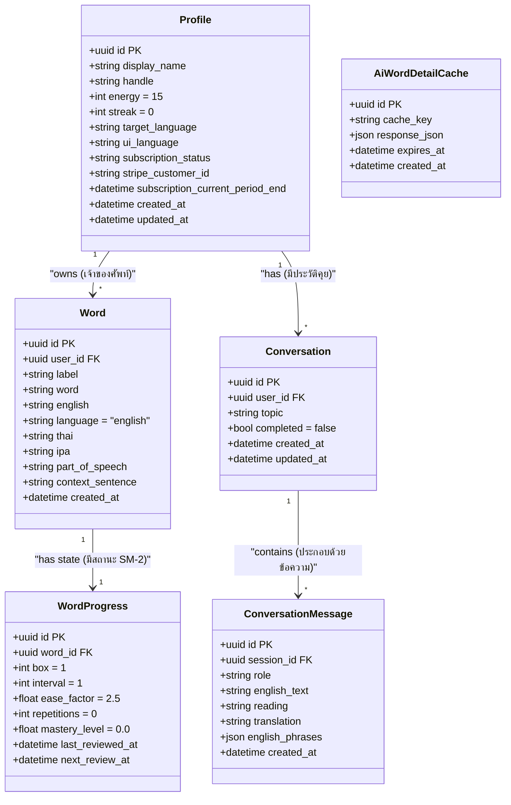
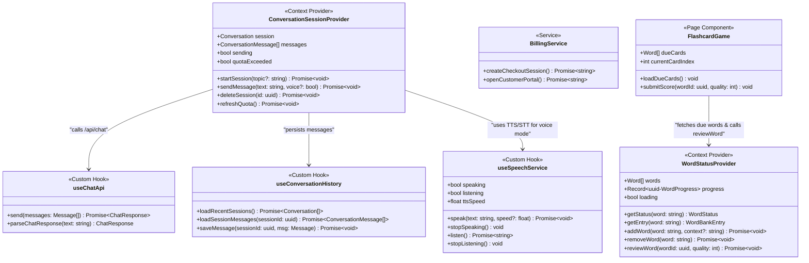
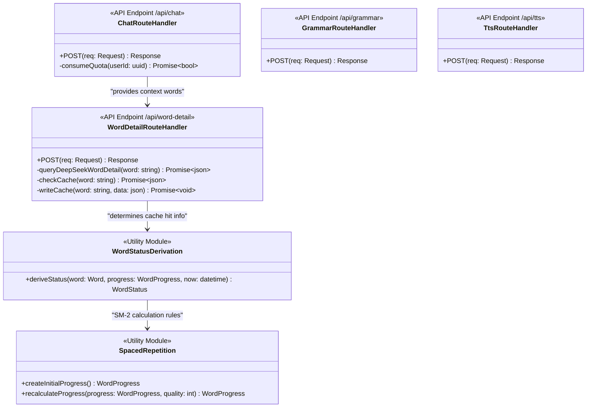

# Tarnly — แบบจำลองคลาสระบบ (Class Diagram Blueprint)

> เอกสารระบุโครงสร้างการออกแบบเชิงวัตถุ (Object-Oriented Design) ของแอปพลิเคชัน **Tarnly** โดยแปลงโครงสร้างข้อมูลและส่วนประกอบการทำงานจริง (Entity, React Provider, Custom Hook และ Backend Service) ให้อยู่ในรูปของคลาส (Classes) เพื่อแสดงขอบเขตหน้าที่และความสัมพันธ์ระหว่างกัน
> อ้างอิงสถาปัตยกรรมและโค้ดจริงใน [frontend-architecture.md](frontend-architecture.md), [backend-architecture.md](backend-architecture.md) และ [database-design.md](database-design.md)

---

## 1. ภาพรวมสถาปัตยกรรมการออกแบบคลาส (System Architecture Overview)

เนื่องจากระบบ Tarnly พัฒนาด้วยเทคโนโลยีสมัยใหม่ (React 19 Functional Components + Next.js App Router) ซึ่งไม่ได้ใช้ OOP (Object-Oriented Programming) เป็นหลัก แผนภาพคลาสในเอกสารนี้จึงสร้างขึ้นโดยการจัดกลุ่มและวิเคราะห์โครงสร้างหน้าที่ดังนี้:
1. **Data Entities (คลาสข้อมูล):** จำลองจากตารางจริงในฐานข้อมูล Supabase PostgreSQL
2. **Client-Side Services & Hooks (บริการฝั่งหน้าบ้าน):** จำลองจาก React Context Providers และ Custom Hooks ที่ทำหน้าที่ควบคุมสถานะของ UI และเชื่อมต่อกับเซิร์ฟเวอร์
3. **Backend Route Handlers & Utilities (บริการฝั่งหลังบ้าน):** จำลองจาก Next.js API Routes และไลบรารีคำนวณอัลกอริทึมต่าง ๆ

---

## 2. แผนภาพคลาสข้อมูลและโครงสร้างข้อมูล (Data Entities Class Diagram)

แผนภาพแสดงความสัมพันธ์ของโครงสร้างข้อมูล (Schema) ในระบบ Tarnly ที่ถูกเก็บไว้บนฐานข้อมูล Supabase:

---

## 3. แผนภาพคลาสบริการฝั่งหน้าบ้าน (Client Services & React Hooks Class Diagram)

คลาสเหล่านี้แสดงโครงสร้าง React Providers และ Custom Hooks ที่คุมสถานะ UI ในหน้าจอฝึกแชต คลังคำศัพท์ และระบบสังเคราะห์เสียงพูด:

---

## 4. แผนภาพคลาสและฟังก์ชันบริการฝั่งหลังบ้าน (Backend API & Services Class Diagram)

แสดงกลุ่ม Router Handlers และโมดูลช่วยคำนวณตรรกะเบื้องหลังบนเซิร์ฟเวอร์ รวมถึงระบบประมวลผลอัลกอริทึมเว้นระยะ:

---

## 5. รายละเอียดสมาชิกและหน้าที่ของแต่ละคลาส (Detailed Specifications)

### 5.1 คลาสข้อมูลหลัก (Data Entities)

| คลาส / แหล่งเก็บข้อมูล | หน้าที่และความสำคัญ | สมาชิกหลัก (Fields/Properties) |
| :--- | :--- | :--- |
| **Profile** | บัญชีข้อมูลหลักของผู้ใช้ระบบ ควบคุมสิทธิ์การใช้แชตและธีมระบบ | `id` (คีย์หลัก), `display_name` (ชื่อแสดงผล), `handle` (แฮนเดิลเฉพาะ), `energy` (โควต้า microbaht ฟรี), `subscription_status` (สถานะการจ่ายเงิน: free/active) |
| **Word** | ตารางเก็บคำศัพท์เดี่ยวแต่ละคำที่ผู้เรียนคลิกและกดบันทึก | `id`, `user_id` (โยงหาโปรไฟล์), `word` (คำศัพท์ตัวพิมพ์เล็ก), `ipa` (การออกเสียง), `thai` (คำแปลไทย), `part_of_speech` (ประเภทคำ) |
| **WordProgress** | เก็บประวัติและสเกลการทบทวนของคำศัพท์แต่ละคำด้วยระบบ SM-2 | `word_id` (โยงหาคำศัพท์), `box` (กล่องระดับ), `interval` (ระยะห่างวัน), `ease_factor` (ความจำง่ายขั้นต่ำ 1.3), `next_review_at` (กำหนดทบทวนครั้งหน้า) |
| **Conversation** | รายชื่อเซสชันหรือหน้าต่างฝึกคุยสนทนาที่ผ่านมา | `id`, `user_id`, `topic` (คำสรุปหัวข้อแชตเพื่อแสดงผลที่ Sidebar), `completed` (สถานะปิดแชต) |
| **ConversationMessage** | ประโยคโต้ตอบจริงในแชตแต่ละบรรทัด | `id`, `session_id`, `role` (ผู้ใช้/AI), `english_text` (ประโยคอังกฤษ), `translation` (คำแปลไทย), `english_phrases` (ไวยากรณ์/POS ย่อย) |

### 5.2 คลาสบริการหน้าบ้าน (Client Services & Custom Hooks)

| คลาสบริการ | สิทธิ์ / บริการที่รับผิดชอบ | ฟังก์ชันสำคัญ (Core Methods) |
| :--- | :--- | :--- |
| **WordStatusProvider** | จัดการโหลดคลังศัพท์ ประสานงานเพิ่ม/ลบศัพท์ และส่งรีวิวเข้าฐานข้อมูล | `addWord()` (เพิ่มคำเข้าคลังแบบออปติมิสติกลดดีเลย์), `reviewWord()` (ส่งผลประเมิน), `getStatus()` (เช็กว่าสีเขียวหรือสีเหลือง) |
| **ConversationSessionProvider** | ควบคุมสถานะบทสนทนาที่กำลังเกิดขึ้น และการจัดการสิทธิเข้าคุย | `startSession()` (สร้างหน้าต่างคุยใหม่), `sendMessage()` (ส่งข้อความ + วิเคราะห์), `refreshQuota()` (โหลดสถานะโควต้าล่าสุด) |
| **useSpeechService** | ตัวประสานงานเชื่อมต่อไมโครโฟน ถอดความ และสังเคราะห์เสียงอ่าน | `speak()` (สั่งแปลงเสียงด้วย Kokoro 82M), `listen()` (เปิดการฟังถอดเสียงผู้ใช้ด้วย Web Speech API/Whisper) |

### 5.3 คลาสและโมดูลบริการหลังบ้าน (Backend Logic)

| คลาส / บริการ | หน้าที่และความสำคัญ | ตรรกะสำคัญ (Internal Logic) |
| :--- | :--- | :--- |
| **SpacedRepetition** | ดำเนินการคํานวณตามสูตร SM-2 (SuperMemo 2) เพื่อจัดตารางทบทวน | `recalculateProgress()`: ป้อนระดับความจำ $q$ (0-5) ประมวลค่า `interval` และ `ease_factor` ตัวใหม่ โดยจำกัดค่า $EF \geq 1.3$ และปัดเศษวันเป็นจำนวนเต็ม |
| **WordStatusDerivation** | ตรวจสอบสีคำศัพท์ว่าควรเป็นสีเหลือง (Needs Review) หรือยัง | `deriveStatus()`: เปรียบเทียบ `next_review_at` หากค่าน้อยกว่าหรือเท่ากับวันเวลาปัจจุบันจะระบุเป็นสีเหลืองทันที เพื่อแยกนำไปแสดงในเกมทบทวน |
| **WordDetailRouteHandler** | ดึงความหมายศัพท์เชิงลึกผ่าน LLM และดูแลการโหลดจาก Cache | `POST()`: ตรวจสอบคำศัพท์ใน `ai_word_detail_cache` ก่อน หากไม่มี จึงจะสั่งเรียก DeepSeek วิเคราะห์คำศัพท์ จากนั้นเขียนแคชลง DB มีอายุการใช้งาน 30 วัน |
