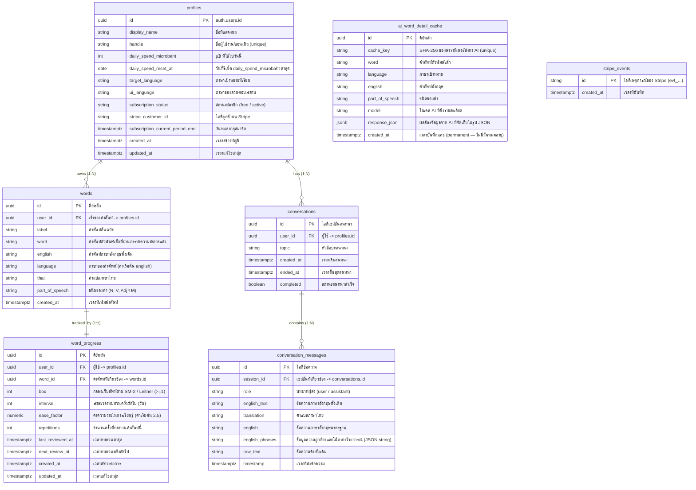

# Tarnly — การออกแบบฐานข้อมูล (Database Design Blueprint)

เอกสารนี้ระบุโครงสร้างฐานข้อมูลของระบบ **Tarnly** บน Supabase (PostgreSQL) โดยอ้างอิงจาก schema และ logic การทำงานจริง ณ ปัจจุบัน (ปี 2026) เอกสารนี้ครอบคลุมความสัมพันธ์ระหว่างตาราง (ER Diagram), รายละเอียด Data Directory ของแต่ละตาราง, นโยบายความปลอดภัย RLS, และการทำงานของระบบโควตา/การล้างข้อมูลอัตโนมัติ

---

## 1. แผนภาพความสัมพันธ์ของข้อมูล (ER Diagram)

ระบบใช้ความสัมพันธ์แบบ Relational Database โดยมี `profiles` เป็นศูนย์กลางของข้อมูลผู้ใช้ และเชื่อมต่อกับตารางคำศัพท์ ประวัติสนทนา และสถิติการเรียนรู้



---

## 2. พจนานุกรมข้อมูล (Data Directory)

### 2.1 ตาราง `profiles`
ตารางสำหรับเก็บข้อมูลผู้ใช้ โควตา และสถานะการสมัครสมาชิก Stripe เชื่อมโยงโดยตรงกับระบบ Supabase Auth (`auth.users`)

| คอลัมน์ (Column) | ประเภทข้อมูล (Type) | Nullable | คีย์ (Key) | ค่าเริ่มต้น (Default) | คำอธิบาย (Description) |
| :--- | :--- | :---: | :---: | :---: | :--- |
| `id` | `uuid` | NO | PK, FK | - | ไอดีผู้ใช้ อ้างอิงจาก `auth.users.id` |
| `display_name` | `text` | NO | - | `'Learner'` | ชื่อที่แสดงบนโปรไฟล์ของผู้ใช้ |
| `handle` | `text` | YES | UNIQUE | - | ชื่อบัญชีที่ไม่ซ้ำกัน (`^[a-z0-9_]{3,20}$`) |
| `daily_spend_microbaht` | `integer` | NO | - | `0` | µ฿ ที่ใช้ไปวันนี้ (Free limit: 20,000 / Premium: 50,000 ต่อวัน), CHECK `>= 0` |
| `daily_spend_reset_at` | `date` | NO | - | `CURRENT_DATE` | วันที่รีเซ็ต daily_spend_microbaht ล่าสุด ใช้ตรวจสอบว่าต้องรีเซ็ตหรือไม่ |
| `target_language` | `text` | NO | - | `'english'` | ภาษาเป้าหมายที่กำลังศึกษาอยู่ขณะนี้ |
| `ui_language` | `text` | NO | - | `'th'` | ภาษาที่แสดงในระบบเมนู UI ของแอป |
| `subscription_status`| `text` | NO | - | `'free'` | สถานะสมาชิก (`'free'` หรือ `'active'` สำหรับ premium) |
| `stripe_customer_id` | `text` | YES | - | - | รหัสลูกค้าของ Stripe สำหรับจัดการการจ่ายเงิน |
| `subscription_current_period_end` | `timestamptz` | YES | - | - | วันสิ้นสุดสิทธิ์การเป็น Premium ของรอบบิลปัจจุบัน |
| `created_at` | `timestamptz` | NO | - | `now()` | เวลาสร้างบัญชี |
| `updated_at` | `timestamptz` | NO | - | `now()` | เวลาแก้ไขข้อมูลล่าสุด |

---

### 2.2 ตาราง `words`
คลังคำศัพท์ที่ผู้ใช้นำเข้าเพื่อเรียนรู้และท่องจำ เชื่อมกับระบบแปลและวิเคราะห์คำศัพท์

| คอลัมน์ (Column) | ประเภทข้อมูล (Type) | Nullable | คีย์ (Key) | ค่าเริ่มต้น (Default) | คำอธิบาย (Description) |
| :--- | :--- | :---: | :---: | :---: | :--- |
| `id` | `uuid` | NO | PK | `gen_random_uuid()`| คีย์หลักของตารางศัพท์ |
| `user_id` | `uuid` | NO | FK | - | อ้างอิงเจ้าของคำศัพท์ -> `profiles.id` |
| `label` | `text` | NO | - | - | คำศัพท์รูปแบบดิบตามที่ผู้ใช้คลิก/เลือก |
| `word` | `text` | YES | - | - | คำศัพท์ตัวพิมพ์เล็กและทำความสะอาดช่องว่างแล้ว |
| `english` | `text` | YES | - | - | รูปแบบคำศัพท์ภาษาอังกฤษดั้งเดิม |
| `language` | `text` | NO | - | `'english'` | ภาษาของคำศัพท์ที่บันทึก (CHECK = `'english'`) |
| `thai` | `text` | YES | - | - | คำแปลภาษาไทยของคำศัพท์ (แบบสั้น) |
| `part_of_speech` | `text` | YES | - | - | ชนิดของคำศัพท์ เช่น noun, verb, adjective |
| `created_at` | `timestamptz` | NO | - | `timezone('utc', now())` | วันเวลาที่เริ่มบันทึกศัพท์ลงคลัง |

---

### 2.3 ตาราง `word_progress`
เก็บสถานะความเชี่ยวชาญคำศัพท์ของผู้เรียน อิงกับสูตรการคำนวณทบทวนของอัลกอริทึม **SuperMemo-2 (SM-2)**

| คอลัมน์ (Column) | ประเภทข้อมูล (Type) | Nullable | คีย์ (Key) | ค่าเริ่มต้น (Default) | คำอธิบาย (Description) |
| :--- | :--- | :---: | :---: | :---: | :--- |
| `id` | `uuid` | NO | PK | `gen_random_uuid()`| คีย์หลักของการคำนวณ |
| `user_id` | `uuid` | NO | FK | - | อ้างอิงไอดีผู้ใช้ -> `profiles.id` |
| `word_id` | `uuid` | NO | FK | - | คีย์เชื่อมโยงข้อมูลคำศัพท์ -> `words.id` |
| `box` | `integer` | NO | - | `1` | กล่องเก็บการเรียนรู้ (Leitner) สำหรับวิเคราะห์ความคุ้นเคยศัพท์, CHECK `>= 1` |
| `interval` | `integer` | NO | - | `1` | จำนวนวันทิ้งช่วงการทบทวนครั้งต่อไป, CHECK `>= 0` |
| `ease_factor` | `numeric` | NO | - | `2.5` | ปัจจัยความง่ายของคำศัพท์, CHECK `>= 1.3` |
| `repetitions` | `integer` | NO | - | `0` | จำนวนครั้งที่ผู้ใช้ตอบคำถามทบทวนคำศัพท์นี้, CHECK `>= 0` |
| `last_reviewed_at` | `timestamptz` | NO | - | `now()` | วันเวลาที่ผู้ใช้ตอบทบทวนคำนี้ครั้งล่าสุด |
| `next_review_at` | `timestamptz` | NO | - | `now()` | วันเวลาที่จะต้องนำคำศัพท์นี้กลับมาทบทวนครั้งถัดไป |
| `created_at` | `timestamptz` | NO | - | `now()` | วันเวลาที่สร้างรายการ |
| `updated_at` | `timestamptz` | NO | - | `now()` | วันเวลาที่อัปเดตข้อมูลความก้าวหน้าล่าสุด |

---

### 2.4 ตาราง `conversations`
ข้อมูลสรุปเซสชันบทสนทนาระหว่างผู้เรียนกับคู่สนทนา AI

| คอลัมน์ (Column) | ประเภทข้อมูล (Type) | Nullable | คีย์ (Key) | ค่าเริ่มต้น (Default) | คำอธิบาย (Description) |
| :--- | :--- | :---: | :---: | :---: | :--- |
| `id` | `uuid` | NO | PK | `gen_random_uuid()`| ไอดีระบุเซสชันของห้องสนทนา |
| `user_id` | `uuid` | NO | FK | - | เจ้าของบทสนทนา -> `profiles.id` |
| `topic` | `text` | NO | - | - | หัวข้อหรือสถานการณ์จำลองสำหรับการสนทนา |
| `created_at` | `timestamptz` | NO | - | `timezone('utc', now())` | เวลาที่เริ่มเปิดห้องแชต |
| `ended_at` | `timestamptz` | YES | - | - | เวลาที่ปิดห้องแชต |
| `completed` | `boolean` | NO | - | `false` | สถานะการจบบทเรียนแชตตามเงื่อนไขเป้าหมาย |

---

### 2.5 ตาราง `conversation_messages`
ข้อความแต่ละแถวที่ส่งในแต่ละห้องสนทนา ทั้งจากผู้เรียนและ AI
> [!NOTE]
> ตารางนี้มีนโยบายเก็บข้อมูลระยะสั้น (Short-term retention) โดยจะถูกล้างข้อมูลออกหลังจากสร้างเกิน 3 วัน

| คอลัมน์ (Column) | ประเภทข้อมูล (Type) | Nullable | คีย์ (Key) | ค่าเริ่มต้น (Default) | คำอธิบาย (Description) |
| :--- | :--- | :---: | :---: | :---: | :--- |
| `id` | `uuid` | NO | PK | `gen_random_uuid()`| คีย์หลักระบุบรรทัดแชต |
| `session_id` | `uuid` | NO | FK | - | เชื่อมโยงหาเซสชันห้อง -> `conversations.id` (ON DELETE CASCADE) |
| `role` | `text` | NO | - | - | บทบาทผู้ส่ง (CHECK `'user'` หรือ `'assistant'`) |
| `english_text` | `text` | YES | - | - | ข้อความภาษาอังกฤษ (ฝั่งผู้ช่วยอาจแบ่งประโยคด้วยเครื่องหมาย `\|\|\|`) |
| `translation` | `text` | YES | - | - | ข้อความแปลภาษาไทย |
| `english` | `text` | YES | - | - | โครงสร้างภาษาอังกฤษเป้าหมาย |
| `english_phrases` | `text` | YES | - | - | ข้อมูลตรวจ Grammar (ถูก/ผิด, โน้ตแก้ไข) ในรูป JSON String |
| `raw_text` | `text` | YES | - | - | ข้อความเสียงหรือข้อความดั้งเดิมของผู้ส่ง |
| `timestamp` | `timestamptz` | NO | - | `timezone('utc', now())` | เวลาที่สร้าง/ส่งข้อความแชต |

---

### 2.6 ตาราง `ai_word_detail_cache`
แคชกลางถาวร (Permanent Cache) สำหรับเก็บข้อมูลรายละเอียดคำศัพท์ที่สร้างโดย LLM (เช่น IPA, POS, ประโยคตัวอย่าง) เพื่อช่วยลดการเรียกใช้งาน AI API ซ้ำและเร่งความเร็วในการตอบสนอง

| คอลัมน์ (Column) | ประเภทข้อมูล (Type) | Nullable | คีย์ (Key) | ค่าเริ่มต้น (Default) | คำอธิบาย (Description) |
| :--- | :--- | :---: | :---: | :---: | :--- |
| `id` | `uuid` | NO | PK | `gen_random_uuid()`| คีย์หลัก |
| `cache_key` | `text` | NO | UNIQUE | - | คำนวณจาก SHA-256 ของพารามิเตอร์การดึงคำศัพท์ |
| `word` | `text` | NO | - | - | คำศัพท์ตัวพิมพ์เล็กที่ทำดัชนีดึงข้อมูล |
| `language` | `text` | NO | - | - | ภาษาเป้าหมายหลัก (CHECK = `'english'`) |
| `english` | `text` | YES | - | - | ข้อมูลรูปแบบอังกฤษ |
| `part_of_speech` | `text` | YES | - | - | ชนิดของคำ |
| `model` | `text` | NO | - | - | ชื่อโมเดล AI ที่ใช้ประมวลผลลัพธ์ดึงแคช |
| `response_json` | `jsonb` | NO | - | - | ข้อมูลผลลัพธ์คำศัพท์และประโยคตัวอย่างทั้งหมดแบบละเอียด (JSON) |
| `expires_at` | `timestamptz` | NO | - | - | วันหมดอายุแคช (ทั่วไปเก็บนาน 30 วันนับจากวันที่ดึงครั้งแรก) |
| `created_at` | `timestamptz` | NO | - | `now()` | เวลาที่บันทึกข้อมูลแคช |

---

### 2.7 ตาราง `stripe_events`
ใช้สำหรับตรวจสอบการทำงานซ้ำ (Idempotency) ของ Stripe Webhook — บันทึก event id ที่ประมวลผลแล้ว เพื่อป้องกันการประมวลผลคำสั่งซื้อ/สมัครสมาชิกซ้ำซ้อนเมื่อ Stripe ส่ง webhook ซ้ำ

| คอลัมน์ (Column) | ประเภทข้อมูล (Type) | Nullable | คีย์ (Key) | ค่าเริ่มต้น (Default) | คำอธิบาย (Description) |
| :--- | :--- | :---: | :---: | :---: | :--- |
| `id` | `text` | NO | PK | - | ไอดีอ้างอิงจาก Stripe Event (`evt_...`) |
| `created_at` | `timestamptz` | NO | - | `now()` | เวลาที่เริ่มจัดเก็บเพื่อป้องกันการซ้ำ |

> [!NOTE]
> Webhook handler (`/api/stripe/webhook`) จะ `insert` event id ก่อนประมวลผล หากชน PK (code `23505`) แปลว่าเคยประมวลผลแล้ว → ตอบ `{received:true}` ทันทีโดยไม่ทำซ้ำ

---

## 3. ความปลอดภัยและสิทธิ์การเข้าถึงข้อมูล (Row Level Security - RLS)

เนื่องจากระบบรันอยู่บน Supabase ข้อมูลทุกส่วนที่เชื่อมต่อจาก client จะต้องผ่าน **Row Level Security (RLS)** โดยผู้ใช้ที่เข้าสู่ระบบเท่านั้นที่สามารถสร้าง อ่าน แก้ไข หรือลบข้อมูลที่เป็นของตัวเองได้ (RLS เปิดทุกตาราง)

### นโยบายการตรวจสอบสิทธิ์ (Policies)
1. **ตารางส่วนตัวของผู้ใช้ (`profiles`, `words`, `word_progress`, `conversations`):**
   - **SELECT / INSERT / UPDATE / DELETE:** `auth.uid() = user_id` (หรือ `auth.uid() = id` ในกรณีของตาราง `profiles`)
2. **ตารางลูกที่มีความเกี่ยวข้อง (`conversation_messages`):**
   - การเข้าถึงข้อความจะผูกผ่านทาง `session_id` ไปสู่ตาราง `conversations` อีกทอดหนึ่งเพื่อตรวจสอบว่าแชตนั้นเป็นของเจ้าของจริงหรือไม่:
     `EXISTS (SELECT 1 FROM conversations WHERE conversations.id = session_id AND conversations.user_id = auth.uid())`
3. **ตารางแคชกลาง (`ai_word_detail_cache`):**
   - เป็นการแชร์ข้อมูลแคชคำศัพท์สำหรับผู้ใช้ทุกคน เพื่อประสิทธิภาพสูงสุด
   - **SELECT:** เปิดสิทธิ์ให้อ่านได้สาธารณะหรือผู้ใช้งานทุกคน
   - **INSERT/UPDATE:** เฉพาะผู้ใช้ที่ล็อกอินแล้ว หรือรันผ่านฝั่ง Serverless API (Security Definer) เท่านั้น
4. **ตารางระบบ (`stripe_events`):**
   - เปิด RLS แต่ไม่มี policy → client ปกติเข้าถึงไม่ได้
   - เข้าถึงผ่าน Webhook handler ที่ใช้ **Service-role client** (bypass RLS) เท่านั้น

---

## 4. ตรรกะฝั่งฐานข้อมูลและระบบเบื้องหลัง (Database Logic & Automation)

### 4.1 ระบบงบประมาณการใช้งาน AI รายวัน (Daily AI Budget in Microbaht)
ระบบคำนวณโควตาตามจำนวน Token ที่ใช้งานจริง (Microbaht) โดยมีฟังก์ชันฝั่งฐานข้อมูล (RPC):

1. **`check_budget` (p_limit_microbaht)**:
   - ทำการดึงข้อมูล `daily_spend_microbaht` และ `daily_spend_reset_at` จากตาราง `profiles`
   - หากวันที่ปัจจุบันเลยกำหนดวันรีเซ็ต -> รีเซ็ต `daily_spend_microbaht = 0` (Free limit: 20,000 µ฿ / Premium: 50,000 µ฿)
   - คืนค่ากลับไปบอกแอปว่ามูลค่างบประมาณที่คงเหลือสามารถจ่ายค่า Token ตามวงเงินจำกัดขั้นต่ำนี้ได้หรือไม่ (Fail-closed: หากฐานข้อมูลมีปัญหาระบบจะบล็อกชั่วคราวเพื่อป้องกันการรั่วไหล)
2. **`debit_budget` (p_cost_microbaht)**:
   - บวกเพิ่มค่าใช้จ่ายเข้า `daily_spend_microbaht` ในแถวโปรไฟล์ผู้เรียนหลังจากการสร้างการตอบสนองเสร็จสิ้น

### 4.2 ระบบล้างข้อความสนทนาเก่าอัตโนมัติ (pg_cron Conversation Cleanup)
เพื่อรักษาระดับประสิทธิภาพและความปลอดภัยของข้อมูลสนทนา ระบบมีกระบวนการล้างข้อมูลข้อความใน `conversation_messages` ทุกเที่ยงคืนผ่าน Extension **pg_cron** ในฐานข้อมูล:

```sql
SELECT cron.schedule(
  'cleanup-old-messages',
  '0 0 * * *',
  $$
    DELETE FROM conversation_messages
    WHERE created_at < NOW() - INTERVAL '3 days';
  $$
);
```
> [!TIP]
> ผลลัพธ์: ข้อความสนทนาจะหายไปอย่างถาวรหลังจากผ่านไป 3 วัน แต่หัวข้อแชตในตาราง `conversations` จะยังคงอยู่เพื่อให้เห็นบันทึกประวัติการคุยเบื้องต้นได้

### 4.3 ระบบ Cascade Delete บนความรับผิดชอบทางกฎหมาย (PDPA compliance)
เมื่อผู้ใช้ออกคำสั่ง **"ลบบัญชีผู้ใช้"** ระบบจะเรียก API Route `DELETE /api/account/delete` โดยระบบจะทำงานควบคู่กับการลบระเบียนโดยตรงจาก Service-role (Admin Client) ในลำดับความขึ้นต่อกันของ Foreign Key เพื่อเคลียร์ข้อมูลของผู้ใช้งานออกจนหมดสิ้นตามลำดับ:
1. `words`
2. `conversations`
3. `word_progress`
4. `profiles`
5. `auth.users` (ลบผ่าน Supabase Admin auth SDK)
