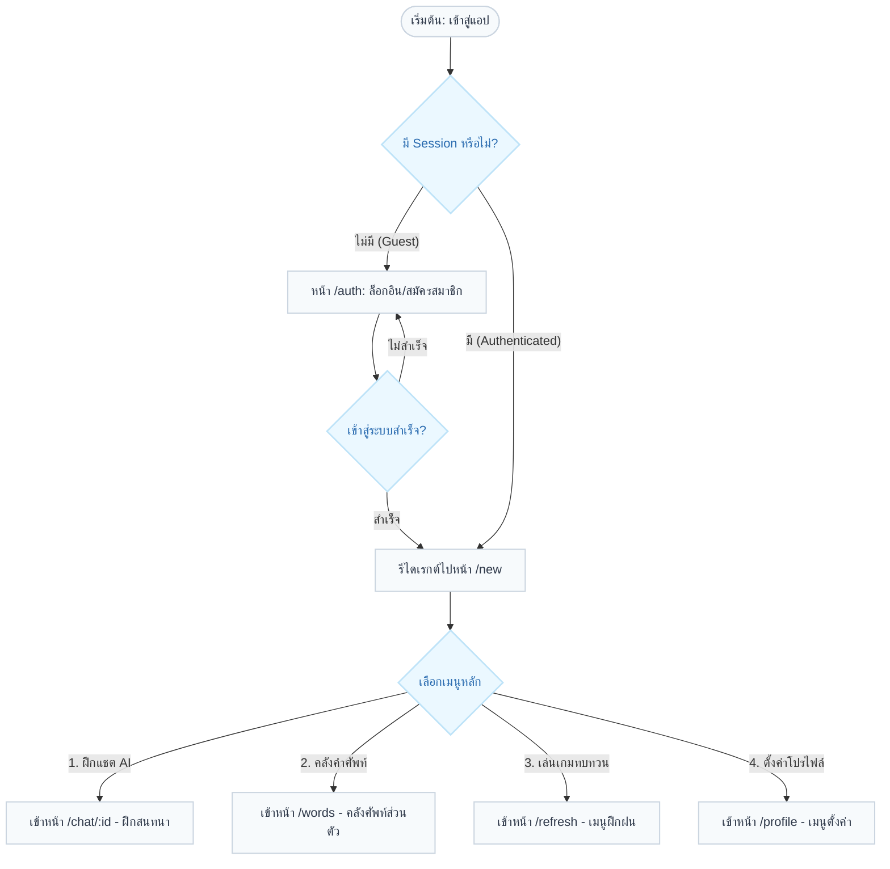
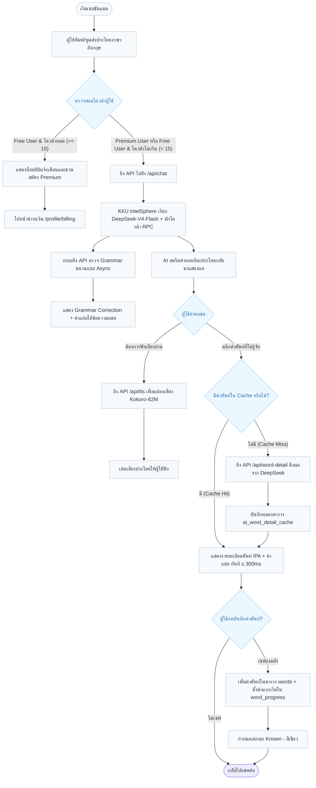
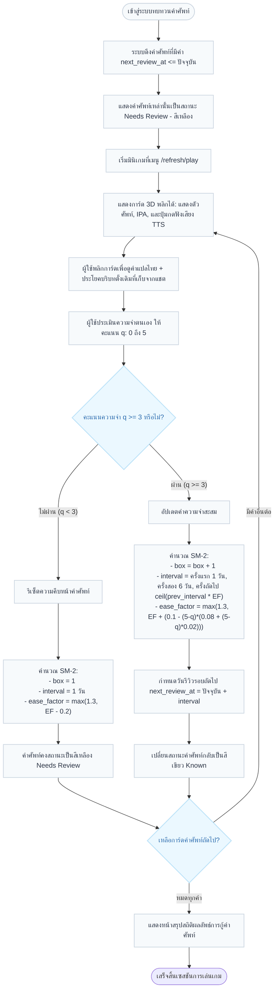

# Tarnly — แผนผังการทำงานของระบบ (System Flowcharts)

> เอกสารอธิบายขั้นตอนการทำงานของระบบ (Workflow) ของแอปพลิเคชัน **Tarnly** ผ่านแผนผังการไหลของข้อมูลและการตัดสินใจ (Flowcharts) เพื่อเป็นแนวทางให้นักพัฒนาเห็นภาพการทำงานของระบบตั้งแต่ต้นจนจบ
> อ้างอิงสถาปัตยกรรมและการเชื่อมต่อข้อมูลจริงใน [sitemap.md](sitemap.md) และ [database-design.md](database-design.md)

---

## 1. แผนผังการใช้งานระบบโดยรวม (Overall System Flowchart)

แผนผังแสดงเส้นทางการเดินทางของคู่สนทนาเมื่อเข้ามาในระบบ โดยจะผ่านการตรวจสอบสิทธิ์การเข้าใช้งาน (Middleware Auth) และสิทธิ์สมาชิก (Subscription Gating):



---

## 2. ขั้นตอนการฝึกสนทนาและการบันทึกคำศัพท์ (AI Tutor Chat & Word Capturing Flow)

ขั้นตอนนี้จะจำลองการตรวจสอบสิทธิ์การแชตประจำวัน (Daily Quota) และกระบวนการดึงข้อมูลศัพท์เชิงลึกเพื่อจัดเก็บลงคลัง:



---

## 3. ขั้นตอนการทบทวนคำศัพท์ด้วย SM-2 (Spaced Repetition & Flashcard Game Flow)

ขั้นตอนนี้จะอธิบายสภาวะและการอัปเดตสเกลเวลาทบทวนคำศัพท์ตามอัลกอริทึม SM-2 เมื่อผู้ใช้งานเข้ามาทำสอบผ่านมินิเกม:



---

## 4. ขั้นตอนการชำระเงินและสมัครสมาชิก Premium (Stripe Payment Flow)

ขั้นตอนการร้องขอเปลี่ยนสถานะผู้ใช้งานจาก Free $\rightarrow$ Premium ผ่านการผสานระบบชำระเงินของ Stripe:

```mermaid
flowchart TD
    StartBilling([เข้าเมนู /profile/billing]) --> ClickSubscribe[ผู้ใช้กดปุ่ม 'สมัครสมาชิก Premium']
    ClickSubscribe --> CreateSession[ยิง API /api/stripe/create-checkout-session]
    CreateSession --> RedirectStripe[ระบบส่งผู้ใช้ไปยังหน้า Stripe Checkout (Hosted Page)]
    
    RedirectStripe --> StripeCheckout{ดำเนินการชำระเงิน}
    StripeCheckout -- "ยกเลิกการชำระเงิน" --> RedirectCancel[ส่งกลับแอป หน้า /profile/billing พร้อมข้อความยกเลิก]
    
    StripeCheckout -- "ชำระเงินสำเร็จ" --> StripeWebhook[Stripe ยิง Webhook event: checkout.session.completed]
    StripeWebhook --> ValidateSignature[ระบบทำการตรวจสอบ Signature และดึง userId จาก Metadata]
    ValidateSignature --> UpdateUserRole[อัปเดตข้อมูลผู้ใช้ใน Supabase: subscription_status = 'active']
    UpdateUserRole --> RedirectSuccess[ส่งกลับแอป หน้า /profile/billing แสดงผลพรีเมียมเรียบร้อย]
    
    RedirectSuccess --> UnlockFeatures[เปิดใช้งานสิทธิ์แชตคุยไม่จำกัด และล้างโควต้าเดิม]

    %% Styles
    classDef startEnd fill:#4a5568,stroke:#2d3748,stroke-width:2px,color:#fff;
    classDef process fill:#f7fafc,stroke:#cbd5e0,stroke-width:1.5px,color:#2d3748;
    classDef decision fill:#ebf8ff,stroke:#bee3f8,stroke-width:2px,color:#2b6cb0;
    
    class StartBilling,ClickSubscribe,CreateSession,RedirectStripe,RedirectCancel,StripeWebhook,ValidateSignature,UpdateUserRole,RedirectSuccess,UnlockFeatures process;
    class StripeCheckout decision;
```
