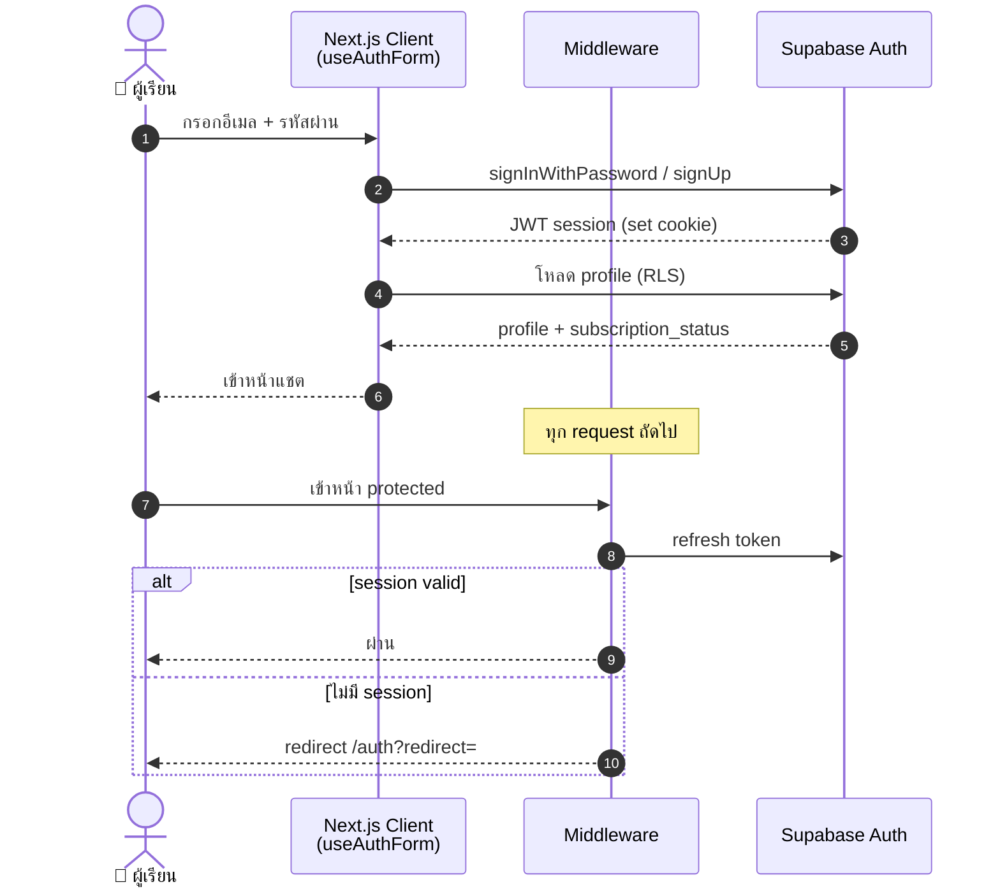
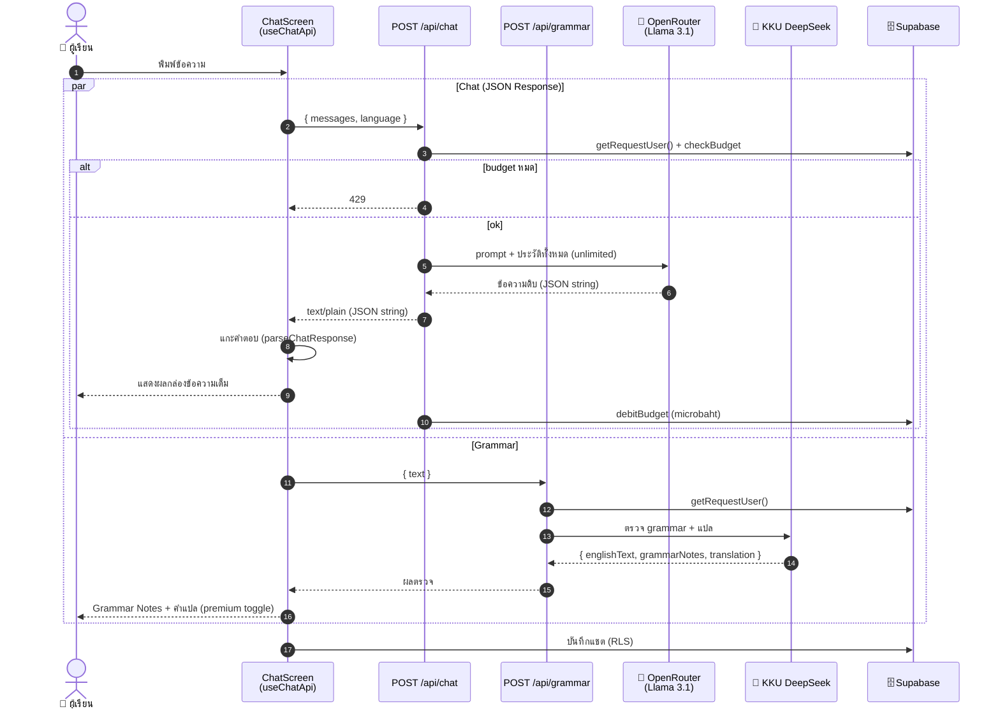
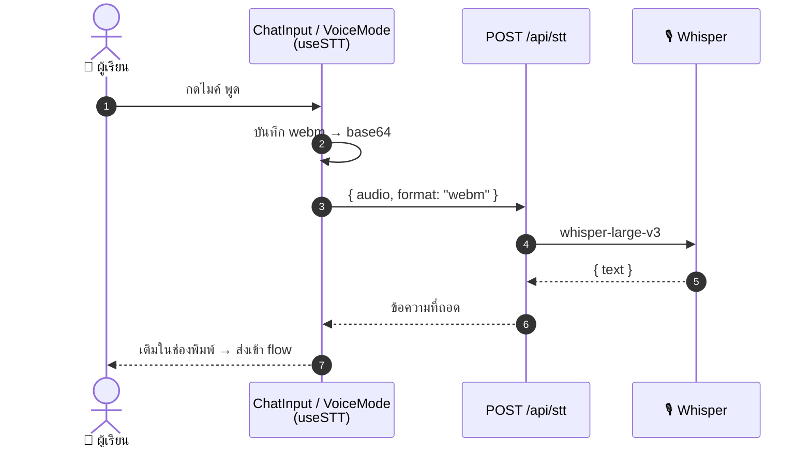
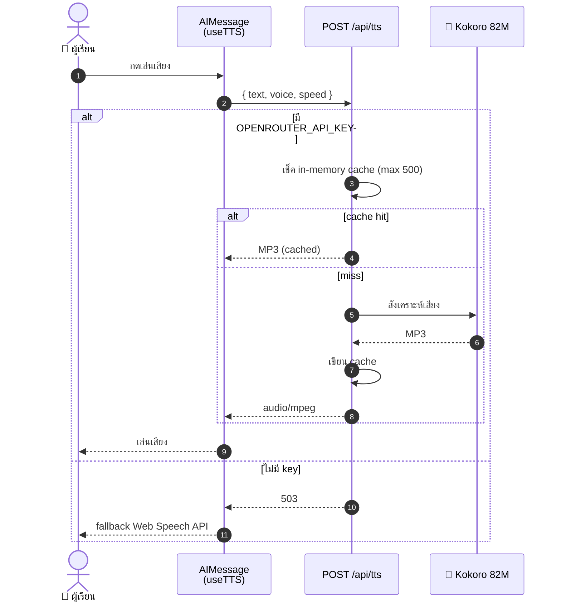
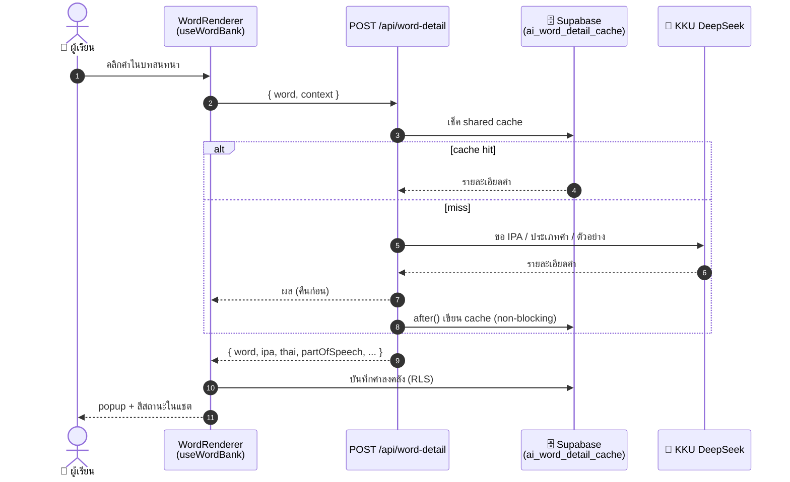
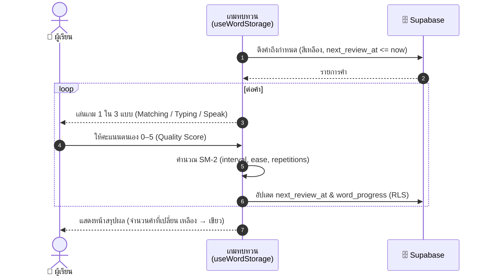
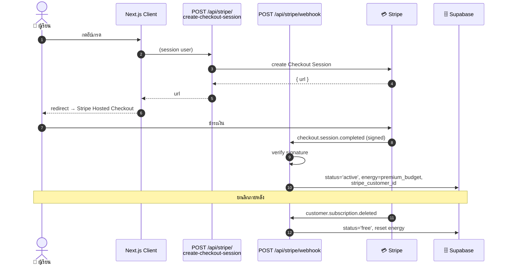
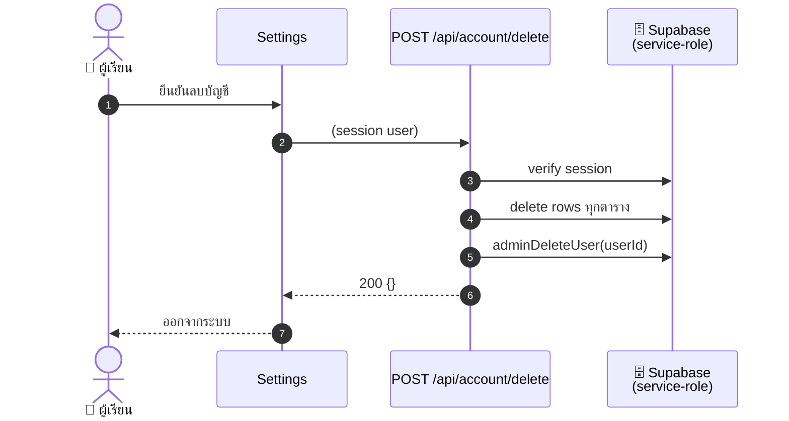

# แผนภาพลำดับ (Sequence Diagram)
### ระบบ Tarnly — AI Conversation Learning Platform

> Sequence diagram ของ flow หลัก อ้างอิง `app/api/` จริง ณ 2026-06-28
> ดูคู่กับ [api-specification.md](./api-specification.md) และ [dfd-context-diagram.md](./dfd-context-diagram.md)

---

## 1. สมัคร / ล็อกอิน (P-01)

---

## 2. สนทนากับ AI + ตรวจ Grammar (P-02 + P-03, ขนาน)

---

## 3. พูด → ข้อความ (STT, P-04)

---

## 4. เสียงอ่าน (TTS, P-05)

---

## 5. คลิกคำศัพท์ + shared cache (P-06)

---

## 6. มินิเกมทบทวน SM-2 (P-07)

### คำอธิบายอัลกอริทึม SM-2 และสีสถานะคำศัพท์ (SM-2 Calculation & Word Statuses)

ระบบจัดเก็บและวิเคราะห์คำศัพท์ผ่านตรรกะ Spaced Repetition (SM-2) ตามโครงสร้างในโค้ดจริง ([spacedRepetition.ts](file:///Users/pat/Project/tranly-free-version/tranly/app/_lib/utils/spacedRepetition.ts) และ [wordStatusDerivation.ts](file:///Users/pat/Project/tranly-free-version/tranly/app/_lib/utils/wordStatusDerivation.ts)) โดยสรุปกระบวนการดังนี้:

#### 1. การเพิ่มคำศัพท์ครั้งแรก (Initial State)
* เมื่อกดเก็บบันทึกคำศัพท์ ระบบจะสร้างเรคคอร์ดความก้าวหน้าเริ่มต้น (ฟังก์ชัน `createInitialProgress`) โดยกำหนดค่า:
  * `repetitions = 0` (จำนวนครั้งทบทวนสำเร็จสะสม)
  * `box = 1` (กล่องระดับที่ 1)
  * `interval = 1` (ระยะเวลาทบทวนถัดไปเป็น 1 วัน)
  * `easeFactor = 2.5` (ตัวคูณความง่ายเริ่มต้น)
  * `nextReviewAt = now + 1 วัน` (24 ชั่วโมงถัดไป)
* **สีสถานะช่วงเริ่มต้น:** ตราบใดที่ `nextReviewAt > now` ฟังก์ชัน `deriveWordStatus` จะประเมินผลเป็นสถานะ **สีเขียว (`known` - รู้แล้ว)**
* **การเปลี่ยนเป็นสีเหลืองครั้งแรก:** เมื่อเวลาผ่านไปครบ 1 วัน (24 ชั่วโมง) จนทำให้เงื่อนไข `nextReviewAt <= now` เป็นจริง คำศัพท์คำนี้จะถูกดึงเข้าเกม และสถานะจะกลายเป็น **สีเหลือง (`needs_review` - ต้องทบทวน)** โดยอัตโนมัติ

#### 2. ระบบการให้คะแนนทบทวน (Quality Score 0-5)
หลังจากการเล่นมินิเกม (จับคู่ พิมพ์คำแปล หรือพูดออกเสียง) ผู้เรียนจะประเมินคะแนนคุณภาพการระลึกความจำของตัวเองจาก `0 ถึง 5` คะแนน:
* **ผ่าน (Pass) คะแนนระดับ 3–5:**
  * **5 (Perfect response):** นึกออกสมบูรณ์แบบทันทีโดยไม่ต้องลังเล
  * **4 (Correct response after hesitation):** นึกออกถูกต้อง แต่คิดช้าเล็กน้อยหรือลังเล
  * **3 (Correct response but with serious difficulty):** นึกออกถูกต้อง แต่ยากมาก/เกือบจะลืม
* **ตก (Fail) คะแนนระดับ 0–2:**
  * **2 (Incorrect response; correct one seemed easy to recall):** ตอบผิด แต่พอเฉลยแล้วจำได้ทันที
  * **1 (Incorrect response; correct one remembered):** ตอบผิด และพอเห็นเฉลยแล้วรู้สึกคุ้น ๆ แต่จำแทบไม่ได้
  * **0 (Complete blackout):** จำไม่ได้เลยสะกดไม่ออกเลย

#### 3. การคำนวณตัวคูณความง่ายใหม่ (Ease Factor - EF)
ในทุกรอบการทบทวน ค่า `easeFactor` จะถูกอัปเดตใหม่ตามสูตร:
$$\text{Ease Factor}' = \max(1.3, \text{Ease Factor} + (0.1 - (5 - q) \times (0.08 + (5 - q) \times 0.02)))$$
* *หมายเหตุ:* ค่า Ease Factor จะถูกจำกัดเพดานขั้นต่ำไว้ที่ **1.3** เสมอ เพื่อไม่ให้ความถี่ถอยเร็วเกินไปเมื่อตอบผิดบ่อย ๆ

#### 4. สูตรกำหนดวันส่งทบทวนใหม่ (Interval Calculation)
* **กรณีสอบผ่าน (q >= 3):**
  * ขยายจำนวนครั้งการจำสำเร็จ `repetitions = repetitions + 1` และขยับระดับกล่องขึ้น `box = box + 1`
  * คำนวณช่วงเวลาห่างของการทบทวนรอบถัดไป (`interval`) ในหน่วยวันดังนี้:
    * **ทบทวนผ่านครั้งที่ 1 (repetitions == 1):** `interval = 1` วัน (คำกลับเป็น **สีเขียว** อยู่ได้ 1 วัน แล้วจึงเปลี่ยนเป็นสีเหลืองอีกครั้ง)
    * **ทบทวนผ่านครั้งที่ 2 (repetitions == 2):** `interval = 6` วัน (คำกลับเป็น **สีเขียว** อยู่ได้ 6 วัน แล้วจึงเปลี่ยนเป็นสีเหลืองอีกครั้ง)
    * **ทบทวนผ่านครั้งที่ 3 ขึ้นไป (repetitions >= 3):** `interval = Math.round(previous\_interval * newEaseFactor)` วัน (เช่น 6 วัน $\times$ 2.5 = 15 วัน)
* **กรณีสอบตก (q < 3):**
  * ล้างค่าสถิติทั้งหมดกลับสู่จุดเริ่มต้น: `repetitions = 0`, `box = 1`, `interval = 1`
  * คำนวณค่า Ease Factor ใหม่ (ซึ่งจะลดลงตามสูตร)
  * ตั้งค่า `nextReviewAt = now + 1 วัน` (คำศัพท์จะกลับเป็น **สีเขียว** มีสถานะเสมือนพักทบทวนเป็นเวลา 1 วัน เพื่อเตรียมเปลี่ยนกลับมาเป็น **สีเหลือง** ให้ทบทวนซ้ำอีกครั้งในวันถัดไปทันที)

#### 5. ตารางจำลองช่วงเวลาทบทวน (Pass Simulation ที่ Ease Factor = 2.5)

| ลำดับการทบทวน | สภาพการเล่นและคะแนนโหวต | ระยะเวลาห่าง (Interval) | สถานะภาพสีที่แสดง |
| :---: | :--- | :---: | :--- |
| **รอบเริ่มต้น** | บันทึกศัพท์ลงคลังครั้งแรก | 1 วัน | 🟢 สีเขียว (อยู่ได้ 1 วัน จนกลายเป็นสีเหลือง 🟡) |
| **รอบที่ 1** | ทบทวนและผ่าน (โหวต $\ge$ 3) | 1 วัน | 🟢 สีเขียว (อยู่ได้ 1 วัน จนกลายเป็นสีเหลือง 🟡) |
| **รอบที่ 2** | ทบทวนและผ่าน (โหวต $\ge$ 3) | 6 วัน | 🟢 สีเขียว (อยู่ได้ 6 วัน จนกลายเป็นสีเหลือง 🟡) |
| **รอบที่ 3** | ทบทวนและผ่าน (โหวต $\ge$ 3) | 15 วัน (6 $\times$ 2.5) | 🟢 สีเขียว (อยู่ได้ 15 วัน จนกลายเป็นสีเหลือง 🟡) |
| **รอบที่ 4** | ทบทวนและผ่าน (โหวต $\ge$ 3) | 38 วัน (15 $\times$ 2.5) | 🟢 สีเขียว (อยู่ได้ 38 วัน จนกลายเป็นสีเหลือง 🟡) |

*หากสอบตก (โหวต 0, 1, 2) ณ รอบใดก็ตาม สิทธิ์ช่วงเวลาทบทวนจะถูกรีเซ็ตกลับไปที่รอบที่ 1 ทันที (เป็นสีเขียว 1 วันแล้วกลับมาเป็นสีเหลือง)*

---

## 7. อัปเกรด Premium (P-08)

---

## 8. ลบบัญชีถาวร (PDPA, P-09)

