# Tarnly — แบบจำลองการออกแบบระบบ (System Design Diagrams)

> Diagram ทั้งหมดเป็น Mermaid อิงโค้ด/schema จริง + ส่วนออกแบบของ Phase 2 ที่ยังไม่ลงโค้ด
> มาร์คสถานะ: ✅ มีในโค้ดแล้ว · 🟡 มี logic ยังไม่มี UI · 🔵 ออกแบบไว้ (Phase 2 ยังไม่ทำ)
> ใช้คู่กับ `backend-architecture.md` (schema จริง), `tarnly_proposal.md` (IPO/ขอบเขต)

---

## 1. Use Case Diagram

actor หลัก = ผู้เรียน (รวม guest). actor นอก = LLM (KKU), TTS (Google)

```mermaid
graph LR
    user((ผู้เรียน / Guest))
    kku{{KKU IntelSphere LLM}}
    gtts{{Kokoro 82M (OpenRouter)}}

    user --- UC1[สมัคร/ล็อกอิน/อัปเกรด guest ✅]
    user --- UC2[แชต AI + แปล + grammar ✅]
    user --- UC3[คลิกคำ → ดู IPA/POS → เก็บลงคลัง ✅]
    user --- UC4[ดูคลังคำ + เล่นเสียง ✅]
    user --- UC5[เล่นเกมแฟลชการ์ด SM-2 🟡]
    user --- UC7[ตั้งค่าโปรไฟล์/ธีม/รีเซ็ต ✅]

    UC2 -.includes.-> UC8[เล่นเสียง TTS]
    UC3 -.includes.-> UC8
    UC5 -.includes.-> UC8
    UC2 --> kku
    UC8 --> gtts
    UC5 -.extends.-> UC9[คำนวณ SM-2 + อัปเดตสถานะสี ✅]

    classDef done fill:#E6F4EA,stroke:#137333;
    classDef partial fill:#FEF7E0,stroke:#B06000;
    classDef plan fill:#E8F0FE,stroke:#1A73E8;
    class UC1,UC2,UC3,UC4,UC7,UC8,UC9 done;
    class UC5 partial;
```

| UC | คำอธิบายสั้น | สถานะ | อ้างอิงโค้ด |
| :-- | :-- | :-: | :-- |
| UC1 | สมัคร/ล็อกอิน email·Google·guest, อัปเกรด guest→email | ✅ | `/auth`, Supabase Auth |
| UC2 | แชต AI stream + แปลไทย + grammar notes | ✅ | `/api/chat`, `/api/translate`, `useChatApi` |
| UC3 | คลิกคำ → detail → เก็บลง `words`+`word_progress` | ✅ | `WordRenderer`, `/api/word-detail` |
| UC4 | คลังคำจัดกลุ่มตามวัน + เล่นเสียง | ✅ | `/words` |
| UC5 | เกมแฟลชการ์ด ทบทวนคำสีเหลือง | 🟡 | logic เสร็จ, `/refresh` = placeholder |
| UC7 | ตั้งค่า + reset ข้อมูล | ✅ | `/profile`, `useDataReset` |

---

## 2. Domain Model + Class Diagram

> หมายเหตุความซื่อสัตย์: โค้ดจริงเป็น **React functional + hooks/context ไม่ใช่ OOP**.
> ไดอะแกรมนี้แทน **entity ของข้อมูล** (จาก schema จริง) และ **module/service** (จาก hook/lib จริง) ในรูปแบบ class
> เพื่อให้เห็นโครงสร้าง responsibility — method = ฟังก์ชันจริงที่ module นั้น export

### 2.1 Data Entities (จาก schema จริง — ดู `backend-architecture.md` §5)

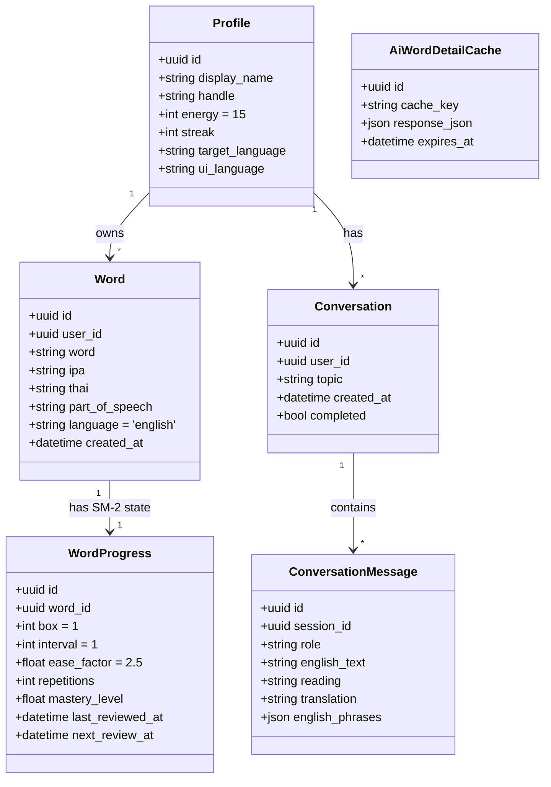

### 2.2 Service / Module Classes (จาก `app/_lib` + provider จริง)

```mermaid
classDiagram
    class WordStatusProvider {
        <<Context>>
        +getStatus(word) WordStatus
        +getEntry(word) WordBankEntry
        +addWord(word) void
        +removeWord(word) void
        +reviewWord(word, quality) void
    }
    class SpacedRepetition {
        <<module spacedRepetition.ts>>
        +createInitialProgress() Progress
        +recalculateProgress(progress, quality) Progress
    }
    class WordStatusDerivation {
        <<module>>
        +deriveStatus(entry, now) WordStatus
    }
    class ChatApi {
        <<hook useChatApi>>
        +send(messages) Promise<ChatResponse>
        +parseChatResponse(text) ChatResponse
    }
    class FlashcardGame🟡 {
        <<Phase 2 UI — /refresh>>
        +loadDueCards() Word[]
        +submitScore(word, quality) void
    }

    WordStatusProvider --> SpacedRepetition : reviewWord ใช้ recalculate
    WordStatusProvider --> WordStatusDerivation : คำนวณสีคำ
    FlashcardGame🟡 --> WordStatusProvider : reviewWord()
    FlashcardGame🟡 --> WordStatusDerivation : loadDueCards (next_review_at<=now)
```

---

## 3. Sequence Diagrams (ฟีเจอร์หลัก)

### 3.1 แชต AI (UC2) ✅

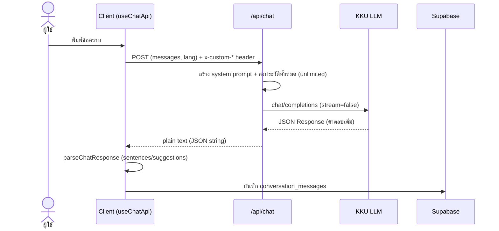

### 3.2 คลิกคำ → เก็บลงคลัง + backfill (UC3) ✅

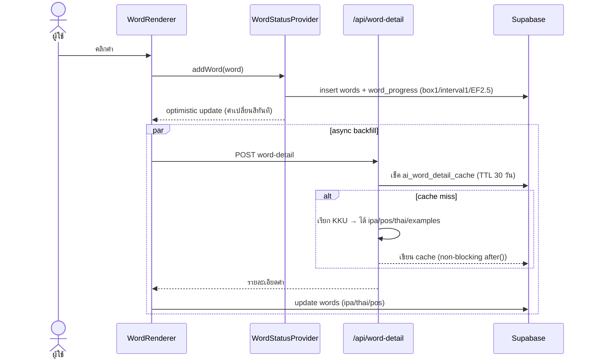

### 3.3 เล่นเกมแฟลชการ์ด → SM-2 (UC5/UC9) 🟡

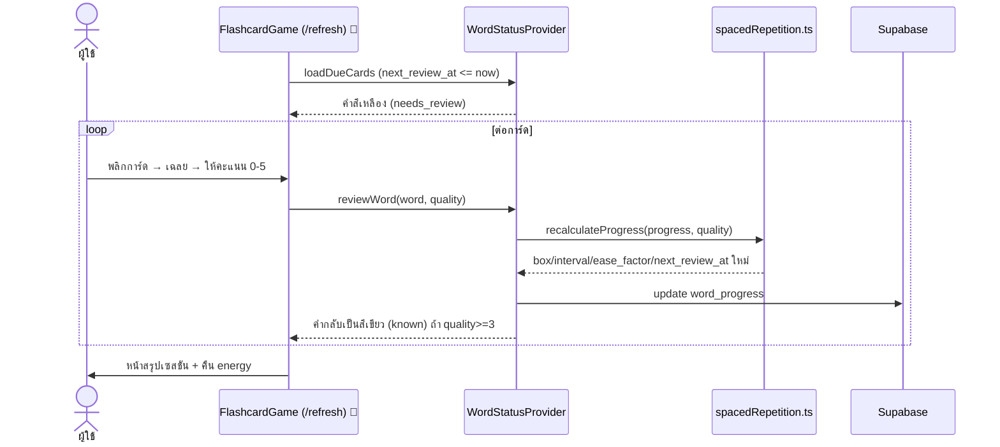

---

## 4. State Diagrams

### 4.1 สถานะคำศัพท์ (จาก `wordStatusDerivation.ts`) ✅

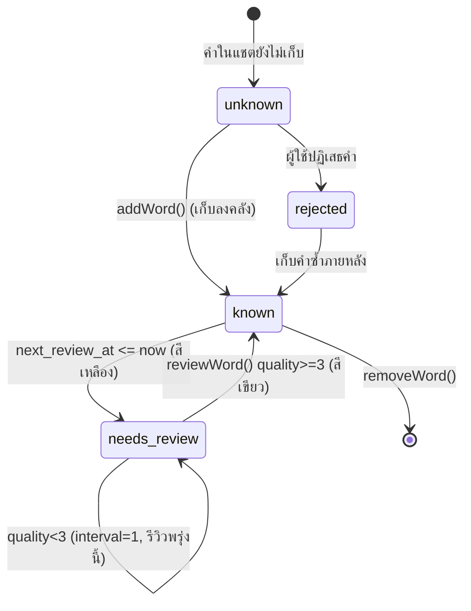

### 4.2 วงจร SM-2 ต่อคำ (จาก `spacedRepetition.ts`)

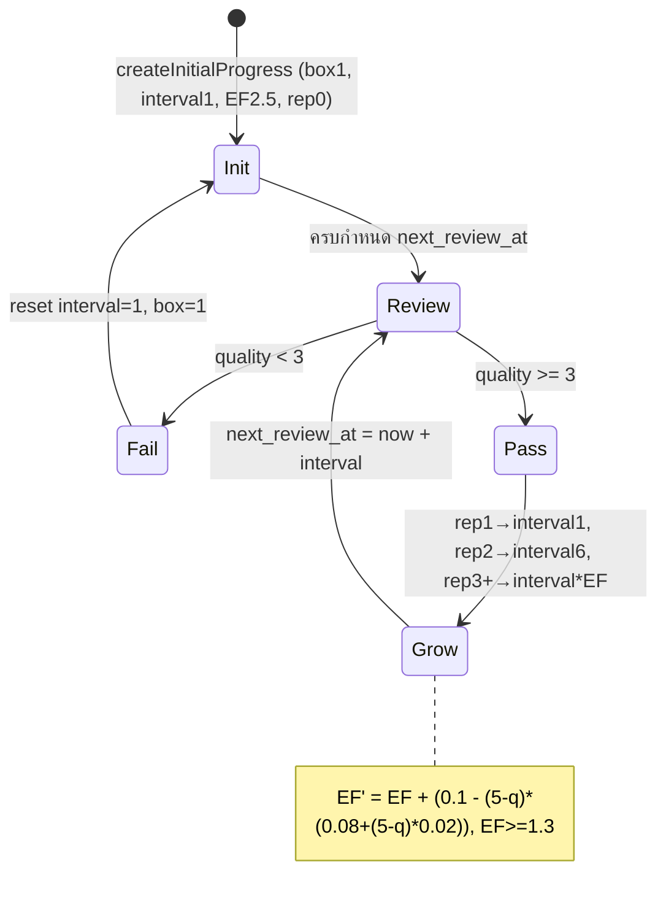

---

## 4-bis. State Diagrams ของฟีเจอร์แชต (`app/chat/_lib`)

> ครบทุก hook ที่มี state จริงในแชต — แต่ละตัวคือ state machine แยก ทำงานประสานกันใน `/chat`
> ลำดับชั้น: `useConversationSession` เป็นตัว orchestrate เรียก `useChatApi` (network) + `useConversationHistory` (persist); `useSTT`/`useTTS`/`useSuggestionPanel` เป็น state ฝั่ง UI/อุปกรณ์

### 4b.1 วงจรชีวิตเซสชัน — `useConversationSession`

```mermaid
stateDiagram-v2
    [*] --> Idle
    Idle --> NewSession : startSession(config) — gen uuid, messages=[], sessionSaved=false
    Idle --> Restoring : restoreSession(id, lang)
    Restoring --> Active : loadSessionMessages ✓ (sessionSaved=true)
    Restoring --> Active : load ล้ม → messages=[]
    NewSession --> Active : sendMessage ข้อความแรก → ensureSessionSaved() สร้างแถว conversations
    Active --> Active : sendMessage / retryLastMessage
    note right of NewSession : lazy persistence — ยังไม่สร้างแถวใน DB จนกว่ามีข้อความแรก<br/>(เปิด /chat เฉยๆ ไม่ทิ้งเซสชันว่าง); ข้อความแรก = topic (60 ตัวอักษร)
```

### 4b.2 วงจรชีวิตข้อความผู้ใช้ (user message) — แปลแบบ non-blocking

```mermaid
stateDiagram-v2
    [*] --> Translating : สร้าง user msg (status=sent, isTranslating=true) แสดงทันที + saveMessage
    Translating --> Translated : /api/translate คืน englishText → patch (reading/grammar) + saveMessage อีกรอบ
    Translating --> RawFallback : คืนว่าง / error / network → isTranslating=false ใช้ rawText
    Translated --> [*]
    RawFallback --> [*]
    note right of Translating : แปลเบื้องหลัง ไม่บล็อกการขอคำตอบ AI; แสดง skeleton จน resolve
```

### 4b.3 วงจรชีวิตข้อความ AI (assistant message)

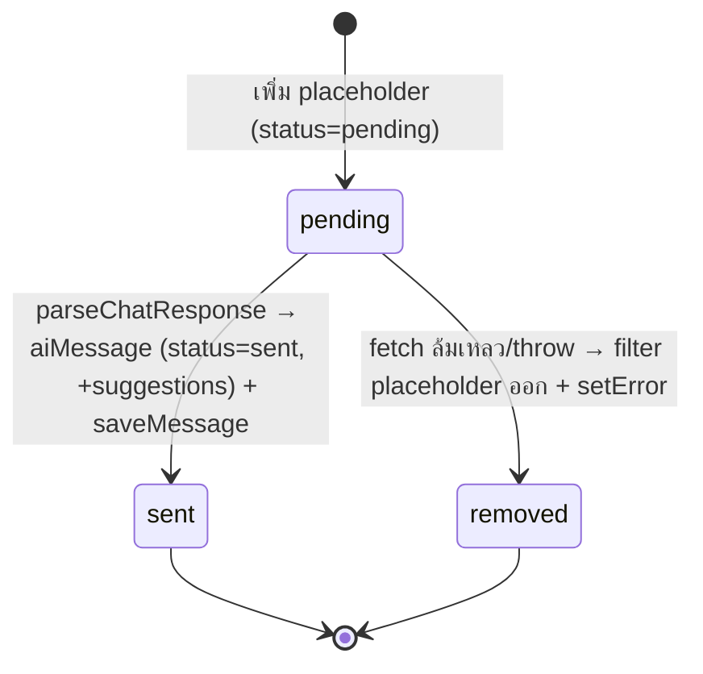

### 4b.4 ชั้น network — `useChatApi` (stateless)

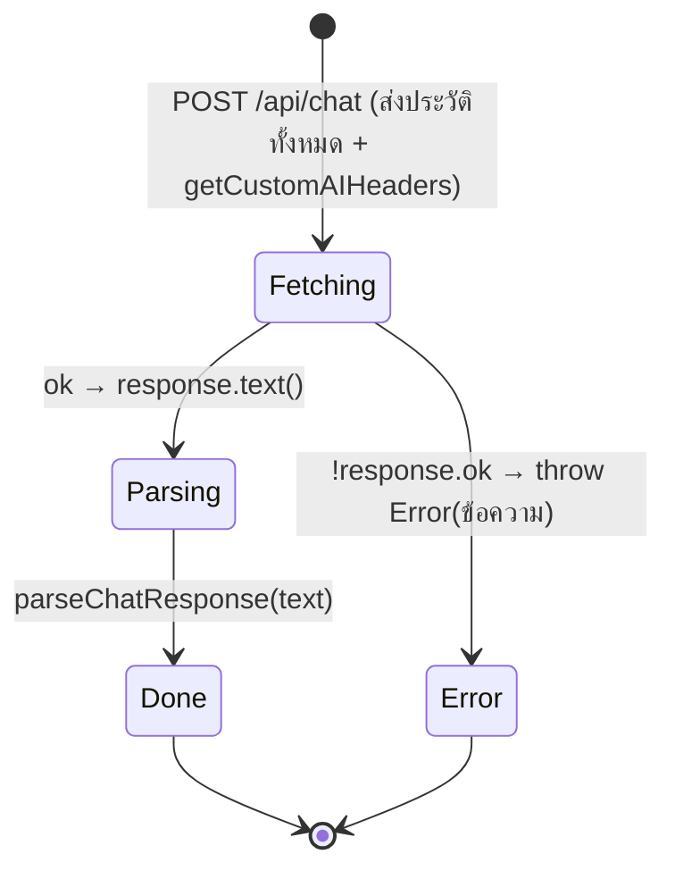

### 4b.5 ชั้น persist (CRUD) — `useConversationHistory`

ทุก op (`loadSessions` · `loadSessionMessages` · `saveSession` · `saveMessage` · `deleteSession`) ใช้ pattern เดียว:

```mermaid
stateDiagram-v2
    [*] --> Idle
    Idle --> Loading : เรียก op — isLoading=true, error=null
    Loading --> Idle : สำเร็จ — isLoading=false (อัปเดต sessions / คืน messages)
    Loading --> ErrorState : dbError → setError, isLoading=false, re-throw
    ErrorState --> Loading : เรียกใหม่
    note right of Loading : loadSessions/saveSession/deleteSession ต้อง auth.getUser() ก่อน<br/>ไม่มี user → คืนว่าง/throw; delete = cascade ลบ conversation_messages อัตโนมัติ
```

### 4b.6 รับเสียงพูด (STT) — `useSTT` (Web Speech API)

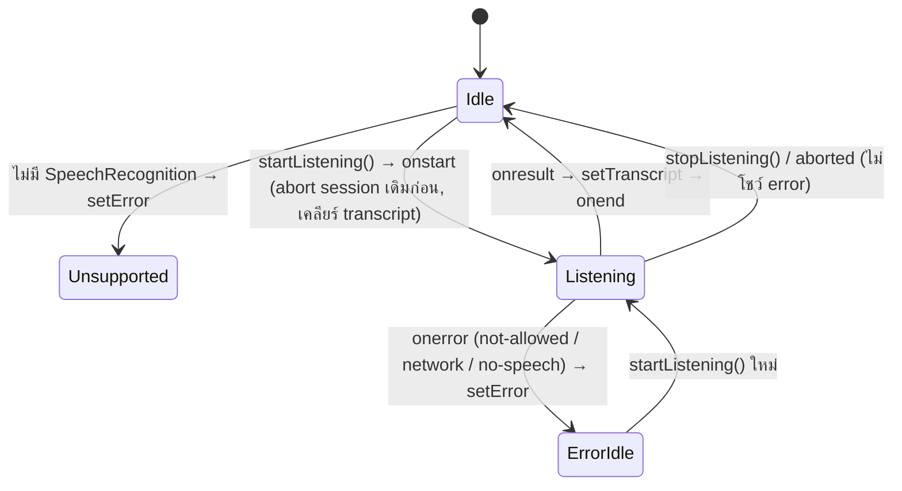

### 4b.7 เล่นเสียง (TTS) — `useTTS` (Google → fallback Web Speech)

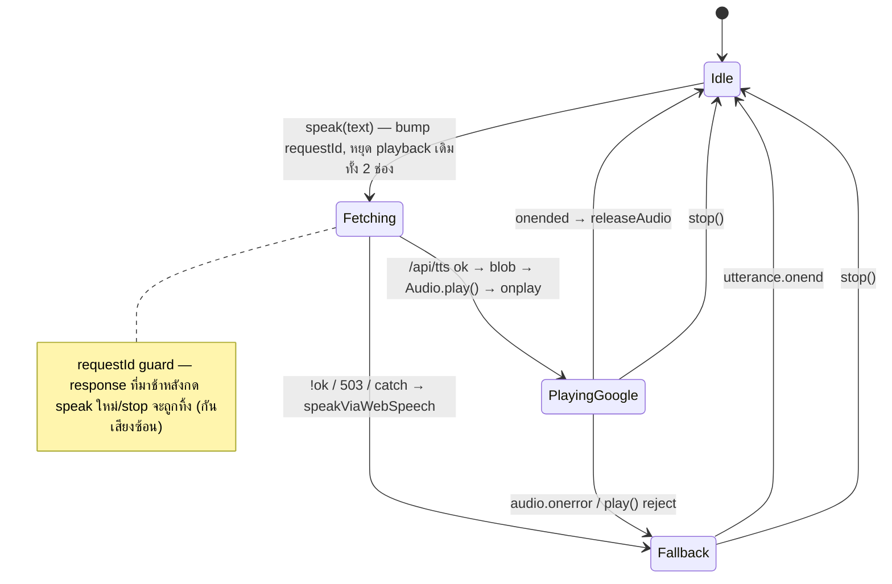

### 4b.8 พาเนลคำแนะนำการตอบ — `useSuggestionPanel` (UI)

```mermaid
stateDiagram-v2
    [*] --> Collapsed : default isOptionsCollapsed=true (ไม่เด้งเอง)
    Collapsed --> Animating : toggleOptions/handleToggleSuggestions
    Animating --> Expanded : หลัง 200ms (โชว์ตัวเลือกตอบ)
    Expanded --> Animating --> Collapsed : กดพับ
    Expanded --> Dismissed : "ข้าม" → setDismissedSuggestId(lastMessage.id)
    Collapsed --> Collapsed : AI ตอบใหม่ (lastMessage.id เปลี่ยน) → collapse อัตโนมัติ
    Dismissed --> Collapsed : AI ตอบ turn ถัดไป (optionsMode กลับมา)
    note right of Expanded : optionsMode = มี suggestions + ไม่ loading + ยังไม่ dismiss turn นี้
```

> **ภาพรวมการประสาน 1 รอบ sendMessage:** user msg (4b.2) แสดงทันที → แตกขนาน 3 ทาง: (ก) แปล background, (ข) ensureSessionSaved + saveMessage, (ค) runAssistantReply → useChatApi stream (4b.4) → assistant msg pending→sent (4b.3) → saveMessage. STT ป้อน input, TTS เล่นผล, SuggestionPanel โชว์ตัวเลือกหลัง AI ตอบ

---

## 5. Wireframe / UI Flow

### 5.1 Navigation flow ระดับหน้า

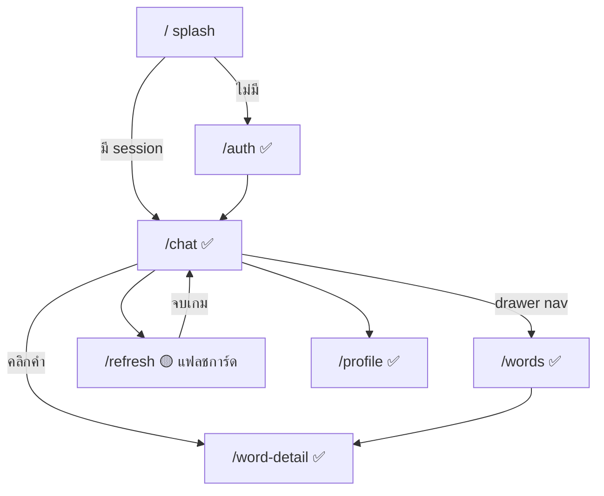

### 5.2 Wireframe หน้าหลัก (ASCII)

```
/chat (✅)                          /refresh (🔵 ออกแบบ)
┌───────────────────────────┐      ┌───────────────────────────┐
│ ☰  Tarnly          👤      │      │  ทบทวน 5 คำที่ครบกำหนด      │
├───────────────────────────┤      ├───────────────────────────┤
│ AI: Hello! [แปลไทย]        │      │      ┌───────────────┐    │
│     [grammar note]         │      │      │   apple  🔊   │    │  ด้านหน้า
│ คำคลิกได้: known·needs·new │      │      │   /ˈæp.əl/    │    │  (3D flip)
│                            │      │      └───────────────┘    │
│ You: I want an [apple]     │      │   พลิก → ไทย/POS/ประโยค    │
├───────────────────────────┤      ├───────────────────────────┤
│ [พิมพ์...]      🎤  ➤       │      │  0  1  2  3  4  5  (คะแนน) │
└───────────────────────────┘      └───────────────────────────┘
```

> wireframe เป็น low-fidelity เพื่อสื่อ layout/flow — รายละเอียด component จริงดู `frontend-architecture.md`
