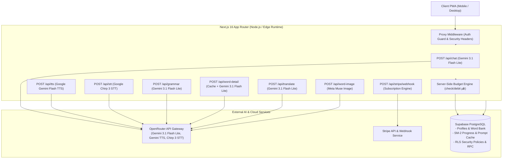

<div align="center">

# EvelyAI

[+%26+Micro-Budgeting+Engine;Next.js+16+%7C+React+19+%7C+Supabase+%7C+Gemini+3.1+Flash+Lite;Zero-Latency+Word+Detail+Cache+%26+Interactive+Mini-Games)](https://git.io/typing-svg)

<p>
  <strong>Mobile-First AI English Learning Partner with SM-2 Spaced Repetition & Micro-Budgeting Engine</strong><br>
  เว็บแอปพลิเคชัน Progressive Web App (PWA) ผู้ช่วยฝึกสนทนาภาษาอังกฤษสำหรับคนไทย ขับเคลื่อนด้วยสถาปัตยกรรม LLM,<br>
  ระบบคลังคำศัพท์ Spaced Repetition (SM-2), แอนิเมชันอินเทอร์แอ็กทีฟ และระบบควบคุมต้นทุนแบบ Micro-Baht (µ฿)
</p>

</div>

---

## 1. ข้อมูลโครงงานและข้อมูลจำเพาะ (Project Specifications)

| หัวข้อ | รายละเอียด |
|---|---|
| **ชื่อโครงงาน** | EvelyAI — แพลตฟอร์มการเรียนรู้ภาษาอังกฤษอัจฉริยะสำหรับคนไทย |
| **ประเภทโครงงาน** | ปริญญานิพนธ์ / Senior Project & Capstone Coursework |
| **สถาบันการศึกษา** | มหาวิทยาลัยขอนแก่น (Khon Kaen University) |
| **คณะ / สาขาวิชา** | วิทยาลัยการคอมพิวเตอร์ / สาขาวิชาวิทยาการคอมพิวเตอร์และเทคโนโลยีสารสนเทศ |
| **เวอร์ชันปัจจุบัน** | 0.1.0 |
| **รูปแบบแอปพลิเคชัน** | Mobile-First Progressive Web App (PWA) |
| **เฟรมเวิร์กหลัก** | Next.js 16.2.6 (App Router, Turbopack) / React 19.2.4 |
| **ภาษาหลัก** | TypeScript 5.0 (Strict Mode) |
| **ฐานข้อมูลและการยืนยันตัวตน** | Supabase (PostgreSQL 15+, Row Level Security, RPC Functions) |
| **ระบบประมวลผล AI** | OpenRouter (Google Gemini 3.1 Flash Lite, Gemini Flash TTS, Google Chirp 3 STT) |
| **การควบคุมต้นทุน** | Token-to-Micro-Baht Engine (Server-Side RPC) |
| **สถานะการทดสอบ** | Vitest 4.1.7 (29 test files, 229 passed) |

---

## 2. ตารางสรุปฟังก์ชันหลักของระบบ (Core Capabilities Matrix)

| ฟังก์ชัน | กลไกการทำงาน | สถาปัตยกรรมทางเทคนิค | คุณค่าต่อผู้เรียนและการดำเนินงาน |
|---|---|---|---|
| **Contextual AI Chat** | สนทนาภาษาอังกฤษแบบโต้ตอบตามบริบท พร้อมแท็กอารมณ์เสียง | Google Gemini 3.1 Flash Lite via OpenRouter | ผู้เรียนได้ฝึกฝนบทสนทนาที่เป็นธรรมชาติและตอบสนองเร็ว |
| **One-Tap Word Capture** | แตะคำศัพท์ในแชทเพื่อเปิดดูความหมาย คำแปล ชนิดคำ และตัวอย่าง | Regex Tokenizer + SHA-256 Prompt Versioned Cache | เรียนรู้คำศัพท์ได้ทันทีโดยไม่ต้องสลับแอป และลด Token ได้กว่า 80% |
| **SM-2 Spaced Repetition** | คำนวณรอบทบทวนคำศัพท์ตามระดับความจำ (SuperMemo 2) | PostgreSQL Trigger + Interval & Ease Factor Algorithm | จดจำคำศัพท์ระยะยาวได้อย่างแม่นยำ ไม่ลืมคำศัพท์ที่บันทึก |
| **Interactive Mini-Games** | ทบทวนคำศัพท์ผ่านเกม Matching, Typing และ Speaking | React State Machine + Web Speech API + STT API | การทบทวนสนุก ไม่น่าเบื่อ วัดผลความถูกต้องแบบเรียลไทม์ |
| **Micro-Baht Budgeting** | จำกัดงบประมาณค่า AI รายวันของผู้ใช้แบบละเอียดระดับไมโครบาท | Supabase RPC Functions (`check_budget`, `debit_budget`) | ป้องกันปัญหางบประมาณบานปลาย และบริหารต้นทุน API ได้คุ้มค่า |
| **Data Privacy & PDPA** | ทำความสะอาดประวัติแชทอัตโนมัติ และรองรับการลบบัญชีถาวร | PostgreSQL `pg_cron` (ล้างทุก 3 วัน) + Cascade Deletion | เป็นไปตามมาตรฐานความปลอดภัยและความเป็นส่วนตัวของผู้ใช้ |

---

## 3. สถาปัตยกรรมระบบ (System Architecture)



### ตารางเปรียบเทียบบริการภายนอกและโมเดล AI (External Services Matrix)

| บริการ / เส้นทาง | ผู้ให้บริการ | โมเดล / เทคโนโลยี | กลยุทธ์ Caching & Latency | บทบาทในระบบ |
|---|---|---|---|---|
| **Chat & Conversation** | OpenRouter | `google/gemini-3.1-flash-lite` | Streaming / Context Trimming | จัดการบทสนทนาโต้ตอบและประเมินระดับภาษา |
| **Grammar Correction** | OpenRouter | `google/gemini-3.1-flash-lite` | Direct Extraction | ตรวจสอบไวยากรณ์พร้อมอธิบายเป็นภาษาไทย |
| **Word Detail** | Supabase + OpenRouter | `google/gemini-3.1-flash-lite` | SHA-256 Cache Table (Permanent) | แสดงคำแปล นิยาม ชนิดคำ และตัวอย่างประโยค |
| **Speech-to-Text (STT)** | OpenRouter | `google/chirp-3` | Direct Audio Forwarding | ถอดเสียงผู้เรียนในเกมฝึกออกเสียง (Speak Game) |
| **Text-to-Speech (TTS)** | OpenRouter | `google/gemini-3.1-flash-tts-preview` | Client Audio Cache + Web Speech fallback | สังเคราะห์เสียงพูดตามระดับอารมณ์ (Emotional TTS) |
| **Word Image Illustration** | OpenRouter | `meta/muse-image` | Database Image URL Storage | สร้างภาพประกอบคำศัพท์เพื่อช่วยเสริมการจำ |
| **Payment & Billing** | Stripe | Customer Portal & Webhook | Idempotent Event Processing | จัดการระบบสมัครสมาชิกรายเดือน (Subscription) |

---

## 4. สแต็กเทคโนโลยีที่ใช้งาน (Comprehensive Tech Stack Matrix)

| ส่วนของระบบ | รายชื่อเทคโนโลยี | เวอร์ชัน | หน้าที่และความรับผิดชอบ |
|---|---|---|---|
| **Core Framework** | Next.js | 16.2.6 | App Router, Server Components, API Route Handlers |
| **UI Library** | React | 19.2.4 | โครงสร้าง Component, React Hooks และ Concurrent Rendering |
| **Styling System** | Tailwind CSS | 4.0.0 | Neobrutalist Design System, CSS Variables, Theme Dark/Light |
| **Animations & Motion** | CSS Keyframes + Motion | 12.42.2 | Micro-interactions, Mascot Lifecycle, Card Swipes, Transitions |
| **Iconography** | Lucide React | 1.21.0 | SVG Icons สำหรับเมนูและสถานะการใช้งาน |
| **Backend & Database** | Supabase PostgreSQL | 15+ | ฐานข้อมูลเชิงสัมพันธ์, Row Level Security, Triggers, RPC |
| **Authentication** | Supabase Auth (@supabase/ssr) | 0.10.3 | จัดการ Cookie Session, SSR Auth Guard, Middleware Guard |
| **Payment Gateway** | Stripe Node SDK | 22.3.0 | Checkout Sessions, Billing Portal, Webhook Signature Verification |
| **Test Runner** | Vitest | 4.1.7 | Unit Testing, Component Testing, Edge Cases Verification |
| **Testing Utilities** | React Testing Library | 16.3.2 | DOM Simulation, Hook Testing, User Interaction Tests |

---

## 5. ระบบแอนิเมชันและการตอบสนองต่อผู้ใช้ (UI Animation & Micro-Interactions Matrix)

ระบบออกแบบตามแนวคิด **Tactile Neobrutalism** ที่มีการตอบสนองอย่างเป็นธรรมชาติ พร้อมรองรับผู้ใช้ที่เปิดโหมดลดการเคลื่อนไหว (Accessibility: Reduced Motion):

| ชื่อคลาส / แอนิเมชัน | องค์ประกอบเป้าหมาย | จังหวะเวลา (Timing / Easing) | ทริกเกอร์การทำงาน (Trigger) | การจัดการ Accessibility |
|---|---|---|---|---|
| `.mascot-breathe` | มาสคอตช้าง Evely | 3.0s `ease-in-out` (Infinite) | เมื่ออยู่ในสถานะพัก (Idle State) | ปิดอัตโนมัติเมื่อตรวจพบ `prefers-reduced-motion` |
| `.mascot-think` | มาสคอตช้าง Evely | 0.9s `ease-in-out` (Infinite) | ระหว่างรอ AI ประมวลผลคำตอบ | ปิดอัตโนมัติเมื่อตรวจพบ `prefers-reduced-motion` |
| `.mascot-bounce` | มาสคอตช้าง Evely | 0.6s `ease-in-out` | เมื่อผู้ใช้ส่งข้อความหรือทำคะแนนผ่าน | ปิดอัตโนมัติเมื่อตรวจพบ `prefers-reduced-motion` |
| `.mascot-eyes-look` | ดวงตาของมาสคอต | 4.0s `ease-in-out` (Infinite) | แอนิเมชันกวาดสายตาแบบสุ่ม | ปิดอัตโนมัติเมื่อตรวจพบ `prefers-reduced-motion` |
| `.animate-mascot-pop-in` | กรอบมาสคอต | 0.45s `cubic-bezier(0.34, 1.56, 0.64, 1)` | เมื่อเปิดหน้าต่างแชทครั้งแรก | แสดงผลทันทีโดยไม่หมุนหรือเด้งขยาย |
| `.animate-bubble-pop-in` | กล่องข้อความ AI | 0.45s `cubic-bezier(0.34, 1.56, 0.64, 1)` | เมื่อข้อความ AI ปรากฏในหน้าจอ | แสดงผลทันทีโดยไม่สเกล |
| `.animate-user-bubble-pop-in` | กล่องข้อความผู้ใช้ | 0.45s `cubic-bezier(0.34, 1.56, 0.64, 1)` | เมื่อผู้ใช้ส่งข้อความใหม่เข้าห้องแชท | แสดงผลทันทีโดยไม่สเกล |
| `.animate-word-reveal` | คำศัพท์ในการ์ด | 0.25s `ease-out` | เมื่อแตะคำศัพท์เพื่อดูความหมาย | แสดงผลทันทีโดยไม่เฟด |
| `.animate-shake` | การ์ดคำศัพท์ / ปุ่ม | 0.4s `ease` (สั่นซ้าย-ขวา) | ตอบผิดใน Matching Game หรือ Speak Game | เปลี่ยนสีแจ้งเตือนแทนการสั่น |
| `.animate-card-in` | การ์ดคำถามมินิเกม | 0.35s `cubic-bezier(0.25, 0.46, 0.45, 0.94)` | เมื่อเปลี่ยนข้อคำถามใหม่ | โหลดแทนที่ทันที |
| `.animate-card-out` | การ์ดคำถามมินิเกม | 0.45s `cubic-bezier(0.4, 0, 0.2, 1)` | เมื่อตอบคำถามข้อปัจจุบันสำเร็จ | ซ่อนทันที |
| `.animate-card-fade-in` | คอนเทนเนอร์หน้าจอ | 0.45s `cubic-bezier(0.215, 0.61, 0.355, 1)` | เมื่อโหลดหน้า Profile, Billing, Edit | แสดงผลทันที |

---

## 6. โครงสร้างฐานข้อมูลหลัก (Database Schema Matrix)

| ชื่อตาราง | วัตถุประสงค์หลัก | คอลัมน์สำคัญ | นโยบายความปลอดภัย (RLS) | การจัดการวงจรข้อมูล (Lifecycle) |
|---|---|---|---|---|
| `profiles` | จัดเก็บข้อมูลผู้ใช้และงบประมาณ | `id`, `email`, `subscription_tier`, `daily_budget_micro_baht`, `daily_spent_micro_baht`, `last_budget_reset` | ผู้ใช้ดูและแก้ไขเฉพาะแถวของตนเอง | คงอยู่ถาวรตลอดอายุบัญชี |
| `word_bank` | คลังคำศัพท์ส่วนตัวของผู้เรียน | `id`, `user_id`, `word`, `translation`, `definition`, `pos`, `next_review`, `interval_days`, `ease_factor`, `repetitions`, `status` | ผู้ใช้เข้าถึงเฉพาะคำศัพท์ของตนเอง | อัปเดตรอบทบทวนผ่าน SM-2 Engine |
| `ai_word_detail_cache` | แคชความหมายคำศัพท์ส่วนกลาง | `prompt_hash` (PK), `word`, `language`, `result` (JSONB), `created_at` | ทุกคนที่ยืนยันตัวตนอ่านได้ (Public Read) | เก็บถาวรเพื่อลด Token ซ้ำ |
| `word_images` | แคชรูปภาพประกอบคำศัพท์ | `word` (PK), `image_url`, `created_at` | ทุกคนอ่านได้ เขียนผ่าน Service Role | เก็บถาวร |
| `conversations` | ห้องสนทนาภาษาอังกฤษ | `id`, `user_id`, `title`, `created_at`, `updated_at` | ผู้ใช้เข้าถึงเฉพาะห้องของตนเอง | ลบข้อความอัตโนมัติทุก 3 วันผ่าน `pg_cron` |
| `chat_messages` | รายการข้อความในแต่ละห้อง | `id`, `conversation_id`, `role`, `content`, `audio_url`, `created_at` | ตรวจสอบสิทธิ์ผ่าน Foreign Key ห้องแชท | ล้างข้อมูลอัตโนมัติทุก 3 วันตาม PDPA |
| `budget_logs` | บันทึกประวัติการหักงบประมาณ | `id`, `user_id`, `amount_micro_baht`, `operation`, `created_at` | ผู้ใช้ดูประวัติของตนเองได้ | จัดเก็บเพื่อตรวจสอบย้อนหลัง |

---

## 7. ข้อกำหนดเส้นทาง API (REST API Endpoints Matrix)

| เมธอด | เส้นทาง (Endpoint) | สิทธิ์เข้าถึง (Auth) | ตัดงบประมาณ (µ฿) | หน้าที่และรูปแบบข้อมูลตอบกลับ |
|---|---|---|---|---|
| `POST` | `/api/chat` | Session Token | มี (หักตาม Token) | ส่งข้อความสนทนา ตอบกลับเป็นข้อความ AI พร้อมแท็กอารมณ์ |
| `POST` | `/api/grammar` | Session Token | มี (หักตาม Token) | ตรวจแก้ไวยากรณ์พร้อมส่งคำอธิบายภาษาไทย |
| `POST` | `/api/word-detail` | Session Token | มี (เฉพาะ Cache Miss) | คืนค่าโครงสร้างคำแปล, คำนิยาม, ชนิดคำ และประโยคตัวอย่าง |
| `POST` | `/api/word-image` | Session Token | มี | สร้างภาพประกอบคำศัพท์ด้วยโมเดลภาพ Generative AI |
| `POST` | `/api/translate` | Session Token | มี | แปลข้อความภาษาอังกฤษเป็นภาษาไทยตามบริบทแชท |
| `POST` | `/api/tts` | Session Token | มี | สังเคราะห์เสียงพูดภาษาอังกฤษเป็นไฟล์เสียง Audio Stream |
| `POST` | `/api/stt` | Session Token | มี | แปลงเสียงพูดผู้ใช้เป็นข้อความภาษาอังกฤษเพื่อตรวจคำตอบ |
| `POST` | `/api/stripe/checkout` | Session Token | ไม่มี | สร้าง Stripe Checkout Session สำหรับสมัครสมาชิกระดับ Premium |
| `POST` | `/api/stripe/portal` | Session Token | ไม่มี | สร้างลิงก์เข้าสู่ Stripe Customer Billing Portal |
| `POST` | `/api/stripe/webhook` | Stripe Signature | ไม่มี | ประมวลผลสถานะการชำระเงินและอัปเดตระดับ `profiles` |
| `POST` | `/api/account/reset-learning` | Session Token | ไม่มี | รีเซ็ตประวัติคลังคำศัพท์และสถิติ SM-2 ทั้งหมด |
| `POST` | `/api/account/delete` | Session Token | ไม่มี | ลบบัญชีผู้ใช้และข้อมูลที่เกี่ยวข้องทั้งหมดแบบ Cascade (PDPA) |

---

## 8. อัลกอริทึมการจำและมินิเกมทบทวน (SM-2 Algorithm & Mini-Games Matrix)

ระบบประยุกต์ใช้อัลกอริทึม SuperMemo 2 (SM-2) ในการคำนวณช่วงเวลาการทบทวนซ้ำ:

$$I(1) = 1, \quad I(2) = 6, \quad I(n) = I(n-1) \times EF$$

$$EF' = EF + (0.1 - (5 - q) \times (0.08 + (5 - q) \times 0.02))$$

| มินิเกม | รูปแบบการเล่น | เกณฑ์การให้คะแนนคุณภาพ ($q: 0-5$) | ผลกระทบต่อรอบทบทวน ($I(n)$ และ $EF$) |
|---|---|---|---|
| **Matching Game** | จับคู่คำศัพท์ภาษาอังกฤษกับการ์ดคำแปลภาษาไทย | - ถูกต้องในครั้งแรก: $q = 5$<br>- ผิด 1 ครั้ง: $q = 3$<br>- ผิดมากกว่า 1 ครั้ง: $q = 1$ | หาก $q \ge 3$ จะเพิ่ม $I(n)$ และปรับ $EF$<br>หาก $q < 3$ จะรีเซ็ต $I(n) = 1$ |
| **Typing Game** | พิมพ์สะกดคำศัพท์ภาษาอังกฤษตามคำใบ้ภาษาไทย | - พิมพ์ถูกโดยไม่กดเฉลย: $q = 5$<br>- มีการแก้ไขคำตอบ: $q = 4$<br>- กดดูคำเฉลย: $q = 0$ | ช่วยฝึกความแม่นยำในการสะกดคำ<br>คำที่สะกดผิดจะถูกนำกลับมาทบทวนในวันถัดไป |
| **Speak Game** | ฝึกออกเสียงคำศัพท์ผ่านระบบตรวจจับเสียงพูด | - ออกเสียงถูกต้องชัดเจน: $q = 5$<br>- ใกล้เคียงแต่มีเพี้ยนเล็กน้อย: $q = 3$<br>- ไม่ตรงหรือหมดเวลา: $q = 1$ | ประเมินความมั่นใจและการออกเสียงสัทศาสตร์<br>กระตุ้นความคุ้นเคยกับการใช้เสียงจริง |

---

## 9. โครงสร้างการควบคุมงบประมาณ (Micro-Baht Budgeting Tier Matrix)

ระบบควบคุมต้นทุนแบบ **Micro-Baht Engine** เพื่อบริหารจัดการค่าใช้จ่ายโมเดล AI อย่างเคร่งครัด:

| แผนการใช้งาน (Tier) | งบประมาณรายวัน (µ฿) | เทียบเท่างบประมาณจริง | สิทธิ์การเข้าถึงฟีเจอร์ | พฤติกรรมเมื่อใช้งานเต็มโควตา (HTTP 429) |
|---|---|---|---|---|
| **Free Tier** | 20,000 µ฿ / วัน | 0.020 บาท / วัน | สนทนาพื้นฐาน, บันทึกคำศัพท์, เล่นมินิเกม SM-2 | แสดง Banner แจ้งเตือนงบเต็ม ปิดการส่งข้อความ AI จนกว่าจะรีเซ็ตวันใหม่ |
| **Premium Tier** | 50,000 µ฿ / วัน | 0.050 บาท / วัน | ปลดล็อก AI Grammar Correction, คำแนะนำรูปประโยค, เสียงสังเคราะห์ขั้นสูง | มีการแจ้งเตือนระดับงบประมาณ สามารถใช้งานต่อได้ตามเพดานที่ขยายเพิ่ม |
| **Unlimited (Admin)** | Unlimited | ไม่จำกัด | เข้าถึงฟีเจอร์สำหรับตรวจสอบและทดสอบระบบได้ทั้งหมด | ไม่มีการจำกัดอัตราการเรียกใช้งาน API |

---

## 10. รายงานชุดการทดสอบและประกันคุณภาพ (Test Suite & QA Matrix)

รันชุดการทดสอบทั้งหมดผ่านคำสั่ง `npm test` ผลการทดสอบปัจจุบัน: **29 Test Files, 229 Tests Passed (100%)**

| หมวดหมู่การทดสอบ | ไฟล์ทดสอบหลัก | จำนวนเคสที่ผ่าน | ขอบเขตการทดสอบที่ครอบคลุม |
|---|---|---|---|
| **Chat & LLM Pipeline** | `parseChatResponse.test.ts`<br>`buildContext.test.ts`<br>`validateMessage.test.ts` | 39 ผ่าน | การตัดบริบทประวัติแชท, ตรวจสอบ JSON Schema, แยก Emotion Tags |
| **Spaced Repetition (SM-2)** | `spacedRepetition.test.ts`<br>`quality.test.ts`<br>`wordStatusDerivation.test.ts` | 43 ผ่าน | การคำนวณสูตร SM-2, การปรับ Ease Factor, สถานะ Due / Learned |
| **Audio Processing (STT/TTS)** | `sttRoute.test.ts`<br>`useTTS.test.ts` | 18 ผ่าน | การส่งต่อเสียง OpenRouter, Web Speech Fallback, การตัด Emotion Tags |
| **User Profile & State** | `useUserProfile.test.ts`<br>`useTheme.test.ts`<br>`useDataReset.test.ts` | 28 ผ่าน | สลับธีม Neobrutalist, รีเซ็ตข้อมูลตาม PDPA, อัปเดตข้อมูลผู้ใช้ |
| **UI Components** | `ChatInput.test.tsx`<br>`WordOverlay.test.tsx`<br>`WordDetailPopup.test.tsx` | 35 ผ่าน | ป๊อปอัปคำศัพท์, การกดบันทึกคำศัพท์, แอนิเมชันปุ่มและช่องพิมพ์ |
| **Review Games** | `SpeakGame.test.tsx`<br>`SummaryScreen.test.tsx` | 9 ผ่าน | การเปลี่ยนการ์ดมินิเกม, การคำนวณสรุปผลคะแนน, แอนิเมชันผลลัพธ์ |
| **Billing & Webhooks** | `syncSession.test.ts`<br>`subscriptionStatus.test.ts` | 4 ผ่าน | การเชื่อมโยง Session Stripe, การยืนยันสถานะสมาชิกระดับพรีเมียม |
| **Internationalization** | `languagePrompt.test.ts`<br>`ActiveLanguageContext.test.tsx` | 7 ผ่าน | การสลับภาษาเป้าหมายและการส่ง System Prompt |
| **Tokenizer & Utilities** | `wordTokenizer.test.ts`<br>`wordBankRow.test.ts`<br>`relativeTime.test.ts` | 30 ผ่าน | การตัดคำภาษาอังกฤษ, การฟอร์แมตเวลา, ตรวจสอบข้อมูลแถวคลังศัพท์ |
| **อื่นๆ** | Test Files เพิ่มเติมในโมดูลย่อย | 16 ผ่าน | การคงอยู่ของ Suggestion Panel, Helper Functions ต่างๆ |

---

## 11. ตารางบัญชีทดสอบสำเร็จรูป (Demo Accounts Matrix)

บัญชีทั้งหมดถูกสร้างขึ้นอัตโนมัติเมื่อรันสคริปต์ [supabase/seed.sql](supabase/seed.sql):

| บทบาทบัญชี | อีเมลเข้าสู่ระบบ | รหัสผ่าน | ข้อมูลเริ่มต้นในระบบ | วัตถุประสงค์ในการทดสอบ |
|---|---|---|---|---|
| **Free User** | `free-demo@evelyai.local` | `demo1234` | มี 16 คำศัพท์ (6 คำครบกำหนดทบทวนใน `/refresh`) | ทดสอบแชทปกติ แตะดูคำศัพท์ และเล่นมินิเกมทั้ง 3 โหมด |
| **Premium User** | `premium-demo@evelyai.local` | `demo1234` | สิทธิ์พรีเมียมพร้อมใช้งาน | ทดสอบแถบ AI Suggestions และฟังก์ชัน Grammar Correction |
| **Budget Max** | `budget-max@evelyai.local` | `demo1234` | งบประมาณรายวันถูกจำลองว่าใช้เต็มแล้ว | ทดสอบการแสดงผล Banner ป้องกันงบเกิน (HTTP 429 Throttle) |

---

## 12. ขั้นตอนการติดตั้งและเริ่มต้นใช้งาน (Step-by-Step Setup)

### 1. ความต้องการขั้นต่ำของระบบ
- Node.js เวอร์ชัน 20.x หรือสูงกว่า
- บัญชีใช้งาน Supabase และ OpenRouter

### 2. การติดตั้งโค้ดและไลบรารี
```bash
git clone https://github.com/your-username/evelyai.git
cd evelyai
npm install
```

### 3. การตั้งค่าตัวแปรสภาพแวดล้อม (Environment Variables)
```bash
cp .env.example .env
```
กำหนดค่าคีย์ในไฟล์ `.env` ให้ครบถ้วน (สามารถใส่ `STRIPE_SECRET_KEY=sk_test_mock` สำหรับการทดสอบเบื้องต้น)

### 4. การติดตั้งฐานข้อมูล (Database Migrations)
1. เปิด **Supabase Dashboard** เข้าสู่หัวข้อ **SQL Editor**
2. รันสคริปต์ [supabase/migrations/0000_initial_schema.sql](supabase/migrations/0000_initial_schema.sql)
3. รันสคริปต์ [supabase/seed.sql](supabase/seed.sql) เพื่อนำเข้าชุดข้อมูลทดสอบ

### 5. การรันเซิร์ฟเวอร์สำหรับพัฒนา (Development Mode)
```bash
npm run dev
```
เปิดเบราว์เซอร์แล้วเข้าสู่ `http://localhost:3000`

### 6. การทดสอบและตรวจสอบคุณภาพโค้ด
```bash
npm test          # รันชุดการทดสอบ Vitest (229 ผ่าน)
npm run lint      # ตรวจสอบความถูกต้องของโค้ดด้วย ESLint 9
npx tsc --noEmit  # ตรวจสอบความถูกต้องของ Type ด้วย TypeScript
npm run build     # ตรวจสอบการสร้าง Production Build
```

---

## 13. เอกสารอ้างอิงและคู่มือการออกแบบ (Documentation Index)

| ชื่อเอกสาร | เส้นทางไฟล์ | กลุ่มเป้าหมาย | เนื้อหาสำคัญ |
|---|---|---|---|
| **คู่มือการใช้งานและ 5-Minute Evaluator Tour** | [docs/user-manual.md](docs/user-manual.md) | ผู้ประเมิน / ผู้ใช้งาน | ลำดับการทดสอบฟังก์ชันสำคัญทั้งหมดภายใน 5 นาที |
| **ข้อกำหนดความต้องการระบบ (Requirements)** | [design-docs/requirements.md](design-docs/requirements.md) | นักพัฒนา / กรรมการ | Functional & Non-Functional Requirements, Flowchart |
| **การออกแบบฐานข้อมูล (Database Design)** | [design-docs/database-design.md](design-docs/database-design.md) | Database Architect | Data Dictionary, RLS Policies, Triggers, RPC |
| **แผนภาพคลาส (Class Diagram)** | [design-docs/class-diagram.md](design-docs/class-diagram.md) | Software Architect | ความสัมพันธ์ระหว่าง Entity และคลาสต่างๆ |
| **แผนภาพลำดับการทำงาน (Sequence Diagram)** | [design-docs/sequence-diagram.md](design-docs/sequence-diagram.md) | Software Architect | ลำดับขั้นตอนการทำงานของ Chat, Review, และ Budget Engine |
