```mermaid
graph TD
    %% Styling Definitions
    classDef client fill:#E8F0FE,stroke:#1A73E8,stroke-width:2px;
    classDef app fill:#E6F4EA,stroke:#137333,stroke-width:2px;
    classDef db fill:#FEF7E0,stroke:#B06000,stroke-width:2px;
    classDef ext fill:#FCE8E6,stroke:#C5221F,stroke-width:2px;

    %% Client Layer (มือถือเป็นหลัก)
    subgraph Client UI - Tarnly Next.js App
        A[ผู้เรียน / User Interface] -->|แชต / เล่นมินิเกม / ตั้งค่า / สมัคร Premium| B(แอปพลิเคชันหน้าบ้าน / SPA React)
        B -->|เล่นเสียง/บันทึกเสียง| C(Web Speech API STT/TTS)
        B -->|ดึงคำศัพท์จากแชท| D(Word Tokenizer)
        B -->|ทบทวนคำสีเหลือง| E(มินิเกม 4 แบบ: จับคู่ / เลือกความหมาย / พิมพ์ / ออกเสียง)
        B -->|โฆษณาหลังจบเกม เฉพาะผู้ใช้ฟรี| AD(โฆษณา Google AdSense)
    end

    %% API Layer
    subgraph Next.js Server - API Route Handlers
        B -->|ส่งข้อความ / โหมดเสียง| F(แชทบอท — ตัวเลือกการตอบเฉพาะ Premium)
        B -->|วิเคราะห์ไวยากรณ์/แปล| G(ตัวแปลภาษา + ตรวจไวยากรณ์)
        B -->|พูดผ่านไมค์| STT(ถอดเสียงเป็นข้อความ)
        B -->|คลิกคำ ดูรายละเอียด| R(รายละเอียดคำ + cache)
        B -->|สมัคร/จัดการสมาชิก| S(ระบบชำระเงิน Stripe)
        B -->|ลบบัญชี| DEL(ลบบัญชีถาวร PDPA)
    end

    %% External Services
    subgraph External
        ST{{Stripe — โหมดทดสอบ}}
        GA{{เครือข่ายโฆษณา AdSense}}
        H{{LLM API / KKU IntelSphere}}
    end
    F -->|ส่งประวัติแชท + System Prompt| H
    G --> H
    R --> H
    STT --> H
    S <-->|ชำระเงิน + แจ้งผลกลับ| ST
    AD -.-> GA

    %% Database & Cloud Service Layer
    subgraph Storage Layer - Supabase Cloud
        B -->|ล็อกอิน / รีเซ็ตรหัสผ่าน| J((Supabase Auth))
        
        subgraph PostgreSQL Database
            L[(ห้องสนทนา: conversations)]
            M[(ข้อความแชท: conversation_messages)]
            N[(คลังคำศัพท์: words)]
            P[(สถานะ SM-2: word_progress)]
            Q[(ผู้ใช้ + สถานะสมาชิก: profiles)]
            WC[(cache รายละเอียดคำ: ai_word_detail_cache)]
        end
        
        B -->|สร้างห้องแชทใหม่| L
        B -->|บันทึกข้อความสนทนา| M
        B -->|บันทึกคำศัพท์| N
        B -->|สลับธีม / อัปเดตบัญชี / ดูการใช้งาน| Q
        R -->|เก็บ cache ใช้ร่วมกัน| WC
        S -->|แจ้งผลอัปเดตสมาชิก + โควต้า| Q
        DEL -->|ลบข้อมูล + บัญชี| Q
        E -->|ส่งคะแนน 0-5 เข้า SM-2 Engine| O(Spaced Repetition: SM-2 Engine)
        O -->|คำนวณรอบวันถัดไปและค่าความจำ| P
        P -.->|อัปเดตสถานะสีคำศัพท์ เขียว/เหลือง| B
        CRON[(pg_cron)] -.->|ลบแชตเก่ากว่า 3 วัน| M
    end

    %% Apply Styles
    class B,C,D,E,AD client;
    class F,G,R,S,DEL,STT app;
    class ST,GA ext;
    class J,L,M,N,P,Q,WC,O,CRON db;
```

# Tarnly — ภาพรวมระบบ (Product Overview)

> เอกสารนี้มีโครงสร้างเหมือน Requirements.md ทุกประการ แต่อธิบายในภาษาที่เข้าใจได้โดยไม่ต้องมีพื้นฐานด้านโค้ด
> สำหรับรายละเอียดเชิงเทคนิค ดูที่ [Requirements.md](Requirements.md)

---

# ความเป็นมาและความสำคัญของปัญหา (Background and Significance)

ในยุคปัจจุบัน ทักษะการสื่อสารภาษาอังกฤษมีความสำคัญอย่างยิ่งทั้งในด้านการทำงานและการศึกษา ทว่าผู้เรียนชาวไทยจำนวนมากประสบปัญหาขาดโอกาสในการใช้งานภาษาอังกฤษในชีวิตจริงเนื่องจากความประหม่า ความขลาดอาย ขาดคู่สนทนาที่เป็นเจ้าของภาษา หรือการเข้าถึงแหล่งฝึกฝนที่มีราคาสูง การเรียนรู้แบบดั้งเดิมมักเน้นย้ำเรื่องไวยากรณ์จากการอ่านและการท่องจำคำศัพท์จากตารางคำแปล ซึ่งไม่มีการเชื่อมโยงความหมายกับบริบทการใช้งานจริง ส่งผลให้ผู้เรียนไม่สามารถจดจำศัพท์ได้อย่างยั่งยืนและขาดความมั่นใจเมื่อเผชิญสถานการณ์จริง

จากปัญหาดังกล่าว โครงงาน **Tarnly** จึงพัฒนาเว็บแอปพลิเคชันคู่สนทนาอัจฉริยะ (AI Chat Partner) ที่สามารถสนทนาโต้ตอบด้วยข้อความหรือเสียงได้ตลอดเวลา โดยทำหน้าที่เป็นคู่สนทนาภาษาอังกฤษเสมือน (AI Conversation) ที่ผู้เรียนสามารถพูดคุยโต้ตอบในหัวข้อต่างๆได้อย่างเป็นธรรมชาติ เพื่อฝึกทักษะการสื่อสารโดยไม่ต้องกังวลเรื่องการทำผิดพลาด

ขณะทำการสนทนา ระบบจะทำการแปลภาษาแบบกึ่งเรียลไทม์ วิเคราะห์ข้อผิดพลาดด้านไวยากรณ์ (Grammar Correction) เพื่อให้คำแนะนำ และเสนอแนะนำคำศัพท์ที่เกี่ยวข้องกับบริบทการสนทนา เมื่อผู้เรียนกดเลือกคำศัพท์ในแชตเพื่อดูรายละเอียดสัทอักษร (IPA) ประเภทคำ และบันทึกคำศัพท์นั้นไปยังคลังคำศัพท์ส่วนบุคคล

ความท้าทายที่สำคัญของการจำคำศัพท์คือ ความเป็นไปของโค้งการลืม (Forgetting Curve) ระบบ Tarnly จึงได้นำกลไกสถานะตัวแปรสีของคำศัพท์มาใช้เป็นระบบแจ้งเตือน หากคำศัพท์คำใดถึงกำหนดเวลาที่ต้องทบทวน คำนั้นจะเปลี่ยนสถานะเป็น **Needs Review (สีเหลือง)** ทั้งในหน้าแชตและคลังคำศัพท์ ซึ่งผู้เรียนจะต้องเข้ามาฝึกฝนผ่าน **"เกมแฟลชการ์ดคำศัพท์ (Flashcard Game)"** โดยระบบจะนำคำศัพท์สีเหลืองมาแสดงผลในรูปแบบการ์ด 3 มิติที่โต้ตอบกลับด้านได้ ให้ผู้ใช้ฟังเสียงอ่าน ดูประโยคบริบทดั้งเดิม และประเมินความสามารถในการจดจำคำศัพท์ของตนเองระดับ 0-5 คะแนน คะแนนนี้จะถูกนำไปคำนวณวันทบทวนรอบใหม่โดยอัตโนมัติ และปรับสถานะคำศัพท์กลับเป็น **Known (สีเขียว)**

นอกจากนี้ ระบบยังเปิดโอกาสให้ตั้งค่าระบบ (User Settings) อาทิ การแก้ไขข้อมูลโปรไฟล์ (ชื่อแสดงผล, รูปประจำตัว) และการเลือกธีมหน้าจอ (สว่าง/มืด) เพื่อให้สอดคล้องกับความชอบของผู้ใช้งาน

# วัตถุประสงค์ (Objectives)

- เพื่อศึกษาและพัฒนาคู่สนทนาภาษาอังกฤษอัจฉริยะ (AI Conversation Tutor) ที่สนทนาโต้ตอบได้อย่างเป็นธรรมชาติ พร้อมแปลความหมายและวิเคราะห์ไวยากรณ์ประกอบการสนทนา
- เพื่อพัฒนาเว็บแอปพลิเคชัน Tarnly ที่ผู้ใช้สามารถบันทึกคำศัพท์จากบทสนทนาเข้าสู่คลังคำศัพท์ส่วนบุคคล พร้อมเก็บข้อมูลการใช้งานแยกรายบุคคล
- เพื่อศึกษาและพัฒนา **เกมแฟลชการ์ดคำศัพท์ (Interactive Flashcard Game)** ที่มีระบบจำลองบัตรคำสามมิติ แสดงเสียงสังเคราะห์ (TTS) โดยใช้ในการทบทวนคำศัพท์ที่ครบกำหนดเวลา (คำศัพท์สีเหลือง)
- เพื่อประยุกต์ใช้อัลกอริทึมการทบทวนความจำแบบเว้นระยะ (Spaced Repetition SM-2) ร่วมกับการประเมินความพึงพอใจการนึกออกในเกม เพื่อปรับช่วงระยะการทบทวนคำศัพท์อย่างเป็นระบบ
- เพื่อพัฒนาฟังก์ชันการจัดการบัญชีผู้ใช้และการตั้งค่าความพึงพอใจระบบ (User Settings) ให้สอดคล้องกับพฤติกรรมและการถนอมสายตาของผู้เรียน

---

# งานวิจัยและทฤษฎีที่เกี่ยวข้อง (Literature Review)

## ทฤษฎีพื้นฐาน

- **การออกแบบคู่สนทนาผ่าน Prompt Engineering (Conversational Prompting in LLMs):** การกำหนดบทบาทให้ AI ทำหน้าที่เป็นคู่สนทนาภาษาอังกฤษที่เป็นมิตร ช่วยควบคุมรูปแบบการสื่อสาร ความยาวคำตอบ และให้ตอบกลับด้วยภาษาเป้าหมายอย่างสม่ำเสมอ
- **ทฤษฎีการทบทวนเพื่อการเรียนรู้อย่างยั่งยืน (Contextualized Memory Retrieval):** การทบทวนศัพท์ควบคู่กับเสียงสังเคราะห์ (TTS) และบริบทการสนทนาเดิม (Context Sentence) ช่วยเพิ่มอัตราการเรียกคืนความจำ
- **อัลกอริทึม SuperMemo SM-2 (Spaced Repetition Algorithm):** ใช้ประเมินความสม่ำเสมอในการทบทวนความรู้ โดยคำนวณจากระดับคะแนนประเมินตนเองของผู้ใช้ในเกมแฟลชการ์ด (Quality Score 0-5) มาปรับปรุงค่าปัจจัยการจำง่าย (Ease Factor) และรอบทบทวนถัดไป เพื่อให้ระบบทราบว่าควรนำคำศัพท์นั้นกลับมาให้ทบทวนอีกครั้งเมื่อไหร่

---

# การวิเคราะห์ความต้องการ (Requirement Analysis)

## ตารางวิเคราะห์ Input-Process-Output (IPO Table) แยกตามฟังก์ชันการทำงานหลัก

---

### F-01a: ระบบสมัครสมาชิก (User Registration)

| Input                                                                                             | Processing                                                                                                                                                                                                                                                                                                                                                                                                           | Output                                                                                    |
| ------------------------------------------------------------------------------------------------- | -------------------------------------------------------------------------------------------------------------------------------------------------------------------------------------------------------------------------------------------------------------------------------------------------------------------------------------------------------------------------------------------------------------------- | ----------------------------------------------------------------------------------------- |
| - อีเมล - รหัสผ่าน - ชื่อแสดงผล (Display Name) - การยอมรับเงื่อนไข/นโยบายความเป็นส่วนตัว (จำเป็น) | **Processing items:** การสร้างบัญชีผู้ใช้ใหม่ **Algorithm:** 1. รับอีเมล รหัสผ่าน ชื่อแสดงผล และการกดยอมรับเงื่อนไข 2. ตรวจสอบความถูกต้องของข้อมูล (รูปแบบอีเมล ความยาวรหัสผ่าน และต้องติ๊กยอมรับเงื่อนไข) 3. ส่งคำขอสมัครสมาชิกไปยังระบบ — **ไม่มีโหมดผู้เยี่ยมชม (Guest)** 4. ระบบสร้างบัญชีใหม่ (สมาชิกฟรี) พร้อมโควต้าแชตเริ่มต้น 5. ส่งอีเมลยืนยันตัวตนให้ผู้ใช้ 6. พาผู้ใช้ไปยังหน้าเข้าสู่ระบบหรือหน้าแชตหลัก | - บัญชีผู้ใช้ใหม่ในระบบ (สมาชิกฟรี) - โควต้าแชตเริ่มต้น - อีเมลยืนยันตัวตนที่ส่งให้ผู้ใช้ |

*(ความต้องการที่เกี่ยวข้อง: FR-01, FR-22, NFR-03, NFR-12)*

---

### F-01b: ระบบเข้าสู่ระบบและจัดการ Session (Login & Session Management)

| Input              | Processing                                                                                                                                                                                                                             | Output                                                                    |
| ------------------ | -------------------------------------------------------------------------------------------------------------------------------------------------------------------------------------------------------------------------------------- | ------------------------------------------------------------------------- |
| - อีเมลและรหัสผ่าน | **Processing items:** การตรวจสอบตัวตนและจัดการสิทธิ์การใช้งาน **Algorithm:** 1. รับอีเมลและรหัสผ่านจากผู้ใช้ 2. ตรวจสอบข้อมูลกับระบบ 3. บันทึกสิทธิ์การเข้าใช้งานไว้ในเบราว์เซอร์ 4. ดึงข้อมูลโปรไฟล์ของผู้ใช้ 5. แสดงโควต้าแชตคงเหลือ | - สิทธิ์การเข้าใช้งานระบบ - หน้าโปรไฟล์พร้อมข้อมูลชื่อและโควต้าแชตคงเหลือ |

*(ความต้องการที่เกี่ยวข้อง: FR-01, FR-02, NFR-03, NFR-04)*

---

### F-01c: ลืมรหัสผ่านและลบบัญชี (Password Reset & Account Deletion)

| Input                                              | Processing                                                                                                                                                                                                                                                                     | Output                                                                |
| -------------------------------------------------- | ------------------------------------------------------------------------------------------------------------------------------------------------------------------------------------------------------------------------------------------------------------------------------ | --------------------------------------------------------------------- |
| - อีเมล (กรณีลืมรหัส) - รหัสผ่านใหม่ - คำขอลบบัญชี | **Processing items:** การกู้รหัสผ่านและการลบบัญชีถาวร (ตามกฎหมาย PDPA) **ลืมรหัสผ่าน:** 1. ผู้ใช้กรอกอีเมล → ระบบส่งลิงก์รีเซ็ตทางอีเมล 2. ผู้ใช้คลิกลิงก์ → ตั้งรหัสผ่านใหม่ **ลบบัญชี:** 3. ผู้ใช้กดลบบัญชีในหน้าแก้ไขโปรไฟล์ + ยืนยัน 4. ระบบลบข้อมูลทั้งหมดและบัญชีออกถาวร | - รหัสผ่านใหม่ใช้ล็อกอินได้ - บัญชีและข้อมูลถูกลบถาวร (สอดคล้อง PDPA) |

*(ความต้องการที่เกี่ยวข้อง: FR-20, FR-21, NFR-03)*

---

### F-02: การสนทนาโต้ตอบกับ AI (AI Chat Session)

| Input                                                                | Processing                                                                                                                                                                                                                                                                                                                                                                                                                                                       | Output                                                                                       |
| -------------------------------------------------------------------- | ---------------------------------------------------------------------------------------------------------------------------------------------------------------------------------------------------------------------------------------------------------------------------------------------------------------------------------------------------------------------------------------------------------------------------------------------------------------- | -------------------------------------------------------------------------------------------- |
| - ข้อความจากผู้ใช้ (พิมพ์หรือพูด) - ฝึกภาษาอังกฤษ (English เท่านั้น) | **Processing items:** การส่งข้อความไปยัง AI และรับคำตอบแบบสตรีมมิ่ง **Algorithm:** 1. รับข้อความจากผู้ใช้ (พิมพ์ หรือพูดแล้วระบบถอดเป็นข้อความ) 2. ตรวจสอบว่าผู้ใช้ยังมีโควต้าแชตเหลืออยู่ 3. รวบรวมประวัติการสนทนาในเซสชันนั้นส่งให้ AI พร้อมบทบาทที่กำหนด 4. รับคำตอบจาก AI และแสดงผลทีละประโยคแบบเรียลไทม์ 5. บันทึกทั้งข้อความผู้ใช้และคำตอบ AI ไว้ในระบบ 6. เล่นเสียงอ่านคำตอบให้ผู้ใช้ฟัง — มีโหมดสนทนาด้วยเสียง (Voice Mode) คุยแบบไม่ต้องพิมพ์ (ดู F-10) | - ข้อความตอบรับของ AI Tutor พร้อมคำอ่านและคำแปลภาษาไทย (Premium) - เสียงอ่านสังเคราะห์ (TTS) |

*(ความต้องการที่เกี่ยวข้อง: FR-03, FR-05, FR-06, NFR-01, NFR-05, NFR-10)*

---

### F-03: การวิเคราะห์ไวยากรณ์และแปลประโยค (Grammar Analysis & Translation)

| Input                                       | Processing                                                                                                                                                                                                                                                                                               | Output                                                                         |
| ------------------------------------------- | -------------------------------------------------------------------------------------------------------------------------------------------------------------------------------------------------------------------------------------------------------------------------------------------------------- | ------------------------------------------------------------------------------ |
| - ประโยคภาษาอังกฤษที่ผู้ใช้พิมพ์เข้ามาในแชต | **Processing items:** การวิเคราะห์ไวยากรณ์และแปลภาษาแบบขนาน **Algorithm:** 1. รับประโยคของผู้ใช้พร้อมกันกับที่ส่งให้ AI ตอบ 2. ส่งคำขอแปลภาษาและวิเคราะห์ไวยากรณ์ไปพร้อมกันโดยไม่รอคำตอบจาก AI ก่อน 3. AI ตรวจสอบข้อผิดพลาดทางไวยากรณ์และสรุปคำแนะนำ 4. แปลประโยคเป็นภาษาไทย 5. แสดงผลใต้ประโยคของผู้ใช้ | - คำแปลภาษาไทยแสดงใต้ประโยคแชตของผู้ใช้ - กล่องคำแนะนำไวยากรณ์ (Grammar Notes) |

*(ความต้องการที่เกี่ยวข้อง: FR-04, NFR-01)*

---

### F-04: การแนะนำตัวเลือกการตอบ (Reply Suggestions — เฉพาะ Premium)

| Input                                                        | Processing                                                                                                                                                                                                                                                                                                                                                       | Output                                                                 |
| ------------------------------------------------------------ | ---------------------------------------------------------------------------------------------------------------------------------------------------------------------------------------------------------------------------------------------------------------------------------------------------------------------------------------------------------------- | ---------------------------------------------------------------------- |
| - ประวัติบทสนทนาในเซสชันปัจจุบัน - สถานะสมาชิก (ฟรี/Premium) | **Processing items:** การสร้างประโยคตอบกลับให้ผู้ใช้เลือก (เฉพาะ Premium) **Algorithm:** 1. ตรวจสอบว่าผู้ใช้เป็นสมาชิก Premium หรือไม่ 2. ถ้าเป็นผู้ใช้ฟรี: ระบบไม่สร้างตัวเลือกการตอบ (ประหยัดต้นทุน) และแสดงปุ่มล็อกชวนอัปเกรด 3. ถ้าเป็น Premium: AI สร้างประโยคตอบกลับ 2-3 ประโยคพร้อมคำแปลไทย 4. แสดงเป็นการ์ดตัวเลือกเหนือช่องพิมพ์ กดเลือกแล้วส่งได้ทันที | - การ์ดตัวเลือกการตอบ (Premium) - ปุ่มล็อก 🔒 + ชวนอัปเกรด (ผู้ใช้ฟรี) |

*(ความต้องการที่เกี่ยวข้อง: FR-10) — หมายเหตุ: แถบแนะนำคำศัพท์เดิมถูกยกเลิก; เก็บคำได้จากการคลิกคำในแชต (F-05)*

---

### F-05: การบันทึกคำศัพท์ลงคลัง (Word Tokenization & Vocabulary Saving)

| Input                        | Processing                                                                                                                                                                                                                                                                                                                                                   | Output                                                                                                                                          |
| ---------------------------- | ------------------------------------------------------------------------------------------------------------------------------------------------------------------------------------------------------------------------------------------------------------------------------------------------------------------------------------------------------------ | ----------------------------------------------------------------------------------------------------------------------------------------------- |
| - การกดเลือกคำศัพท์ในบทสนทนา | **Processing items:** การดึงรายละเอียดคำศัพท์และบันทึกลงคลัง **Algorithm:** 1. แยกประโยคเป็นคำ ๆ ให้กดได้ 2. เมื่อผู้ใช้กดคำ ดึงข้อมูล IPA, ประเภทคำ, คำแปลจากระบบ 3. แสดง popup รายละเอียดคำศัพท์ 4. เมื่อผู้ใช้กดปุ่มบันทึก: เพิ่มคำลงคลังส่วนตัวพร้อมตั้งค่าการทบทวนเริ่มต้น 5. อัปเดตสีคำในแชตตามสถานะ: **เขียว** = จำได้แล้ว, **เหลือง** = ถึงเวลาทบทวน | - หน้าต่าง popup แสดง IPA, ประเภทคำ และคำแปลภาษาไทย - คำศัพท์ถูกบันทึกลงคลังส่วนตัวพร้อมตั้งค่าการทบทวนเริ่มต้น - สีคำศัพท์ในแชตเปลี่ยนตามสถานะ |

*(ความต้องการที่เกี่ยวข้อง: FR-07, FR-08, FR-09, NFR-02)*

---

### F-06: ระบบมินิเกมทบทวนคำศัพท์ (Vocabulary Mini-Game Hub `/refresh`)

| Input                                                         | Processing                                                                                                                                                                                                                                                                                                                                                                                                                                                                                                                                                                | Output                                                                                                                                                |
| ------------------------------------------------------------- | ------------------------------------------------------------------------------------------------------------------------------------------------------------------------------------------------------------------------------------------------------------------------------------------------------------------------------------------------------------------------------------------------------------------------------------------------------------------------------------------------------------------------------------------------------------------------- | ----------------------------------------------------------------------------------------------------------------------------------------------------- |
| - คำขอเริ่มเล่นที่หน้าเกม - การเล่นต่อคำ (signal ของแต่ละเกม) | **Processing items:** คัดคำที่ถึงเวลาทบทวน → สุ่มมินิเกม → คิดคะแนน 0-5 → คำนวณรอบทบทวนใหม่ **Algorithm:** 1. ดึงคำที่ถึงเวลาทบทวน (สีเหลือง); ถ้าไม่มี → เล่นโหมดฝึก (practice) ด้วยคำที่จำได้แล้ว โดยไม่กระทบรอบทบทวน 2. จำกัด 20 คำ/รอบ; แต่ละคำสุ่ม 1 เกมจาก **4 เกม**: จับคู่คำ↔คำแปล, เลือกความหมาย (4 ตัว), พิมพ์คำให้ตรง, ออกเสียง (ตรวจด้วยไมค์ — ข้ามถ้าไม่รองรับ) 3. แปลงการเล่นจริงเป็นคะแนนความจำ 0-5 (เล่นแม่น/เร็ว = คะแนนสูง, พลาดหลายครั้ง = ต่ำ) 4. คำนวณวันทบทวนรอบใหม่อัตโนมัติและบันทึกทันที 5. วนจนครบคิว แล้วแสดงหน้าสรุป (มีโฆษณาสำหรับผู้ใช้ฟรี) | - มินิเกม 4 รูปแบบพร้อมเสียงอ่านและตรวจการออกเสียง - คะแนน 0-5 ต่อคำตามการเล่นจริง - สถานะสีคำเปลี่ยนเหลือง→เขียว เมื่อเล่นผ่าน - หน้าสรุปผลเซสชันเกม |

*(ความต้องการที่เกี่ยวข้อง: FR-11, FR-12, FR-13, FR-18, NFR-08)*

---

### F-09: ระบบแสดงโฆษณา Google AdSense หลังจบเซสชันเกม (Post-Game Ad Display)

| Input                                                 | Processing                                                                                                                                                                                                                                                                                           | Output                                                                             |
| ----------------------------------------------------- | ---------------------------------------------------------------------------------------------------------------------------------------------------------------------------------------------------------------------------------------------------------------------------------------------------- | ---------------------------------------------------------------------------------- |
| - สัญญาณจบเซสชันมินิเกม - สถานะการเป็นสมาชิกของผู้ใช้ | **Processing items:** การแสดงโฆษณาบนหน้าสรุปผลเกม **Algorithm:** 1. เมื่อผู้ใช้เล่นมินิเกมครบคิว ระบบแสดงหน้าสรุปผล 2. ตรวจสอบว่าผู้ใช้เป็นสมาชิกพรีเมียมหรือไม่ 3. หากเป็นผู้ใช้ฟรี: แสดงโฆษณา (ช่วงเปิดตัวเป็นกล่องเปล่า placeholder รอ Google อนุมัติ) 4. หากเป็นสมาชิกพรีเมียม: ข้ามการแสดงโฆษณา | - โฆษณา/กล่อง placeholder บนหน้าสรุปผลสำหรับผู้ใช้ฟรี - ผู้ใช้พรีเมียมไม่เห็นโฆษณา |

*(ความต้องการที่เกี่ยวข้อง: FR-18, NFR-06)*

---

### F-10: โหมดสนทนาด้วยเสียง (Voice Mode)

| Input                       | Processing                                                                                                                                                                                                                                                              | Output                                                             |
| --------------------------- | ----------------------------------------------------------------------------------------------------------------------------------------------------------------------------------------------------------------------------------------------------------------------- | ------------------------------------------------------------------ |
| - เสียงพูดของผู้ใช้ผ่านไมค์ | **Processing items:** การสนทนาด้วยเสียงแบบต่อเนื่องไม่ต้องพิมพ์ **Algorithm:** 1. ผู้ใช้เปิดโหมดเสียงจากหน้าแชต 2. ระบบฟังเสียงและหยุดเองเมื่อเงียบ 3. ถอดเสียงเป็นข้อความแล้วส่งให้ AI เหมือนการแชตปกติ 4. เล่นเสียงคำตอบของ AI ทันที 5. วนกลับไปฟังต่อจนผู้ใช้ปิดโหมด | - การสนทนาด้วยเสียงต่อเนื่อง พร้อมสถานะ กำลังฟัง/กำลังคิด/กำลังพูด |

*(ความต้องการที่เกี่ยวข้อง: FR-24, FR-05, FR-06)*

---

### F-07: ระบบตั้งค่าและจัดการบัญชีผู้ใช้ (Settings & Profile Management)

| Input                                               | Processing                                                                                                                                                                                                                                                                                                                                                                                                                | Output                                                                                                               |
| --------------------------------------------------- | ------------------------------------------------------------------------------------------------------------------------------------------------------------------------------------------------------------------------------------------------------------------------------------------------------------------------------------------------------------------------------------------------------------------------- | -------------------------------------------------------------------------------------------------------------------- |
| - ค่าธีม (Light/Dark) - ชื่อแสดงผลและรูปโปรไฟล์ใหม่ | **Processing items:** การจัดการบัญชีและการตั้งค่า ผ่านเมนูแบบรายการ (สไตล์ iOS) **Algorithm:** หน้าโปรไฟล์เป็นเมนูแถว: **แก้ไขโปรไฟล์** (ชื่อ/รูป + ลืมรหัสผ่าน + ลบบัญชี), **Billing** (สถานะสมาชิก + ปุ่มสมัคร/จัดการ), **Usage** (ดูโควต้า AI วันนี้), **Dark Mode** (สลับธีม บันทึกในเบราว์เซอร์), **ออกจากระบบ** *(ตัดเมนูทั่วไป, ตั้งค่าเสียง, สถิติ/ปฏิทินการเรียน และการเลือกภาษาออก — แอปฝึกภาษาอังกฤษเท่านั้น)* | - UI เปลี่ยนธีมทันทีโดยไม่รีโหลดหน้า - ข้อมูลโปรไฟล์แสดงชื่อและรูปใหม่ - เมนูบัญชีครบ (สมาชิก/การใช้งาน/จัดการบัญชี) |

*(ความต้องการที่เกี่ยวข้อง: FR-14, FR-15, FR-23, NFR-06)*

---

### F-08: ระบบชำระเงินเพื่อสมัครสมาชิก (Subscription & Payment via Stripe)

| Input                                                                                                    | Processing                                                                                                                                                                                                                                                                                                                                                                                    | Output                                                                                                                                          |
| -------------------------------------------------------------------------------------------------------- | --------------------------------------------------------------------------------------------------------------------------------------------------------------------------------------------------------------------------------------------------------------------------------------------------------------------------------------------------------------------------------------------- | ----------------------------------------------------------------------------------------------------------------------------------------------- |
| - แพลนที่เลือก (Premium Monthly **167 บาท/เดือน**) - ข้อมูลบัตรเครดิต/เดบิต - ข้อมูลผู้ใช้ที่ล็อกอินอยู่ | **Processing items:** การสร้างคำสั่งชำระเงินและยืนยันผลผ่าน Stripe (ช่วงแรกเป็น **โหมดทดสอบ**) **Algorithm:** 1. ผู้ใช้เลือกแพลนและกดสมัครสมาชิก 2. ระบบพาไปหน้าชำระเงินของ Stripe 3. ผู้ใช้กรอกบัตรและยืนยัน 4. Stripe แจ้งผลกลับมายังระบบอัตโนมัติ (ตรวจลายเซ็นกันปลอม) 5. ระบบอัปเกรดสถานะสมาชิกและเพิ่มงบ AI 6. การยกเลิก/เปลี่ยนบัตร/ดูใบเสร็จ ทำผ่านหน้าจัดการสมาชิกสำเร็จรูปของ Stripe | - สถานะสมาชิกอัปเกรดเป็นพรีเมียม - งบ AI เพิ่มขึ้นตามแพลน - จัดการสมาชิกผ่านหน้าสำเร็จรูปของ Stripe - *(เปิดรับเงินจริงเมื่อจดนิติบุคคล + VAT)* |

*(ความต้องการที่เกี่ยวข้อง: FR-17, NFR-03, NFR-04)*

---

## ความต้องการเชิงฟังก์ชัน (Functional Requirements)

| รหัส      | ความต้องการ                               | รายละเอียด                                                                                                                                                                                                                                                                                    |
| --------- | ----------------------------------------- | --------------------------------------------------------------------------------------------------------------------------------------------------------------------------------------------------------------------------------------------------------------------------------------------- |
| **FR-01** | ระบบสมัครสมาชิกและเข้าสู่ระบบ             | ผู้ใช้ต้องสมัครสมาชิกด้วยอีเมล/รหัสผ่าน หรือ Google เข้าสู่ระบบ และออกจากระบบได้ **ไม่มีโหมดผู้เยี่ยมชม (Guest)** ทุกคนต้องสมัคร                                                                                                                                                              |
| **FR-02** | งบ AI รายวัน (Token Budget)               | ระบบต้องจำกัดงบ AI ต่อผู้ใช้ฟรีที่ **0.02 บาท/วัน** (20,000 µ฿) และพรีเมียม **0.05 บาท/วัน** (50,000 µ฿) คำนวณจากการใช้งาน AI จริง และรีเซ็ตอัตโนมัติเที่ยงคืน เมื่อ budget หมด ระบบแสดง banner แจ้งว่าโควต้าหมดพร้อมปุ่ม "อัปเกรดเป็น Premium" และ block การส่งข้อความจนกว่าจะรีเซ็ต |
| **FR-03** | สนทนากับ AI แบบสตรีมมิ่ง                  | ผู้ใช้ต้องสามารถพิมพ์หรือพูดข้อความเพื่อสนทนากับ AI Tutor ที่ตอบกลับแบบสตรีมมิ่งทีละประโยค พร้อมบันทึกประวัติแชต โดยคำอ่าน คำแปล และ romanization แสดงเฉพาะผู้ใช้ **Premium** เท่านั้น                                                                                                        |
| **FR-04** | แปลภาษาและวิเคราะห์ไวยากรณ์               | ระบบต้องแสดงคำแนะนำไวยากรณ์ (Grammar Notes) สำหรับทุก user แต่คำแปลภาษาไทยแสดงเฉพาะผู้ใช้ **Premium** เท่านั้น (เปิด/ปิดได้)                                                                                                                                                                  |
| **FR-05** | Speech-to-Text (STT)                      | ผู้ใช้ต้องสามารถกดปุ่มไมค์เพื่อพูดแทนการพิมพ์ โดยระบบบันทึกเสียงแล้วถอดเป็นข้อความให้อัตโนมัติ                                                                                                                                                                                                |
| **FR-06** | Text-to-Speech (TTS)                      | ระบบต้องเล่นเสียงอ่านประโยคของ AI ให้ผู้ใช้ฟัง                                                                                                                                                                                                                                                |
| **FR-07** | กดเลือกคำศัพท์ในแชต                       | ผู้ใช้ต้องสามารถกดคำศัพท์ในบทสนทนาเพื่อดู IPA, ประเภทคำ และคำแปลภาษาไทยได้ทันที                                                                                                                                                                                                               |
| **FR-08** | บันทึกคำศัพท์ลงคลังส่วนตัว                | ผู้ใช้ต้องสามารถบันทึกคำศัพท์จากแชตลงคลังคำศัพท์ส่วนตัว พร้อมตั้งค่าการทบทวนเริ่มต้น                                                                                                                                                                                                          |
| **FR-09** | แสดงสถานะสีคำศัพท์                        | ระบบต้องแสดงสีคำศัพท์ในแชตตามสถานะ: **เขียว (Known)** = ยังไม่ถึงกำหนด, **เหลือง (Needs Review)** = ถึงเวลาทบทวนแล้ว                                                                                                                                                                          |
| **FR-10** | ตัวเลือกการตอบ (Premium)                  | ระบบต้องแนะนำประโยคให้ผู้ใช้เลือกตอบกลับ AI แสดงเฉพาะสมาชิก **Premium** (ผู้ใช้ฟรีเห็นปุ่มล็อกชวนอัปเกรด). *แถบแนะนำคำศัพท์เดิมถูกยกเลิก*                                                                                                                                                     |
| **FR-11** | มินิเกมคำศัพท์                            | ระบบต้องมีชุดมินิเกม **4 เกม** (จับคู่คำ พิมพ์คำ, ออกเสียง) ดึงคำสีเหลืองเป็นหลัก ถ้าไม่มีให้เล่นโหมดฝึกด้วยคำที่จำได้แล้ว จำกัด 20 คำ/รอบ แต่ละคำสุ่ม 1 เกม (เบราว์เซอร์ไม่รองรับไมค์ → ข้ามเกมออกเสียง)                                                                                     |
| **FR-12** | ประเมินความจำและคำนวณรอบทบทวน (คะแนน 0-5) | แต่ละเกมแปลงการเล่นจริงเป็น **คะแนนความจำ 0-5** (ไม่ใช่แค่ถูก/ผิด): เลือกความหมาย=ตอบเร็วได้คะแนนเยอะ · จับคู่=ยิ่งจับผิดน้อยยิ่งสูง · พิมพ์คำ=ยิ่งสะกดใกล้ยิ่งสูง · ออกเสียง=พูดถูกครั้งเดียวได้สูงสุด แล้วคำนวณรอบทบทวนถัดไปอัตโนมัติและบันทึกทันที                                         |
| **FR-13** | สรุปผลเซสชันเกม                           | ระบบต้องแสดงหน้าสรุปหลังเล่นจบ แสดงจำนวนคำที่ทบทวนและจำนวนคำที่เปลี่ยนกลับเป็นสีเขียว (มีโฆษณาสำหรับผู้ใช้ฟรี)                                                                                                                                                                                |
| **FR-14** | แก้ไขโปรไฟล์ผู้ใช้                        | ผู้ใช้ต้องสามารถแก้ไขชื่อแสดงผล (Display Name) และอัปโหลดรูปประจำตัว (Avatar) ได้                                                                                                                                                                                                             |
| **FR-15** | เลือกธีมการแสดงผล                         | ผู้ใช้ต้องสามารถสลับระหว่าง Light Mode และ Dark Mode ได้                                                                                                                                                                                                                                      |
| **FR-17** | ระบบชำระเงินสมัครสมาชิก                   | ผู้ใช้ต้องสมัครแพลน Premium (167 บาท/เดือน) ผ่าน Stripe (**เริ่มโหมดทดสอบ**) ระบบอัปเกรดสถานะสมาชิกและโควต้าอัตโนมัติ *(รับเงินจริงเมื่อจดนิติบุคคล + VAT)*                                                                                                                                   |
| **FR-19** | ยกเลิก subscription                       | ผู้ใช้ต้องยกเลิก/เปลี่ยนบัตร/ดูใบเสร็จได้ผ่านหน้าจัดการสมาชิกของ Stripe สิทธิ์ Premium ใช้ได้จนสิ้นรอบบิล แล้วระบบปรับกลับเป็น free อัตโนมัติเมื่อครบกำหนด                                                                                                                                    |
| **FR-18** | แสดงโฆษณา AdSense หลังเกมจบ               | ระบบต้องแสดงโฆษณา Google AdSense บนหน้าสรุปผลมินิเกม เฉพาะผู้ใช้ที่ไม่ใช่สมาชิกพรีเมียม ช่วงเปิดตัวเป็นกล่องเปล่า (placeholder) รอ Google อนุมัติ                                                                                                                                             |
| **FR-20** | ลืมรหัสผ่าน                               | ผู้ใช้ต้องขอลิงก์รีเซ็ตรหัสผ่านทางอีเมล แล้วตั้งรหัสผ่านใหม่ได้                                                                                                                                                                                                                               |
| **FR-21** | ลบบัญชีถาวร (PDPA)                        | ผู้ใช้ต้องลบบัญชีและข้อมูลทั้งหมดได้เองจากหน้าแก้ไขโปรไฟล์ (มีหน้ายืนยันก่อนลบ)                                                                                                                                                                                                               |
| **FR-22** | การยอมรับเงื่อนไข                         | ฟอร์มสมัครต้องมีช่องติ๊กยอมรับข้อตกลงการใช้งานและนโยบายความเป็นส่วนตัว (จำเป็น)                                                                                                                                                                                                               |
| **FR-23** | หน้าดูการใช้งาน (Usage)                   | ผู้ใช้ต้องดูได้ว่าวันนี้ใช้โควต้า AI ไปเท่าไรและเหลือเท่าไรจากหน้าโปรไฟล์                                                                                                                                                                                                                     |
| **FR-24** | โหมดสนทนาด้วยเสียง (Voice Mode)           | ผู้ใช้ต้องเปิดโหมดคุยด้วยเสียงแบบไม่ต้องพิมพ์ได้: ระบบฟังเสียง → ถอดเป็นข้อความ → ส่งให้ AI → เล่นเสียงคำตอบ แล้ววนต่อให้อัตโนมัติ                                                                                                                                                            |

---

## ความต้องการเชิงไม่ใช่ฟังก์ชัน (Non-Functional Requirements)

| รหัส       | ด้าน                                        | ความต้องการ                                                                                                                                                                                                                                                                                      |
| ---------- | ------------------------------------------- | ------------------------------------------------------------------------------------------------------------------------------------------------------------------------------------------------------------------------------------------------------------------------------------------------ |
| **NFR-01** | ประสิทธิภาพ (Performance)                   | การตอบสนองแรกของ AI ต้องเริ่มแสดงผลภายใน 3 วินาทีหลังส่งข้อความ ภายใต้สัญญาณเครือข่ายปกติ                                                                                                                                                                                                        |
| **NFR-02** | ประสิทธิภาพ (Performance)                   | การดึงรายละเอียดคำศัพท์ (IPA, คำแปล) ต้องตอบกลับภายใน 2 วินาที โดยใช้ cache ถาวรที่ **ไม่มีวันหมดอายุ** — คำที่เคยถูกดูแล้วโดย user คนใดก็ตาม จะถูกเก็บไว้ให้ทุกคนใช้ร่วมกันโดยไม่เสียค่า AI อีก ทั้ง free และ premium ใช้ได้ แต่ถ้าคำนั้นยังไม่มีใน cache จะนับรวมใน daily budget ของผู้ที่กดดู |
| **NFR-03** | ความปลอดภัย (Security)                      | ทุกการร้องขอข้อมูลต้องตรวจสอบสิทธิ์ก่อนประมวลผล ผู้ใช้ที่ไม่ได้ล็อกอินไม่สามารถเข้าถึงข้อมูลของผู้อื่นได้                                                                                                                                                                                        |
| **NFR-04** | ความปลอดภัย (Security)                      | การตรวจสอบโควต้าแชตต้องเกิดขึ้นฝั่งเซิร์ฟเวอร์เท่านั้น ป้องกันการหลีกเลี่ยงจากฝั่งผู้ใช้                                                                                                                                                                                                         |
| **NFR-05** | ความพร้อมใช้งาน (Availability)              | หากระบบเสียงอ่านหลักไม่พร้อมใช้งาน ระบบต้องสลับไปใช้ระบบสำรองโดยอัตโนมัติ โดยไม่แจ้ง error ต่อผู้ใช้                                                                                                                                                                                             |
| **NFR-06** | ความสามารถในการใช้งาน (Usability)           | UI ต้องรองรับทั้ง Light Mode และ Dark Mode โดยไม่มีการกระพริบหน้าจอขณะโหลดหน้าแรก                                                                                                                                                                                                                |
| **NFR-07** | ความสามารถในการใช้งาน (Usability)           | ระบบออกแบบสำหรับมือถือเป็นหลัก (mobile-only) รองรับหน้าจอ 375px ขึ้นไป (Chrome, Safari)                                                                                                                                                                                                          |
| **NFR-08** | ความน่าเชื่อถือ (Reliability)               | ข้อมูลคะแนนการทบทวนและวันทบทวนถัดไปต้องถูกบันทึกทุกครั้งหลังผู้ใช้ให้คะแนนการ์ด ป้องกันการสูญหายหากปิดหน้าต่างกลางคัน                                                                                                                                                                            |
| **NFR-11** | ความสามารถในการขยาย (Scalability)           | ระบบต้องลบประวัติแชตที่เก่ากว่า 3 วันโดยอัตโนมัติ เพื่อควบคุมขนาดฐานข้อมูลให้รองรับผู้ใช้จำนวนมากได้โดยไม่ต้องอัปเกรด                                                                                                                                                                            |
| **NFR-09** | ความสามารถในการบำรุงรักษา (Maintainability) | โครงสร้างระบบต้องแยกส่วนการทำงานออกจากกันอย่างชัดเจน เพื่อให้แก้ไขและพัฒนาต่อได้ง่าย                                                                                                                                                                                                             |
| **NFR-10** | ความสามารถในการขยาย (Scalability)           | ระบบต้องรองรับการเปลี่ยน AI provider ได้โดยแก้ไขเพียงการตั้งค่า โดยไม่ต้องแก้ไข logic หลัก                                                                                                                                                                                                       |
| **NFR-12** | ความเป็นส่วนตัวและกฎหมาย (Legal/Privacy)    | ต้องมีหน้าข้อตกลงการใช้งานและนโยบายความเป็นส่วนตัว (สอดคล้อง PDPA) และเก็บการยอมรับเงื่อนไขตอนสมัคร                                                                                                                                                                                              |

---

---

