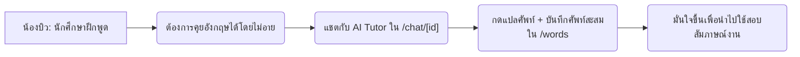
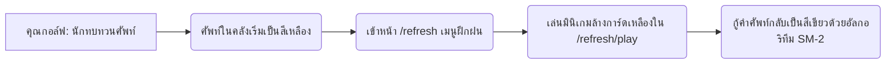
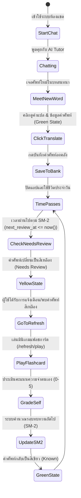

# Tarnly — บุคลิกภาพของผู้ใช้งาน (User Personas)

> เอกสารวิเคราะห์และจำลองลักษณะของผู้ใช้งานกลุ่มเป้าหมาย (User Personas) ของระบบ **Tarnly** เพื่อนำมาใช้ในการออกแบบประสบการณ์ผู้ใช้ (UX/UI), จัดลำดับความสำคัญของฟีเจอร์ (Feature Prioritization), และวางแผนพัฒนาผลิตภัณฑ์อย่างตรงจุด
> อ้างอิงบริบทการทำงานจริงตามข้อกำหนดใน [Requirements.md](Requirements.md) และ [prd.md](prd.md)

---

## 1. ภาพรวมกลุ่มผู้ใช้งานเป้าหมาย (User Archetypes Overview)

ระบบ Tarnly ถูกออกแบบมาเพื่อตอบโจทย์ผู้เรียนชาวไทยที่ต้องการฝึกฝนทักษะภาษาอังกฤษเพื่อการใช้งานจริง โดยแบ่งกลุ่มเป้าหมายหลักออกเป็น 2 กลุ่มตามวัตถุประสงค์และพฤติกรรมการใช้งาน:

| กลุ่มผู้ใช้ | บทบาทหลักในระบบ (Persona Archetype) | จุดประสงค์หลัก (Core Objective) | อุปกรณ์การใช้งาน (Primary Device) |
| :--- | :--- | :--- | :--- |
| **P1 (Primary)** | **นักศึกษาผู้ฝึกสนทนา (The Conversational Learner)** | ฝึกฝนทักษะการพูด/เขียนภาษาอังกฤษในสภาวะแวดล้อมที่ไร้แรงกดดันและมีความยืดหยุ่นสูง | Desktop / Laptop (ใช้จอใหญ่เพื่อพิมพ์สะดวกและอ่านคู่มือแกรมม่า) |
| **P2 (Secondary)** | **นักทบทวนศัพท์ระบบ Spaced Repetition (The Vocabulary Master)** | ทบทวนคลังคำศัพท์เดิมอย่างมีหลักการเพื่อเอาชนะโค้งการลืม และเพิ่มความแม่นยำในการใช้ศัพท์ระดับสูง | Mobile / Tablet (ใช้ระหว่างการเดินทาง หรือมีเวลากระชั้นชิด) |

---

## 2. ข้อมูลเชิงลึกของ Persona 1 (P1): น้องบิว — นักศึกษาผู้ฝึกสนทนา (Primary)

### 2.1 ประวัติและข้อมูลพื้นฐาน (Demographics & Background)
* **ชื่อสมมติ:** นางสาวชนิกานต์ (น้องบิว)
* **อายุ:** 21 ปี (นักศึกษาชั้นปีที่ 3 คณะบริหารธุรกิจ มหาวิทยาลัยเอกชนแห่งหนึ่ง)
* **ทักษะภาษาอังกฤษปัจจุบัน:** CEFR Level B1 (Intermediate)
  * อ่านและฟังเข้าใจเนื้อหาทั่วไปได้ดีพอสมควร
  * ทักษะการพูดและเขียนค่อนข้างติดขัด มักจะใช้เวลาเรียบเรียงประโยคนาน และกลัวการออกเสียงผิด
* **พฤติกรรมด้านเทคโนโลยี:** ใช้งานโซเชียลมีเดีย ท่องเว็บ และทำงานวิจัยในมหาวิทยาลัยผ่านโน้ตบุ๊กเป็นหลัก

### 2.2 เป้าหมายและแรงจูงใจ (Goals & Motivations)
* **เป้าหมายระยะสั้น:** ฝึกฝนการคุยตอบโต้ภาษาอังกฤษเพื่อเตรียมสอบสัมภาษณ์เข้าฝึกงาน (Internship) ในบริษัทต่างชาติ
* **เป้าหมายระยะยาว:** สื่อสารภาษาอังกฤษได้อย่างคล่องแคล่วและมั่นใจโดยไม่ต้องนึกภาษาไทยในหัวก่อนพูด
* **แรงจูงใจ:** ต้องการผู้ช่วยเรียนรู้ที่เป็นมิตร ไม่ตัดสินเมื่อพูดผิด และสามารถเข้าใช้งานได้ทุกเมื่อที่สะดวกโดยไม่ต้องเสียค่าใช้จ่ายราคาแพง

### 2.3 ปัญหาและความกังวล (Pain Points & Frustrations)
* **ความประหม่า (English Anxiety):** รู้สึกอายและประหม่ามากเมื่อต้องพูดคุยกับเจ้าของภาษาจริง ๆ กลัวว่าจะตอบช้าเกินไปจนคู่สนทนารอนาน หรือตอบไม่ตรงคำถาม
* **การท่องจำศัพท์แบบเดิมไม่ได้ผล:** เคยพยายามท่องจำคำศัพท์เป็นตารางคำแปล (เช่น ท่องวันละ 10 คำ) แต่สุดท้ายก็ลืมหมดและไม่รู้ว่าถ้านำมาแต่งประโยคจริง ๆ จะต้องใช้คำบุพบทตัวไหน
* **ไม่มั่นใจเรื่องไวยากรณ์:** เมื่อพยายามแต่งประโยคยาว ๆ มักกังวลว่าแกรมม่าจะผิดพลาด ทำให้เลือกที่จะเงียบแทนที่จะสื่อสารออกไป

### 2.4 วิธีการใช้งานระบบ Tarnly (Behavior in System)
* **ห้องแชตอัจฉริยะ (`/chat/[id]`):** ใช้แชตเพื่อฝึกคุยโต้ตอบกับ AI Tutor คอยสลับหัวข้อไปเรื่อย ๆ (เช่น คุยเรื่องอาหารโปรด แนะนำสถานที่ท่องเที่ยว หรือจำลองการสัมภาษณ์งาน)
* **การใช้งานโหมดเสียง (Voice & Audio):** ใช้ Hands-free Voice Mode เพื่อฝึกทักษะการฟังและการพูดตอบกลับสด ๆ โดยพึ่งพาระบบสังเคราะห์เสียง (TTS) จาก Kokoro-82M เพื่อฟังสำเนียงที่ถูกต้อง และใช้ Speech-to-Text (STT) เพื่อถอดเสียงคำพูดของตัวเอง
* **การเก็บสะสมคำศัพท์:** ขณะสนทนาเมื่อเจอคำศัพท์ที่ไม่มั่นใจความหมาย จะกดที่คำนั้นทันทีเพื่ออ่าน IPA, POS และคำแปลภาษาไทยผ่านระบบ Cache (`ai_word_detail_cache`) จากนั้นกดเซฟเก็บไว้เป็นคำศัพท์สีเขียวในคลังส่วนตัวทันที
* **โควต้าการใช้งาน:** ด้วยสถานะบัญชี Free เธอจะคอยบริหารจัดการโควต้า 15 ข้อความต่อวันให้เกิดประโยชน์สูงสุด และอาจพิจารณาซื้อ Premium หากเห็นว่าคุ้มค่าและต้องการคุยไม่จำกัด

---

## 3. ข้อมูลเชิงลึกของ Persona 2 (P2): คุณกอล์ฟ — นักทบทวนศัพท์ Spaced Repetition (Secondary)

### 3.1 ประวัติและข้อมูลพื้นฐาน (Demographics & Background)
* **ชื่อสมมติ:** นายณภัทร (คุณกอล์ฟ)
* **อายุ:** 28 ปี (Junior Digital Marketer ในบริษัทเอเจนซี่โฆษณาต่างประเทศ)
* **ทักษะภาษาอังกฤษปัจจุบัน:** CEFR Level B2 (Upper-Intermediate)
  * สนทนาทั่วไปได้คล่อง แต่ต้องการพัฒนาคลังคำศัพท์วิชาชีพ (Business English / Advanced Vocabulary) เพื่อเขียนรายงานและประสานงานกับทีมงานในต่างประเทศ
* **พฤติกรรมด้านเทคโนโลยี:** ใช้คอมพิวเตอร์ทำงานเกือบตลอดเวลา และใช้สมาร์ตโฟนเครื่องโปรดในการเช็กข่าวสารและเล่นเกมนอกเวลาทำงาน

### 3.2 เป้าหมายและแรงจูงใจ (Goals & Motivations)
* **เป้าหมายระยะสั้น:** ทบทวนคำศัพท์ที่สะสมไว้จำนวนมากไม่ให้ลืม และสามารถดึงออกมาใช้งานในการเขียนอีเมลหรือพรีเซนต์งานได้อย่างแม่นยำ
* **เป้าหมายระยะยาว:** อัปเกรดความมั่นใจและภาษาอังกฤษให้ก้าวสู่ระดับ Senior ในสายอาชีพ
* **แรงจูงใจ:** การเรียนรู้อย่างเป็นระบบและมีประสิทธิภาพตามหลักการศึกษา โดยต้องการความสนุกในรูปแบบ Gamification เข้ามาช่วยกระตุ้นให้อยากทบทวนบ่อย ๆ

### 3.3 ปัญหาและความกังวล (Pain Points & Frustrations)
* **ความจำเสื่อมถอย (Forgetting Curve):** เรียนรู้ศัพท์ใหม่ ๆ ได้เร็ว แต่ลืมง่ายหากไม่มีการทบทวนซ้ำอย่างถูกจังหวะเวลา
* **เวลาที่จำกัด:** มีภาระงานประจำที่ยุ่งและเหนื่อยล้าเกินกว่าจะมานั่งอ่านชีทสรุปศัพท์เล่มหนาเป็นชั่วโมง ๆ
* **ขาดเครื่องมือช่วยเตือน:** ไม่มีแอปพลิเคชันใดที่ช่วยคัดกรองเฉพาะ "ศัพท์ที่กำลังจะลืม" ออกมาให้ทบทวนได้อย่างแม่นยำ ทำให้มักเสียเวลาไปกับการทบทวนคำศัพท์ที่ตัวเองจำได้อยู่แล้ว

### 3.4 วิธีการใช้งานระบบ Tarnly (Behavior in System)
* **คลังคำศัพท์อัจฉริยะ (`/words`):** เปิดหน้านี้บ่อย ๆ เพื่อเช็กจำนวนคำศัพท์สะสม และดูว่ามีคำใดเปลี่ยนสถานะเป็นสีเหลือง (Needs Review) หรือไม่
* **มินิเกมฝึกคำศัพท์ (`/refresh/play`):** เล่นเกมการ์ด 3 มิติ (3D Flip Card) โดยตั้งใจฟังเสียงอ่าน TTS เพื่อประเมินความนึกออกของตัวเอง โดยโหวตคะแนน 0-5 ให้ตรงกับความเป็นจริง เพื่อให้อัลกอริทึม SM-2 จัดตารางระยะเวลาทบทวนได้อย่างเหมาะสม
* **การปรับตั้งค่าระบบ (`/profile/edit`):** เข้าไปปรับแต่งความเร็วในการอ่านออกเสียง TTS ให้เร็วขึ้น (เช่น 1.1x หรือ 1.2x) เพื่อฝึกการฟังประโยคตัวอย่างในระดับความเร็วการพูดของเพื่อนร่วมงานต่างชาติ
* **การสนับสนุน Premium Gated:** สมัครใช้บริการ Premium (`/profile/billing`) ผ่านระบบของ Stripe เพื่อให้สามารถเล่นมินิเกมและเก็บสถิติต่าง ๆ ได้ไม่จำกัดแบบไม่มีสะดุด

---

## 4. วงจรการเรียนรู้และการทบทวนคำศัพท์ (Tarnly Learner's Loop)

เพื่อให้เข้าใจพฤติกรรมและการโต้ตอบของทั้งสอง Persona แผนภาพด้านล่างจำลองลูปวงจรการจำและการเรียนรู้ในระบบ Tarnly:

---

## 5. การวิเคราะห์เปรียบเทียบตามฟีเจอร์ของระบบ (Feature Matrix Mapping)

ตารางด้านล่างเปรียบเทียบระดับความถี่และความคาดหวังของฟีเจอร์ต่าง ๆ ระหว่าง P1 และ P2 เพื่อใช้ในการพัฒนาปรับปรุงประสบการณ์ผู้ใช้งาน:

| หน้าจอ/ฟีเจอร์ | พฤติกรรมของ น้องบิว (P1 - Conversational Learner) | พฤติกรรมของ คุณกอล์ฟ (P2 - Vocabulary Master) | สิ่งที่ทีมนักพัฒนา/นักออกแบบต้องใส่ใจ (Implications) |
| :--- | :--- | :--- | :--- |
| **แชตบอทฝึกพูด (`/chat/[id]`)** | **สูงมาก:** พิมพ์แชตและใช้ STT พูดโต้ตอบทุกวัน คาดหวังการสตรีมข้อความตอบกลับที่รวดเร็ว (TTFB ≤ 2.0s) | **ปานกลาง:** ใช้งานเมื่อต้องการหาหัวข้อสนทนาใหม่ ๆ เพื่อเก็บสะสมคำศัพท์เฉพาะทางเพิ่มเติม | ปรับปรุงโมเดลภาษาให้วิเคราะห์ Grammatical errors ได้แม่นยำ และแสดง Suggestion Panel ให้คำศัพท์ทางเลือกตามบริบทที่ลื่นไหล |
| **คลังสะสมศัพท์ (`/words`)** | **ปานกลาง:** ใช้บันทึกศัพท์ที่สนใจเพิ่มเติมจากแชต ดูคำแปลภาษาไทยเป็นหลัก | **สูงมาก:** ใช้จัดการคลังคำศัพท์ ค้นหาคำศัพท์สะสม จัดหมวดหมู่ และติดตามสถานะความคืบหน้าการเรียนรู้ | ค้นหาแบบกึ่งเรียลไทม์ ฟิลเตอร์จำแนกสีเหลือง/เขียวได้ชัดเจน และโหลดการแปลความหมายที่แคชไว้อย่างรวดเร็ว (≤ 300ms) |
| **มินิเกมแฟลชการ์ด (`/refresh/play`)** | **ปานกลาง:** เล่นเพื่อความสนุกและทดสอบความเข้าใจคำแปล | **สูงมาก:** เล่นอย่างสม่ำเสมอ คาดหวังให้ระบบ SM-2 ทำงานถูกต้อง และมีการ์ดแบบ 3D พลิกกลับได้จริงบนมือถือ | การ์ดต้องออกแบบให้รองรับการทัชสกรีน (Swipe, Tap) ที่ลื่นไหล มีเสียง TTS คมชัด และจัดตารางการ์ดเหลืองที่ถึงกำหนดทบทวนได้ครบ 100% |
| **การตั้งค่าระบบ (`/profile`)** | **ต่ำ:** สลับธีมเป็น Dark Mode ในช่วงดึก ปรับแต่งรูปภาพโปรไฟล์เล็กน้อย | **ปานกลาง:** เข้ามาเช็กโควต้าพลังงานและปรับความเร็ว TTS บ่อยครั้งเพื่อจำลองสถานการณ์สนทนาที่รวดเร็ว | การสลับหน้าจอตั้งค่าแบบ iOS Settings ต้องโหลดรวดเร็วไม่มีดีเลย์ เมนูตั้งค่าความเร็วออกเสียง TTS ต้องชัดเจนและใช้งานง่าย |

---

## 6. แนวทางการออกแบบและประเด็นที่ต้องพิจารณา (Product Design Guidelines)

เพื่อรองรับลักษณะเฉพาะของ User Persona ทั้งสองกลุ่มนี้ ทีมพัฒนาผลิตภัณฑ์ควรคำนึงถึงประเด็นสำคัญดังนี้:

> [!IMPORTANT]
> **การรองรับอุปกรณ์ที่ต่างกัน (Responsive Layouts):**
> หน้าแชตต้องปรับให้เหมาะสมและทำงานได้ดีที่สุดบนหน้าจอขนาดใหญ่ (Desktop) เพื่อให้น้องบิว (P1) สามารถพิมพ์บทสนทนายาว ๆ ได้สะดวก ในขณะที่มินิเกมทบทวนศัพท์และการ์ด 3D พลิกได้ต้องได้รับการขัดเกลาและทดสอบให้ใช้งานได้ดีเยี่ยมบนหน้าจอขนาดพกพา (Mobile) เพื่อความสะดวกของคุณกอล์ฟ (P2)

> [!TIP]
> **ระบบการทบทวนที่ปรับแต่งได้ (Adaptive Review Paths):**
> ควรเพิ่มฟังก์ชันคัดกรองระดับความเร็วในการทบทวนหรือตัวเลือกตัวอย่างประโยคบริบท เพื่อให้คุณกอล์ฟ (P2) สามารถข้ามศัพท์พื้นฐานไปยังคำศัพท์ภาษาอังกฤษธุรกิจหรือประโยคทำงานเชิงลึกได้ และส่งเสริมการเก็บคำแปลที่เป็นธรรมชาติสำหรับน้องบิว (P1) เพื่อไม่ให้กดดันเกินไป
