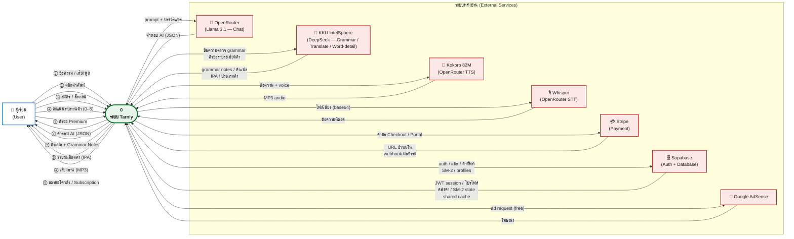

# แผนภาพบริบท (Context Diagram)
### ระบบ Tarnly — AI Conversation Learning Platform

---

---

## ฝั่ง User — ข้อมูลที่ไหลเข้า-ออก

| # | ทิศทาง | ข้อมูล |
| :---: | :--- | :--- |
| ① | ผู้เรียน → ระบบ | ข้อความพิมพ์ / เสียงพูด |
| ② | ผู้เรียน → ระบบ | คลิกคำศัพท์ในบทสนทนา |
| ③ | ผู้เรียน → ระบบ | สมัครสมาชิก / ล็อกอิน |
| ④ | ผู้เรียน → ระบบ | คะแนนทบทวนคำ 0–5 (มินิเกม SM-2) |
| ⑤ | ผู้เรียน → ระบบ | คำขออัปเกรด Premium |
| ① | ระบบ → ผู้เรียน | คำตอบ AI แบบ JSON |
| ② | ระบบ → ผู้เรียน | คำแปลไทย + Grammar Notes |
| ③ | ระบบ → ผู้เรียน | รายละเอียดคำ (IPA / ประเภทคำ) |
| ④ | ระบบ → ผู้เรียน | เสียงอ่าน MP3 (Kokoro TTS) |
| ⑤ | ระบบ → ผู้เรียน | สถานะโควต้า / สถานะ subscription |

---

## ฝั่งหลังบ้าน — External Services

| Service | หน้าที่ | ข้อมูลเข้า | ข้อมูลออก |
| :--- | :--- | :--- | :--- |
| **OpenRouter** (Llama 3.1) | AI สนทนาหลัก | prompt + ประวัติแชต | คำตอบ AI (JSON) |
| **KKU IntelSphere** (DeepSeek) | ตรวจ grammar, แปลไทย, รายละเอียดคำ | ข้อความตรวจ grammar / คำขอรายละเอียดคำ | grammar notes, คำแปล, IPA |
| **Kokoro 82M** (OpenRouter TTS) | สังเคราะห์เสียงอ่าน EN | ข้อความ + voice config | ไฟล์ MP3 |
| **Whisper** (OpenRouter STT) | ถอดเสียงพูดเป็นข้อความ | ไฟล์เสียง base64/webm | ข้อความที่ถอด |
| **Stripe** | ประมวลผลการชำระเงิน | คำขอ Checkout/Portal | URL ชำระเงิน, webhook |
| **Supabase** | Auth + ฐานข้อมูล + shared cache | auth, แชต, คำ, SM-2 | JWT, โปรไฟล์, คลังคำ, cache |
| **Google AdSense** | โฆษณาหลังจบเกม (free เท่านั้น) | ad slot request | โฆษณาแสดงผล |

---

## Process Description — ระบบ Tarnly (Process 0)

| # | ฟังก์ชัน | คำอธิบาย | Input | Output |
| :---: | :--- | :--- | :--- | :--- |
| P-01 | **จัดการบัญชีผู้ใช้** | รับข้อมูลสมัคร/ล็อกอิน ตรวจสอบกับ Supabase Auth ออก JWT session และโหลดโปรไฟล์ผู้ใช้ | อีเมล, รหัสผ่าน | JWT session, โปรไฟล์, สถานะ subscription |
| P-02 | **สนทนากับ AI (Chat)** | รับข้อความหรือเสียงพูด ตรวจโควต้า ส่ง prompt ไป LLM รับคำตอบ JSON และบันทึกแชตลง Supabase | ข้อความ / เสียง | คำตอบ AI (JSON), เสียงอ่าน MP3 |
| P-03 | **ตรวจ Grammar + แปลภาษา** | วิเคราะห์ประโยคผู้ใช้คู่ขนานกับ P-02 ส่งไป LLM เพื่อตรวจข้อผิดพลาดและแปลเป็นภาษาไทย | ข้อความของผู้ใช้ | Grammar Notes, คำแปลไทย |
| P-04 | **แปลงเสียงพูด → ข้อความ (STT)** | บันทึกเสียงจากไมค์ส่งไป Whisper API ถอดเสียงเป็นข้อความแล้วป้อนเข้า P-02 ต่อ | ไฟล์เสียง (webm) | ข้อความที่ถอดได้ |
| P-05 | **สังเคราะห์เสียงอ่าน (TTS)** | รับประโยคคำตอบ AI ส่งไป Kokoro 82M รับ MP3 กลับมาเล่นให้ผู้ใช้ฟัง; cache ใน memory 500 entries | ข้อความภาษาอังกฤษ | ไฟล์เสียง MP3 |
| P-06 | **บันทึกและแสดงคำศัพท์** | เมื่อผู้ใช้คลิกคำ ดึง IPA/คำแปล/ประเภทคำจาก shared cache (หรือ LLM ถ้า cache miss) แสดง popup และบันทึกลงคลัง | คำที่คลิก | รายละเอียดคำ, สีสถานะในแชต |
| P-07 | **มินิเกมทบทวน SM-2** | ดึงคำที่ถึงกำหนดทบทวน (สีเหลือง) ให้เล่นเกม 4 แบบ รับคะแนน 0–5 คำนวณ interval ใหม่ด้วย SM-2 บันทึกลง Supabase | คะแนน 0–5 ต่อคำ | next_review_at ใหม่, สีคำเปลี่ยน เหลือง→เขียว |
| P-08 | **จัดการ Subscription** | สร้าง Stripe Checkout Session รับ webhook ยืนยันการชำระ อัปเดตสถานะ premium และโควต้าใน profiles | คำขออัปเกรด | สถานะ premium, โควต้าเพิ่ม |
| P-09 | **ตั้งค่าและโปรไฟล์** | แก้ไข display name/avatar สลับธีม Light/Dark ดูโควต้ารายวัน ลบบัญชีถาวร (PDPA) | ข้อมูลโปรไฟล์, ธีม | โปรไฟล์ที่อัปเดต, ธีมเปลี่ยนทันที |
