# Tarnly — แผนผังเว็บไซต์และเส้นทางระบบ (Sitemap & Routing)

> สรุปโครงสร้างเส้นทางหน้าจอ (Frontend Pages) และ API endpoints (Backend API Routes) จริงในระบบ ณ 2026-06-28
> อ้างอิงสถาปัตยกรรมและการตั้งค่าสิทธิการเข้าถึงของแอปพลิเคชัน Tarnly

---

## 1. ผังการเดินทางของผู้ใช้ (Navigation & Middleware Flow)

หน้าจอหลักทั้งหมดจะถูกควบคุมด้วย Middleware และการตรวจสอบสิทธิ์การเข้าใช้งานผ่าน Supabase Auth เพื่อแบ่งการเข้าถึงออกเป็น **Public (เข้าได้ทุกคน)**, **Authenticated Only (ต้องเข้าสู่ระบบ)** และ **Premium Gated (เฉพาะสมาชิกแบบชำระเงิน)**

```mermaid
graph TD
    %% Top Level
    Home["Home Page (/)"]:::root
    
    %% Second Level (Categories)
    Auth["Authentication"]:::category
    Chat["Tutor Chat"]:::category
    Words["Vocabulary"]:::category
    Profile["Profile & Settings"]:::category
    
    Home --> Auth
    Home --> Chat
    Home --> Words
    Home --> Profile
    
    %% Third Level (Pages)
    Auth --> A1["/auth (Login/Register)"]:::page
    Auth --> A2["/auth/reset (Reset Password)"]:::page
    Auth --> A3["/auth/update-password"]:::page
    
    Chat --> C1["/new (Create Session)"]:::page
    Chat --> C2["/chat/[id] (Chat Screen)"]:::page
    Chat --> C3["/recents (Recent Chats)"]:::page
    
    Words --> W1["/words (Word Bank Library)"]:::page
    Words --> W2["/refresh (Practice Menu)"]:::page
    Words --> W3["/refresh/play (Game Screen)"]:::page
    
    Profile --> P1["/profile (Settings Menu)"]:::page
    Profile --> P2["/profile/edit (Edit Info)"]:::page
    Profile --> P3["/profile/usage (Usage Stats)"]:::page
    Profile --> P4["/profile/billing (Subscription)"]:::page
    Profile --> P5["/privacy (Privacy Policy)"]:::page
    Profile --> P6["/terms (Terms of Service)"]:::page

    %% Style Classes
    classDef root fill:#4a5568,color:#ffffff,stroke:#2d3748,stroke-width:2px,rx:10px,ry:10px;
    classDef category fill:#3b82f6,color:#ffffff,stroke:#1d4ed8,stroke-width:2px,rx:8px,ry:8px;
    classDef page fill:#ffffff,color:#1f2937,stroke:#d1d5db,stroke-width:1.5px,rx:12px,ry:12px;
```

---

## 2. เส้นทางฝั่งหน้าบ้าน (Frontend Page Routes)

ใช้สถาปัตยกรรม Next.js 15 App Router (`app/` directory) ในการจัดการหน้าจอและการนำทางหลัก:

| เส้นทาง (Route) | ไฟล์หน้าจอหลัก (Page File) | สิทธิ์การเข้าใช้งาน | ส่วนประกอบสำคัญ (Key Components) | หน้าที่และรายละเอียด |
| :--- | :--- | :--- | :--- | :--- |
| `/` | [page.tsx](file:///Users/pat/Project/tranly-free-version/tranly/app/page.tsx) | Public | `<LandingPage>` | หน้าโหลดเริ่มต้น (Splash Screen) ตรวจสอบสถานะ Session เพื่อรีไดเรกต์ไป `/new` หรือ `/auth` |
| `/auth` | [page.tsx](file:///Users/pat/Project/tranly-free-version/tranly/app/auth/page.tsx) | Public | `<AuthForm>` | หน้าจอเข้าสู่ระบบและสมัครสมาชิกด้วย Email/Password หรือ Google OAuth |
| `/auth/reset` | [page.tsx](file:///Users/pat/Project/tranly-free-version/tranly/app/auth/reset/page.tsx) | Public | `<ResetPasswordForm>` | หน้าจอขอรีเซ็ตรหัสผ่านผ่านการส่งลิงก์ยืนยันไปที่อีเมลของผู้ใช้ |
| `/auth/update-password` | [page.tsx](file:///Users/pat/Project/tranly-free-version/tranly/app/auth/update-password/page.tsx) | Public | `<UpdatePasswordForm>` | หน้าจอกำหนดรหัสผ่านใหม่ (ต้องเข้าถึงผ่านลิงก์รีเซ็ตจากอีเมลเท่านั้น) |
| `/new` | [page.tsx](file:///Users/pat/Project/tranly-free-version/tranly/app/new/page.tsx) | Authenticated | `<NewChatPage>`, `<ChatScreen>` | หน้าจอเริ่มต้นบทสนทนาใหม่ โดยจะสร้าง Session ชั่วคราวก่อนบันทึกลงฐานข้อมูล |
| `/chat/[id]` | [page.tsx](file:///Users/pat/Project/tranly-free-version/tranly/app/chat/[id]/page.tsx) | Authenticated | `<ChatScreen>`, `<ChatList>`, `<VoiceMode>`, `<SuggestionOptions>` | หน้าต่างฝึกสนทนาหลัก คล้ายแชตทั่วไป มีฟังก์ชัน **Hands-free Voice Mode** และคำแนะนำศัพท์รายคำ |
| `/recents` | [page.tsx](file:///Users/pat/Project/tranly-free-version/tranly/app/recents/page.tsx) | Authenticated | `<GeminiLayout>` | แสดงรายการบทสนทนาย้อนหลังทั้งหมด สามารถค้นหา จัดเรียง หรือลบประวัติได้ |
| `/words` | [page.tsx](file:///Users/pat/Project/tranly-free-version/tranly/app/words/page.tsx) | Authenticated | `<WordRenderer>`, `<WordDetailPopup>` | คลังคำศัพท์ (Word Bank) ของส่วนตัวที่เก็บสะสมจากการกดคลิกแปลในหน้าแชต แสดงสถานะรีวิวตาม SM-2 |
| `/refresh` | [page.tsx](file:///Users/pat/Project/tranly-free-version/tranly/app/refresh/page.tsx) | Authenticated | `<RefreshMenu>` | หน้าแสดงสถิติคลังศัพท์และเมนูเริ่มเล่นมินิเกมฝึกหัดสำหรับล้างคำศัพท์สีเหลือง (Needs Review) |
| `/refresh/play` | [page.tsx](file:///Users/pat/Project/tranly-free-version/tranly/app/refresh/play/page.tsx) | Authenticated | `<GameShell>`, `<TypingGame>`, `<MatchingGame>`, `<SpeakGame>`, `<SummaryScreen>` | ระบบการเล่นมินิเกมทบทวนศัพท์ตามระดับความยาก-ง่ายด้วยอัลกอริทึม SM-2 ประกอบด้วย 3 เกมหลัก |
| `/profile` | [page.tsx](file:///Users/pat/Project/tranly-free-version/tranly/app/profile/page.tsx) | Authenticated | `<SettingsList>`, `<AccountCard>` | เมนูตั้งค่าสไตล์ iOS สำหรับปรับแต่งบัญชี การตั้งค่า และหน้าไปสู่หมวดต่าง ๆ |
| `/profile/edit` | [page.tsx](file:///Users/pat/Project/tranly-free-version/tranly/app/profile/edit/page.tsx) | Authenticated | `<GeminiLayout>` | หน้าต่างแก้ไขรายละเอียดโปรไฟล์ (ชื่อผู้ใช้, ความเร็วเสียง TTS, และภาษาเป้าหมาย) |
| `/profile/usage` | [page.tsx](file:///Users/pat/Project/tranly-free-version/tranly/app/profile/usage/page.tsx) | Authenticated | `<GeminiLayout>` | แสดงโควต้าการสนทนารายวัน ค่าใช้จ่ายจริงของการใช้งาน API และประวัติการหักโควต้า |
| `/profile/billing` | [page.tsx](file:///Users/pat/Project/tranly-free-version/tranly/app/profile/billing/page.tsx) | Authenticated | `<GeminiLayout>` | จัดการระบบสมาชิกและสมัครสมาชิก Premium ผ่านบริการชำระเงินของ Stripe |
| `/privacy` | [page.tsx](file:///Users/pat/Project/tranly-free-version/tranly/app/privacy/page.tsx) | Public | - | หน้านโยบายความเป็นส่วนตัวของแพลตฟอร์ม (PDPA Compliance) |
| `/terms` | [page.tsx](file:///Users/pat/Project/tranly-free-version/tranly/app/terms/page.tsx) | Public | - | หน้าข้อตกลงและเงื่อนไขการใช้งานระบบ (Terms of Service) |

---

## 3. เส้นทางฝั่งเซิร์ฟเวอร์ (Backend API Routes)

แอปพลิเคชันให้บริการ API Routes ภายใต้ไดเรกทอรี `app/api/` เพื่อเชื่อมต่อบริการภายนอก จัดการโมเดลภาษา และตรวจสอบการชำระเงิน:

| เส้นทางปลายทาง (Endpoint) | ไฟล์ควบคุม (Route Handler) | ระบบสิทธิ์การเข้าถึง | บริการปลายทาง (Backend Service / Integration) | การจำกัดโควต้า / Premium Gating |
| :--- | :--- | :--- | :--- | :--- |
| `/api/chat` | [route.ts](file:///Users/pat/Project/tranly-free-version/tranly/app/api/chat/route.ts) | User Required | KKU IntelSphere (`gen.ai.kku.ac.th`) -> `deepseek-v4-flash` | **จำกัด 15 ข้อความ/วันสำหรับบัญชี Free** (บันทึกและหักใน `consume_chat_quota`), บัญชี Premium ไม่จำกัด |
| `/api/grammar` | [route.ts](file:///Users/pat/Project/tranly-free-version/tranly/app/api/grammar/route.ts) | User Required | KKU IntelSphere -> `deepseek-v4-flash` | ตรวจสอบไวยากรณ์และแปลงภาษาของประโยคสนทนา ทำงานขนานไปกับการคุยหลัก |
| `/api/translate` | [route.ts](file:///Users/pat/Project/tranly-free-version/tranly/app/api/translate/route.ts) | User Required | KKU IntelSphere (DeepSeek Model) | รองรับการแปลข้อความและบทสนทนาเป้าหมายเป็นภาษาไทยบน Client |
| `/api/tts` | [route.ts](file:///Users/pat/Project/tranly-free-version/tranly/app/api/tts/route.ts) | User Required | OpenRouter -> `hexgrad/kokoro-82m` | บริการแปลงข้อความเป็นเสียง (Text-to-Speech) รองรับการตั้งความเร็วการออกเสียง |
| `/api/stt` | [route.ts](file:///Users/pat/Project/tranly-free-version/tranly/app/api/stt/route.ts) | User Required | OpenAI Whisper API | บริการถอดรหัสเสียงพูดกลับมาเป็นตัวหนังสือ (Speech-to-Text) สำหรับ Voice Mode |
| `/api/word-detail` | [route.ts](file:///Users/pat/Project/tranly-free-version/tranly/app/api/word-detail/route.ts) | User Required | KKU IntelSphere + Database Cache (`ai_word_detail_cache`) | บริการดึงข้อมูลศัพท์เชิงลึก (IPA, POS, คำจำกัดความภาษาอังกฤษ, คำแปลไทย) และเก็บแคชถาวร |
| `/api/account/delete` | [route.ts](file:///Users/pat/Project/tranly-free-version/tranly/app/api/account/delete/route.ts) | User Required | Supabase Auth (Service-Role Admin API) | สำหรับลบบัญชีและล้างข้อมูลส่วนตัวของผู้ใช้ทั้งหมดในตารางฐานข้อมูล |
| `/api/stripe/create-checkout-session` | [route.ts](file:///Users/pat/Project/tranly-free-version/tranly/app/api/stripe/create-checkout-session/route.ts) | User Required | Stripe Checkout API | สร้างหน้าชำระเงินสำหรับรับสิทธิ์ Premium โดยเชื่อมต่อกับ ID ของผู้สมัคร |
| `/api/stripe/portal` | [route.ts](file:///Users/pat/Project/tranly-free-version/tranly/app/api/stripe/portal/route.ts) | User Required | Stripe Customer Portal API | สำหรับยกเลิกสมาชิกหรือจัดการรูปแบบการจ่ายเงินของ Stripe สำหรับผู้ใช้ Premium |
| `/api/stripe/webhook` | [route.ts](file:///Users/pat/Project/tranly-free-version/tranly/app/api/stripe/webhook/route.ts) | Public (Webhook) | Stripe Platform Event Webhook | รับเหตุการณ์ชำระเงินเพื่อมาเปิดสิทธิ์สมาชิก (`profiles.subscription_status = 'active'`) |

---

## 4. กฎการเข้าถึงเส้นทาง (Middleware & Redirect Rules)

ระบบใช้ [middleware.ts](file:///Users/pat/Project/tranly-free-version/tranly/middleware.ts) ในการสกัดกั้นทราฟฟิกฝั่งเซิร์ฟเวอร์โดยอิงจากสิทธิ์การตรวจสอบตัวตน (Authentication):

1. **การปกป้องเส้นทางส่วนตัว (Protected Routes):**
   * หากผู้ใช้ยังไม่ได้เข้าสู่ระบบ (ไม่มี session cookie) และพยายามจะโหลดหน้า `/new`, `/chat/`, `/recents`, `/words`, `/refresh/`, หรือ `/profile/` -> ระบบจะทำ **Redirect 302** ไปที่หน้า `/auth` โดยอัตโนมัติ
2. **การรีไดเรกต์เส้นทางสาธารณะ (Public Redirects):**
   * หากผู้ใช้เข้าสู่ระบบแล้ว (มี session cookie) และพยายามเข้าหน้า `/` หรือ `/auth` -> ระบบจะทำ **Redirect 302** ไปที่หน้า `/new` ทันทีเพื่อความรวดเร็วในการใช้งาน
3. **การเข้าถึงแบบจำกัดสิทธิ์ (Premium Gating):**
   * **ฝั่ง Client:** ในหน้าจอ `/chat/[id]` ปุ่ม Reply Suggestions จะแสดงไอคอน 🔒 และจะไม่ทำงานหากผู้ใช้ไม่เป็นสมาชิก Premium
   * **ฝั่ง Server:** API `/api/chat` จะหักลบโควต้าในฐานข้อมูล หากตรวจสอบแล้วพบว่าโควต้าในวันนั้นหมดลง (มากกว่า 15 ข้อความสำหรับบัญชี Free) ระบบจะตอบกลับด้วยข้อผิดพลาด HTTP 403 (Daily quota exhausted)
