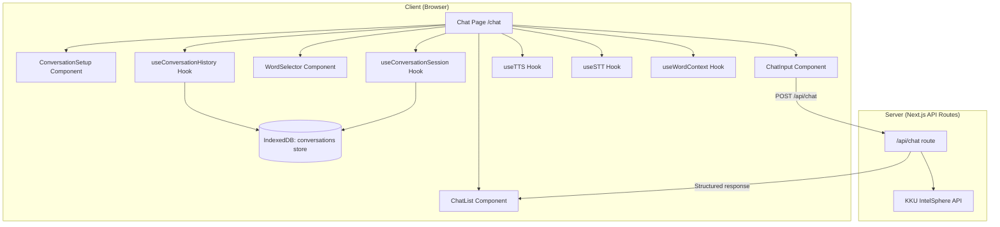
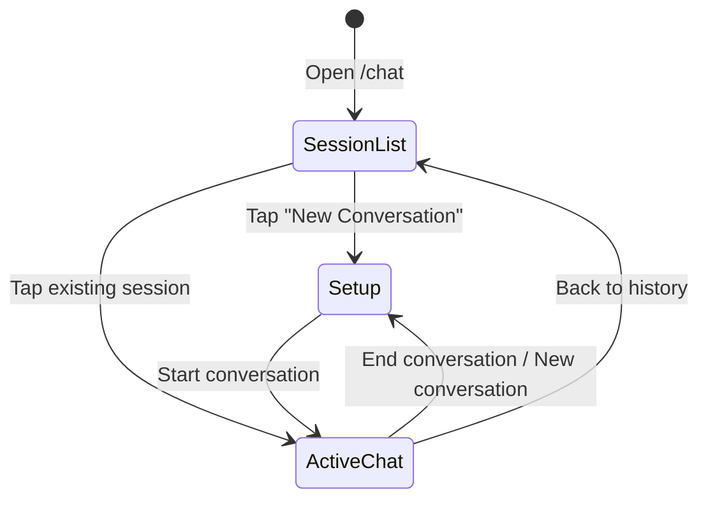

# Design Document: AI Conversation

## Overview

ฟีเจอร์ AI Conversation เพิ่มหน้าแชทสนทนาภาษาเกาหลีกับ AI ให้กับแอป Tarnly Korean โดยผู้ใช้สามารถเลือกหัวข้อ ระดับภาษา และคำศัพท์ที่บันทึกไว้เป็นบริบท AI จะตอบกลับเป็นภาษาเกาหลีพร้อมคำอ่าน romanization และคำแปล รองรับ text-to-speech สำหรับฟังเสียงอ่าน และ speech-to-text สำหรับพูดส่งข้อความ ประวัติบทสนทนาถูกเก็บใน IndexedDB

### Design Decisions

1. **KKU IntelSphere API** — ใช้ API เดียวกับ feed และ identify routes ที่มีอยู่แล้ว เพื่อความสม่ำเสมอและไม่ต้องเพิ่ม API key ใหม่
2. **IndexedDB via raw IDB pattern** — ใช้ pattern เดียวกับ `openDatabase()` ที่มีอยู่ใน `app/_lib/db.ts` โดยเพิ่ม object store ใหม่สำหรับ conversations
3. **Web Speech API** — ใช้ browser-native SpeechSynthesis สำหรับ TTS และ SpeechRecognition สำหรับ STT โดยไม่ต้องพึ่ง third-party service
4. **Client-side state management** — ใช้ React state + custom hooks ตาม pattern ที่มีอยู่ (เช่น `useFeedStorage`, `useWordStorage`)
5. **Next.js App Router** — เพิ่ม route `/chat` สำหรับหน้า conversation ใช้ client components สำหรับ interactive UI

## Architecture



### Page Flow



## Components and Interfaces

### Page Component: `/app/chat/page.tsx`

Top-level client component that manages view state (setup | active-chat | history).

### ConversationSetup Component

Renders topic input, proficiency level selector, word context selector, and start button.

```typescript
interface ConversationSetupProps {
  onStart: (config: SessionConfig) => void;
  savedWords: SavedWord[];
}

interface SessionConfig {
  topic: string;           // 2-100 characters
  proficiencyLevel: ProficiencyLevel;
  wordContext: SavedWord[]; // max 10 words
}

type ProficiencyLevel = 'beginner' | 'intermediate' | 'advanced';
```

### ChatList Component

Renders the scrollable message list with auto-scroll behavior.

```typescript
interface ChatListProps {
  messages: ChatMessage[];
  onPlayAudio: (messageId: string) => void;
  playingMessageId: string | null;
}
```

### ChatInput Component

Text input with send button and microphone button.

```typescript
interface ChatInputProps {
  onSend: (text: string) => void;
  disabled: boolean;
  maxLength: number; // 500
}
```

### WordSelector Component

Modal/drawer showing saved words for selection.

```typescript
interface WordSelectorProps {
  words: SavedWord[];
  selected: SavedWord[];
  maxSelection: number; // 10
  onSelectionChange: (words: SavedWord[]) => void;
}
```

### SessionHistory Component

List of previous conversation sessions.

```typescript
interface SessionHistoryProps {
  sessions: ConversationSessionRecord[];
  onSelect: (sessionId: string) => void;
  onDelete: (sessionId: string) => void;
  onNewConversation: () => void;
}
```

### API Route: `/app/api/chat/route.ts`

```typescript
// Request
interface ChatRequest {
  messages: ChatMessagePayload[];  // up to 20 most recent
  proficiencyLevel: ProficiencyLevel;
  topic: string;
  wordContext?: string[];  // Korean words to incorporate
}

interface ChatMessagePayload {
  role: 'user' | 'assistant';
  content: string;
}

// Success Response
interface ChatSuccessResponse {
  korean: string;
  reading: string;
  romanization: string;
  translation: string;
}

// Error Response
interface ChatErrorResponse {
  error: {
    type: ChatErrorType;
    message: string;
  };
}

type ChatErrorType = 'invalid_input' | 'api_error' | 'rate_limit' | 'timeout' | 'network_error';
```

### Custom Hooks

#### `useConversationSession`

Manages the active conversation session state, message sending, and API communication.

```typescript
interface UseConversationSessionReturn {
  messages: ChatMessage[];
  sendMessage: (text: string) => Promise<void>;
  retryLastMessage: () => Promise<void>;
  isLoading: boolean;
  error: string | null;
  sessionConfig: SessionConfig | null;
  startSession: (config: SessionConfig) => void;
  endSession: () => Promise<void>;
}
```

#### `useConversationHistory`

Manages CRUD operations on conversation sessions in IndexedDB.

```typescript
interface UseConversationHistoryReturn {
  sessions: ConversationSessionRecord[];
  loadSessions: () => Promise<void>;
  loadSessionMessages: (sessionId: string) => Promise<ChatMessage[]>;
  saveSession: (session: ConversationSessionRecord) => Promise<void>;
  saveMessage: (sessionId: string, message: ChatMessage) => Promise<void>;
  deleteSession: (sessionId: string) => Promise<void>;
  isLoading: boolean;
  error: string | null;
}
```

#### `useTTS`

Wraps Web Speech API SpeechSynthesis for Korean text-to-speech.

```typescript
interface UseTTSReturn {
  speak: (text: string) => void;
  stop: () => void;
  isSpeaking: boolean;
  isSupported: boolean;
  error: string | null;
}
```

#### `useSTT`

Wraps Web Speech API SpeechRecognition for voice input.

```typescript
interface UseSTTReturn {
  startListening: (lang?: SpeechLang) => void;
  stopListening: () => void;
  isListening: boolean;
  transcript: string;
  isSupported: boolean;
  error: string | null;
}

type SpeechLang = 'ko-KR' | 'th-TH' | 'en-US';
```

#### `useWordContext`

Loads saved words from both Word Store and bookmarked Feed Words.

```typescript
interface UseWordContextReturn {
  savedWords: SavedWord[];
  loadSavedWords: () => Promise<void>;
  isLoading: boolean;
}

interface SavedWord {
  id: string;
  korean: string;
  reading: string;
  romanization: string;
  english: string;
  source: 'word-store' | 'feed-words';
}
```

## Data Models

### IndexedDB Schema Changes

Add two new object stores to the existing database (bump `DB_VERSION` to 5):

#### `conversations` store

```typescript
interface ConversationSessionRecord {
  id: string;                    // crypto.randomUUID()
  topic: string;                 // max 100 chars
  proficiencyLevel: ProficiencyLevel;
  wordContext: string[];         // Korean words selected
  createdAt: string;             // ISO 8601 timestamp
  endedAt: string | null;        // ISO 8601 timestamp, null if active
  completed: boolean;            // true if ended normally
}
```

Indexes:
- `createdAt` — for sorting sessions by date
- `completed` — for filtering active vs completed sessions

#### `conversation-messages` store

```typescript
interface ConversationMessageRecord {
  id: string;                    // crypto.randomUUID()
  sessionId: string;             // FK to conversations store
  role: 'user' | 'assistant';
  korean: string;                // Korean text (for AI messages)
  reading: string;               // Thai pronunciation (for AI messages)
  romanization: string;          // Latin romanization (for AI messages)
  translation: string;           // Thai translation (for AI messages)
  rawText: string;               // Original text (for user messages)
  timestamp: string;             // ISO 8601 timestamp
}
```

Indexes:
- `sessionId` — for loading all messages in a session
- `timestamp` — for ordering messages chronologically

### Chat Message (Runtime Type)

```typescript
interface ChatMessage {
  id: string;
  role: 'user' | 'assistant';
  korean: string;
  reading: string;
  romanization: string;
  translation: string;
  rawText: string;
  timestamp: string;
  status: 'sent' | 'pending' | 'error';
}
```

### API Prompt Construction

The Chat API route constructs a system prompt based on session configuration:

```typescript
function buildSystemPrompt(
  topic: string,
  level: ProficiencyLevel,
  wordContext: string[]
): string {
  const levelInstructions = {
    beginner: 'Use basic vocabulary, short sentences (under 10 words), simple grammar (present tense, basic particles like 은/는, 이/가, 을/를).',
    intermediate: 'Use common vocabulary, compound sentences, standard grammar (past/future tense, conjunctions like 그리고/하지만, honorifics).',
    advanced: 'Use advanced vocabulary, complex sentences, formal/informal registers, idioms, proverbs, and nuanced expressions.',
  };

  const wordInstruction = wordContext.length > 0
    ? `Naturally incorporate these Korean words into the conversation within the first 5 exchanges: ${wordContext.join(', ')}.`
    : '';

  return `You are a Korean conversation partner. The topic is "${topic}". ${levelInstructions[level]} ${wordInstruction} Reply with ONLY a raw JSON object: {"korean":"<Korean text>","reading":"<Thai pronunciation>","romanization":"<Romanization>","translation":"<Thai translation>"}. Return ONLY the JSON object.`;
}
```


## Correctness Properties

*A property is a characteristic or behavior that should hold true across all valid executions of a system—essentially, a formal statement about what the system should do. Properties serve as the bridge between human-readable specifications and machine-verifiable correctness guarantees.*

### Property 1: Topic input validation

*For any* string input, the topic validation function SHALL accept the string if and only if its trimmed length is between 2 and 100 characters inclusive.

**Validates: Requirements 1.1**

### Property 2: Start button form validation

*For any* combination of topic string and proficiency level selection, the start-conversation button SHALL be enabled if and only if the topic is valid (2-100 characters after trimming) AND a proficiency level is selected.

**Validates: Requirements 1.6**

### Property 3: Word selection cap enforcement

*For any* sequence of word selection actions on a list of saved words, the resulting Word_Context SHALL never contain more than 10 words.

**Validates: Requirements 2.4**

### Property 4: Message input validation

*For any* string composed entirely of whitespace characters (including empty string), the send action SHALL be disabled. *For any* non-whitespace string with length exceeding 500 characters, the input SHALL be constrained to 500 characters.

**Validates: Requirements 3.8, 3.9**

### Property 5: Chat response parsing round trip

*For any* valid ChatSuccessResponse JSON object containing korean, reading, romanization, and translation fields, serializing it to a string and then parsing it with the response parser SHALL produce an equivalent object with all four fields preserved.

**Validates: Requirements 4.2**

### Property 6: Conversation context window

*For any* message history of length N, the context payload sent to the Chat API SHALL contain at most 20 messages, and those messages SHALL be the N most recent messages (or all messages if N ≤ 20), preserving chronological order.

**Validates: Requirements 4.5**

### Property 7: Single audio playback invariant

*For any* sequence of audio play requests on different messages, at most one audio SHALL be playing at any given time. Starting playback on a new message SHALL stop any currently playing audio.

**Validates: Requirements 5.5**

### Property 8: Message persistence round trip

*For any* valid ConversationMessageRecord, saving it to the Conversation_Store and then loading it back by session ID SHALL produce a record with identical sessionId, role, korean, reading, romanization, translation, rawText, and timestamp fields.

**Validates: Requirements 6.1, 6.2**

### Property 9: Session list ordering

*For any* set of ConversationSessionRecords with distinct createdAt timestamps, loading the session list SHALL return them sorted in descending order by createdAt (most recent first).

**Validates: Requirements 6.3**

### Property 10: Session deletion cascades to messages

*For any* conversation session with associated messages, deleting the session SHALL result in both the session record and all associated message records being removed from the store.

**Validates: Requirements 6.6**

### Property 11: Session completion marking

*For any* active conversation session, ending the session SHALL set completed to true and endedAt to a valid ISO 8601 timestamp that is greater than or equal to the session's createdAt timestamp.

**Validates: Requirements 8.3**

## Error Handling

### API Errors

| Error Type | HTTP Status | User Message (Thai) | Recovery |
|---|---|---|---|
| `invalid_input` | 400 | ข้อมูลไม่ถูกต้อง | Show error, no retry |
| `api_error` | 502 | ไม่สามารถสร้างข้อความได้ กรุณาลองอีกครั้ง | Show retry button |
| `rate_limit` | 429 | ส่งคำขอบ่อยเกินไป กรุณารอสักครู่ | Show error with wait message |
| `timeout` | 504 | หมดเวลาเชื่อมต่อ กรุณาลองอีกครั้ง | Show retry button |
| `network_error` | 502 | ไม่สามารถเชื่อมต่อได้ กรุณาตรวจสอบอินเทอร์เน็ต | Show retry button |

### IndexedDB Errors

- **Save failure**: Display error toast, retain data in React state. Retry on next user action.
- **Load failure**: Display error message, show empty state with retry option.
- **Delete failure**: Display error toast, session remains in list.

### Web Speech API Errors

| Scenario | Behavior |
|---|---|
| TTS not supported | Hide audio buttons, no error shown |
| TTS playback fails | Show toast: "ไม่สามารถเล่นเสียงได้" |
| STT not supported | Hide microphone button |
| STT permission denied | Show message: "กรุณาอนุญาตการใช้ไมโครโฟนในการตั้งค่าเบราว์เซอร์" |
| STT network error | Show toast: "ไม่สามารถรับเสียงได้ กรุณาตรวจสอบอินเทอร์เน็ต" |
| STT no speech detected | Show toast: "ไม่ได้ยินเสียงพูด กรุณาลองอีกครั้ง" |

### Timeout Strategy

- Chat API: 30 second timeout via AbortController (consistent with existing feed route pattern)
- IndexedDB operations: No explicit timeout (local operations are fast)
- TTS/STT: Browser-managed timeouts

## Testing Strategy

### Property-Based Tests (fast-check)

The project already uses `fast-check` (v4.8.0) and `vitest` (v4.1.7). Each property test runs a minimum of 100 iterations.

| Property | Test File | What's Tested |
|---|---|---|
| Property 1: Topic validation | `app/chat/_lib/validateTopic.test.ts` | Topic length validation logic |
| Property 2: Form validation | `app/chat/_lib/validateSessionConfig.test.ts` | Combined form state logic |
| Property 3: Word selection cap | `app/chat/_lib/wordSelection.test.ts` | Selection cap enforcement |
| Property 4: Message validation | `app/chat/_lib/validateMessage.test.ts` | Empty/length validation |
| Property 5: Response parsing | `app/api/chat/parseChatResponse.test.ts` | JSON parsing round trip |
| Property 6: Context window | `app/api/chat/buildContext.test.ts` | Message truncation to 20 |
| Property 8: Message persistence | `app/chat/_lib/conversationStorage.test.ts` | IndexedDB round trip |
| Property 9: Session ordering | `app/chat/_lib/conversationStorage.test.ts` | Sort order verification |
| Property 10: Cascade deletion | `app/chat/_lib/conversationStorage.test.ts` | Delete removes all data |
| Property 11: Session completion | `app/chat/_lib/conversationStorage.test.ts` | Completion flag and timestamp |

Property test tag format: `Feature: ai-conversation, Property {N}: {description}`

### Unit Tests (vitest)

- Component rendering tests for ChatMessage, ConversationSetup, ChatInput
- Hook behavior tests for useTTS, useSTT (with mocked Web Speech API)
- API route tests with mocked KKU API responses
- Error state rendering tests

### Integration Tests

- Full conversation flow: setup → send message → receive response → end session
- Word context loading from both Word Store and Feed Words stores
- Session history CRUD operations against fake-indexeddb

### Test Dependencies

Already available in the project:
- `vitest` — test runner
- `fast-check` — property-based testing
- `@testing-library/react` — component testing
- `fake-indexeddb` — IndexedDB mock for storage tests
- `jsdom` — DOM environment
