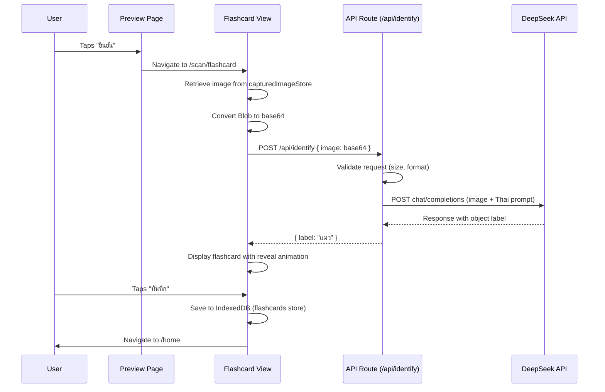
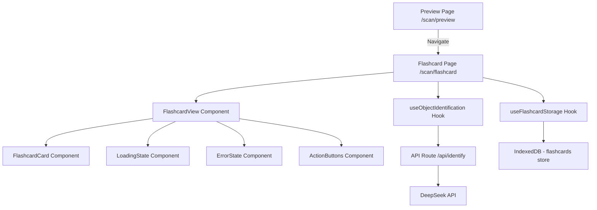

# Design Document: AI Flashcard

## Overview

The AI Flashcard feature enables users to capture photos of real-world objects and receive AI-generated Thai vocabulary labels via the DeepSeek Vision API. The system creates flashcards pairing the captured image with the identified object name in Thai, supporting vocabulary learning through visual association.

The feature integrates into the existing scan flow: after capturing a photo, the user confirms it on the Preview screen, which navigates to a new Flashcard View at `/scan/flashcard`. The Flashcard View sends the image to a Next.js API Route (server-side proxy), which forwards it to the DeepSeek API. The response is displayed as a flashcard with reveal animation, and the user can save it to IndexedDB or retake the photo.

### Key Design Decisions

1. **Server-side API proxy**: The DeepSeek API key is kept server-side via a Next.js API Route, preventing client exposure.
2. **Base64 encoding**: Images are sent as base64 strings to the API route, avoiding multipart form complexity and aligning with the DeepSeek API's OpenAI-compatible image format.
3. **Retry logic on client**: The client manages retry state (max 3 attempts) since the user needs visual feedback and control over retries.
4. **Existing IndexedDB pattern**: Flashcard storage reuses the project's established IndexedDB pattern with a new object store.

## Architecture



### Component Architecture



## Components and Interfaces

### API Route: `/api/identify`

**File**: `app/api/identify/route.ts`

```typescript
// POST /api/identify
// Request body:
interface IdentifyRequest {
  image: string; // base64-encoded image data (without data URI prefix)
}

// Success response (200):
interface IdentifySuccessResponse {
  label: string; // Object name in Thai, max 100 characters
}

// Error response (4xx/5xx):
interface IdentifyErrorResponse {
  error: {
    type: 'api_error' | 'timeout' | 'rate_limit' | 'network_error' | 'invalid_input' | 'too_large';
    message: string; // User-facing message in Thai
  };
}
```

### Custom Hook: `useObjectIdentification`

**File**: `app/scan/flashcard/_lib/useObjectIdentification.ts`

```typescript
interface UseObjectIdentificationReturn {
  label: string | null;
  isLoading: boolean;
  error: { type: string; message: string } | null;
  retryCount: number;
  identify: (blob: Blob) => Promise<void>;
  retry: () => void;
  canRetry: boolean; // false when retryCount >= 3
}
```

Responsibilities:
- Converts Blob to base64
- Calls POST `/api/identify`
- Tracks retry count (max 3)
- Manages loading/error/success states

### Custom Hook: `useFlashcardStorage`

**File**: `app/scan/flashcard/_lib/useFlashcardStorage.ts`

```typescript
interface Flashcard {
  id: string;
  imageBlob: Blob;
  label: string;
  createdAt: number;
}

interface UseFlashcardStorageReturn {
  save: (imageBlob: Blob, label: string) => Promise<string>;
  isLoading: boolean;
  error: string | null;
}
```

Responsibilities:
- Opens/creates the `flashcards` object store in IndexedDB
- Saves flashcard records (image blob + label + timestamp)
- Manages loading and error state

### Page Component: Flashcard View

**File**: `app/scan/flashcard/page.tsx`

States:
1. **Loading**: Spinner + "กำลังวิเคราะห์ภาพ..." while API processes
2. **Success**: Flashcard displayed with reveal animation + action buttons
3. **Error (retryable)**: Error message + "ลองใหม่" button (retryCount < 3)
4. **Error (max retries)**: Error message + "ถ่ายใหม่" button only (retryCount >= 3)

### Utility: `blobToBase64`

**File**: `app/scan/flashcard/_lib/blobToBase64.ts`

```typescript
function blobToBase64(blob: Blob): Promise<string>
```

Converts a Blob to a base64 string (without the `data:...;base64,` prefix) using FileReader.

## Data Models

### Flashcard Record (IndexedDB)

```typescript
interface FlashcardRecord {
  id: string;          // crypto.randomUUID()
  imageBlob: Blob;     // Original captured image
  label: string;       // AI-identified object name in Thai
  createdAt: number;   // Date.now() timestamp
}
```

**IndexedDB Configuration**:
- Database: `tarnly-images` (reuse existing DB)
- Object Store: `flashcards` (new store, separate from `captures`)
- Key Path: `id`
- Indexes: `createdAt` (for chronological retrieval)

### API Request/Response Models

```typescript
// Client → API Route
interface IdentifyRequest {
  image: string; // base64 string, max ~27MB (20MB binary → ~27MB base64)
}

// API Route → DeepSeek (OpenAI-compatible format)
interface DeepSeekRequest {
  model: string;
  messages: Array<{
    role: 'user';
    content: Array<
      | { type: 'text'; text: string }
      | { type: 'image_url'; image_url: { url: string } }
    >;
  }>;
  max_tokens: number;
}

// DeepSeek → API Route
interface DeepSeekResponse {
  choices: Array<{
    message: {
      content: string; // The identified object label
    };
  }>;
}
```

### Error Types

```typescript
type AIErrorType = 'api_error' | 'timeout' | 'rate_limit' | 'network_error' | 'invalid_input' | 'too_large';

interface AIError {
  type: AIErrorType;
  message: string; // Thai user-facing message
}

const ERROR_MESSAGES: Record<AIErrorType, string> = {
  api_error: 'ไม่สามารถระบุวัตถุได้ กรุณาลองอีกครั้ง',
  timeout: 'การเชื่อมต่อหมดเวลา กรุณาลองอีกครั้ง',
  rate_limit: 'ระบบมีผู้ใช้งานมาก กรุณาลองอีกครั้งในภายหลัง',
  network_error: 'เกิดปัญหาการเชื่อมต่อเครือข่าย กรุณาตรวจสอบอินเทอร์เน็ต',
  invalid_input: 'ข้อมูลภาพไม่ถูกต้อง กรุณาถ่ายภาพใหม่',
  too_large: 'ภาพมีขนาดใหญ่เกินไป กรุณาถ่ายภาพใหม่',
};
```

## Correctness Properties

*A property is a characteristic or behavior that should hold true across all valid executions of a system — essentially, a formal statement about what the system should do. Properties serve as the bridge between human-readable specifications and machine-verifiable correctness guarantees.*

### Property 1: Label extraction produces bounded output

*For any* valid DeepSeek API response containing a content string of arbitrary length, the extracted Object_Label SHALL always be a non-empty string of at most 100 characters.

**Validates: Requirements 1.3**

### Property 2: Oversized images are rejected

*For any* base64-encoded image string whose decoded binary size exceeds 20MB, the API route SHALL reject the request and return an error response with type "too_large".

**Validates: Requirements 1.5**

### Property 3: Invalid request bodies are rejected

*For any* request body that is missing the `image` field, or contains a non-string value, or contains a string that is not valid base64, the API route SHALL reject the request and return an error response with type "invalid_input".

**Validates: Requirements 1.7**

### Property 4: Error state shows retry when under max attempts

*For any* error type returned by the AI service, when the retry count is less than 3, the Flashcard View SHALL display the error message and a "ลองใหม่" (Retry) button.

**Validates: Requirements 2.5**

### Property 5: Flashcard image scaling preserves aspect ratio within bounds

*For any* image with natural dimensions (width, height) and any viewport size, the computed display dimensions SHALL maintain the original aspect ratio and the display height SHALL not exceed 60% of the viewport height.

**Validates: Requirements 3.2**

### Property 6: Whitespace-only labels are treated as errors

*For any* string composed entirely of whitespace characters (spaces, tabs, newlines, or empty string), the system SHALL treat it as an identification failure and not display it as a valid Object_Label.

**Validates: Requirements 3.7**

## Error Handling

### API Route Error Handling

The API route (`/api/identify`) handles errors at multiple levels:

| Error Source | Detection | Response |
|---|---|---|
| Invalid/missing base64 input | Request body validation | 400 + `invalid_input` |
| Image too large (>20MB) | Size check on decoded base64 | 413 + `too_large` |
| DeepSeek API timeout | AbortController after 30s | 504 + `timeout` |
| DeepSeek rate limit | HTTP 429 from DeepSeek | 429 + `rate_limit` |
| DeepSeek API error | Non-2xx response | 502 + `api_error` |
| Network failure | fetch throws TypeError | 502 + `network_error` |

### Client-Side Error Handling

The `useObjectIdentification` hook manages error state:

1. **Retry logic**: Tracks consecutive failures. On error, increments `retryCount`. On success, resets to 0.
2. **Max retries (3)**: After 3 consecutive failures, `canRetry` becomes `false`, and the UI shows only "ถ่ายใหม่" (navigate to camera).
3. **Error display**: The error message from the API response is displayed directly to the user (already in Thai).

### IndexedDB Error Handling

The `useFlashcardStorage` hook handles save failures:
- On failure: displays error message, re-enables the save button for retry
- Does NOT count toward the API retry limit (separate concern)

### Edge Cases

- **Empty/whitespace label from API**: Treated as an error on the client side before displaying
- **No captured image on mount**: Immediate redirect to `/scan`
- **Navigation during API call**: Cleanup via useEffect return; AbortController cancels in-flight request

## Testing Strategy

### Property-Based Tests (fast-check)

The project already includes `fast-check` as a dev dependency. Property tests will use it with minimum 100 iterations per property.

**Library**: `fast-check` (already installed)
**Configuration**: 100+ iterations per property test
**Tag format**: `Feature: ai-flashcard, Property {number}: {property_text}`

Properties to implement:
1. Label extraction bounded output (pure function test)
2. Oversized image rejection (API route validation logic)
3. Invalid request body rejection (API route validation logic)
4. Error state retry button visibility (UI state logic)
5. Image scaling aspect ratio preservation (pure computation)
6. Whitespace label rejection (validation logic)

### Unit Tests (vitest)

Example-based tests for:
- API route: correct DeepSeek request formatting, error type mapping (api_error, timeout, rate_limit, network_error)
- `useObjectIdentification` hook: loading states, retry count increment, max retry behavior
- `useFlashcardStorage` hook: successful save flow, save failure handling
- Flashcard View: navigation on confirm, redirect when no image, cleanup on unmount
- UI states: loading indicator text, reveal animation trigger, button disable during save, success confirmation timing

### Integration Tests

- Full flow: Preview confirm → Flashcard View → API call → display (with mocked DeepSeek)
- Save flow: Flashcard displayed → save button → IndexedDB write → navigation to /home (with fake-indexeddb)

### Test File Organization

```
app/
  api/identify/
    route.ts
    route.test.ts              # API route unit + property tests
  scan/flashcard/
    page.tsx
    page.test.tsx              # Page component tests
    _lib/
      useObjectIdentification.ts
      useObjectIdentification.test.ts
      useFlashcardStorage.ts
      useFlashcardStorage.test.ts
      blobToBase64.ts
      blobToBase64.test.ts
      flashcardImageDimensions.ts
      flashcardImageDimensions.test.ts  # Property tests for scaling
      constants.ts
```

