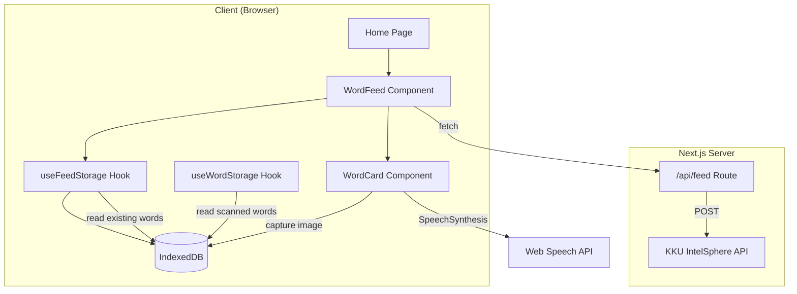

# Design Document: Korean Word Feed

## Overview

ฟีเจอร์ Korean Word Feed เปลี่ยนหน้า Home จากหน้าว่างเป็น Feed การ์ดคำศัพท์ภาษาเกาหลีที่เลื่อนดูได้ในแนวตั้ง ระบบจะสร้างคำศัพท์ใหม่ 5 คำต่อวันผ่าน AI API (KKU IntelSphere) โดยไม่ซ้ำกับคำที่ผู้ใช้เคยสแกนหรือบันทึกไว้ ผู้ใช้สามารถขอคำเพิ่มเติมได้ ถ่ายรูปประกอบคำศัพท์ เล่นเสียงออกเสียง และบุ๊กมาร์กคำที่สนใจ

### Key Design Decisions

1. **Reuse existing KKU API infrastructure** — ใช้ API endpoint pattern เดียวกับ `/api/identify` ที่มีอยู่แล้ว สร้าง endpoint ใหม่ `/api/feed` สำหรับสร้างคำศัพท์
2. **IndexedDB for local persistence** — ใช้ pattern เดียวกับ `useWordStorage` และ `useFlashcardStorage` ที่มีอยู่ เพิ่ม object store ใหม่ `feed-words`
3. **Client-side deduplication** — ส่งรายการคำที่มีอยู่แล้ว (Hangul) ไปกับ API request เพื่อให้ AI สร้างคำที่ไม่ซ้ำ
4. **Web Speech API for TTS** — ใช้ `SpeechSynthesis` API ที่มีในเบราว์เซอร์สำหรับเล่นเสียงภาษาเกาหลี ไม่ต้องเรียก API เพิ่ม
5. **Calendar-day based quota** — ใช้วันที่ปฏิทิน (YYYY-MM-DD) เป็น key สำหรับตรวจสอบว่าวันนี้สร้างคำแล้วหรือยัง

## Architecture



### Data Flow

1. **หน้า Home โหลด** → `useFeedStorage` ตรวจสอบ IndexedDB ว่ามีคำของวันนี้หรือไม่
2. **ถ้ามีคำแล้ว** → แสดงคำจาก IndexedDB โดยไม่เรียก API
3. **ถ้ายังไม่มี** → รวบรวมคำที่มีอยู่ทั้งหมด (scanned + feed) → เรียก `/api/feed` พร้อมส่ง exclusion list → บันทึกคำใหม่ลง IndexedDB → แสดงผล
4. **ขอคำเพิ่ม** → เรียก `/api/feed` อีกครั้งพร้อม exclusion list ที่อัปเดต → เพิ่มคำใหม่ลง IndexedDB

## Components and Interfaces

### UI Components

#### `WordFeed` (Client Component)
- Container component ที่จัดการ state ของ feed ทั้งหมด
- รับผิดชอบ: โหลดคำจาก storage, เรียก API เมื่อจำเป็น, แสดง loading/error states
- แสดง `WordCard` ในรูปแบบ vertical scrollable list
- แสดง `ProgressIndicator` บอกตำแหน่งปัจจุบัน
- แสดงปุ่ม "ขอคำเพิ่ม" เมื่อเลื่อนถึงท้าย feed

#### `WordCard` (Client Component)
- แสดงข้อมูลคำศัพท์เดี่ยว: Hangul, reading (Thai), romanization, English, Thai
- แสดง `CardImageArea` สำหรับรูปภาพ
- ปุ่ม audio สำหรับเล่นเสียง (Web Speech API)
- ปุ่ม bookmark สำหรับบุ๊กมาร์ก
- Styled ตาม Neobrutalist design system (border 3px solid, box-shadow 4px 4px 0)

#### `CardImageArea` (Client Component)
- แสดง placeholder พร้อม camera icon เมื่อยังไม่มีรูป
- เปิดกล้องเมื่อกด → บันทึกรูปลง IndexedDB
- แสดงรูปที่ถ่ายแล้วเมื่อมี

#### `ProgressIndicator` (Client Component)
- แสดง "current/total" format (เช่น "3/5")
- อัปเดตตาม scroll position

### API Route

#### `POST /api/feed`

**Request Body:**
```typescript
interface FeedRequest {
  excludeWords: string[];  // Hangul strings to exclude
  count: number;           // Number of words to generate (default: 5)
}
```

**Success Response:**
```typescript
interface FeedWord {
  korean: string;       // Hangul
  reading: string;      // Thai script pronunciation
  romanization: string; // Latin script pronunciation
  english: string;      // English translation
  thai: string;         // Thai translation
}

interface FeedSuccessResponse {
  words: FeedWord[];
}
```

**Error Response:**
```typescript
interface FeedErrorResponse {
  error: {
    type: 'invalid_input' | 'api_error' | 'rate_limit' | 'timeout' | 'network_error';
    message: string;
  };
}
```

### Hooks

#### `useFeedStorage`
- `loadTodayWords(): Promise<FeedWordRecord[]>` — โหลดคำของวันนี้จาก IndexedDB
- `saveWords(words: FeedWord[]): Promise<void>` — บันทึกคำใหม่ลง IndexedDB
- `updateImage(wordId: string, imageBlob: Blob): Promise<void>` — บันทึกรูปภาพ
- `toggleBookmark(wordId: string): Promise<void>` — สลับสถานะ bookmark
- `getAllKoreanWords(): Promise<string[]>` — ดึง Hangul ทั้งหมดจาก feed store
- `isLoading: boolean`
- `error: string | null`

#### `useExclusionList`
- รวบรวมคำ Hangul ทั้งหมดจาก: Words store (scanned) + Feed store (generated)
- Return: `string[]` ของ Hangul ที่ต้อง exclude

## Data Models

### IndexedDB Schema

**Database:** `tarnly-images` (existing, bump version to 4)

**New Object Store:** `feed-words`
- keyPath: `id`
- Indexes:
  - `generatedDate` — วันที่สร้าง (YYYY-MM-DD format)
  - `korean` — Hangul word (for deduplication lookups)
  - `createdAt` — timestamp

**Record Schema:**
```typescript
interface FeedWordRecord {
  id: string;              // crypto.randomUUID()
  korean: string;          // Hangul word
  reading: string;         // Thai script pronunciation
  romanization: string;    // Latin romanization
  english: string;         // English translation
  thai: string;            // Thai translation
  generatedDate: string;   // "YYYY-MM-DD" calendar day
  bookmarked: boolean;     // bookmark flag
  imageBlob: Blob | null;  // user-captured image
  createdAt: number;       // Date.now() timestamp
}
```

### Existing Stores Used (Read-only)

**`words` store** — ใช้อ่านคำ Hangul ที่ผู้ใช้เคยสแกน (field: `korean`)
**`flashcards` store** — ใช้อ่าน label ที่อาจมีคำเกาหลี (field: `label`)

## Correctness Properties

*A property is a characteristic or behavior that should hold true across all valid executions of a system — essentially, a formal statement about what the system should do. Properties serve as the bridge between human-readable specifications and machine-verifiable correctness guarantees.*

### Property 1: Word card rendering completeness

*For any* valid `FeedWordRecord` with non-empty korean, reading, romanization, and english fields, rendering a `WordCard` component with that record SHALL produce output containing all four text fields.

**Validates: Requirements 1.2**

### Property 2: Progress indicator formatting

*For any* pair of integers (current, total) where 1 ≤ current ≤ total and total > 0, the progress indicator formatting function SHALL produce the string `"${current}/${total}"`.

**Validates: Requirements 1.4**

### Property 3: API response parsing completeness

*For any* valid JSON string containing korean, reading, romanization, english, and thai fields, the feed response parser SHALL extract all five fields with their original values preserved.

**Validates: Requirements 2.2**

### Property 4: Exclusion list correctness

*For any* set of word records in the Words store (scanned) and any set of word records in the Feed-Words store, the exclusion list builder SHALL return a list containing exactly the `korean` (Hangul) field values from both stores combined, with no omissions and no extraneous entries.

**Validates: Requirements 3.1, 3.2, 3.3, 4.2**

### Property 5: Fetch decision based on date

*For any* calendar date and any state of the Feed-Words store, the "should fetch" decision function SHALL return `true` if and only if no records with `generatedDate` matching that calendar date exist in the store.

**Validates: Requirements 2.1, 5.2**

### Property 6: Word persistence round-trip

*For any* array of valid `FeedWord` objects, saving them to the Feed-Words store and then loading all records for the same `generatedDate` SHALL return records with identical korean, reading, romanization, english, thai, generatedDate, and bookmarked fields.

**Validates: Requirements 5.1, 5.3**

### Property 7: Bookmark toggle persistence

*For any* `FeedWordRecord` in the store, toggling its bookmark state and then loading the record SHALL return the record with the `bookmarked` field inverted from its original value.

**Validates: Requirements 6.2**

### Property 8: Image persistence round-trip

*For any* `FeedWordRecord` and any non-empty `Blob`, saving the image to that record and then loading the record SHALL return a record whose `imageBlob` has the same size and type as the original Blob.

**Validates: Requirements 7.3**

## Error Handling

### API Errors

| Error Type | HTTP Status | User-Facing Message (Thai) | Recovery |
|---|---|---|---|
| `invalid_input` | 400 | "ข้อมูลไม่ถูกต้อง" | ไม่ retry อัตโนมัติ |
| `api_error` | 502 | "ไม่สามารถสร้างคำศัพท์ได้ กรุณาลองอีกครั้ง" | แสดงปุ่ม retry |
| `rate_limit` | 429 | "ส่งคำขอบ่อยเกินไป กรุณารอสักครู่" | แสดงปุ่ม retry พร้อม delay |
| `timeout` | 504 | "หมดเวลาเชื่อมต่อ กรุณาลองอีกครั้ง" | แสดงปุ่ม retry |
| `network_error` | 502 | "ไม่สามารถเชื่อมต่อได้ กรุณาตรวจสอบอินเทอร์เน็ต" | แสดงปุ่ม retry |

### Client-Side Errors

- **IndexedDB unavailable**: แสดง error state พร้อมข้อความ "ไม่สามารถเข้าถึงที่เก็บข้อมูลได้"
- **Speech Synthesis unavailable**: ซ่อนปุ่ม audio หรือแสดง disabled state
- **Camera unavailable**: แสดง placeholder คงเดิม ไม่เปิดกล้อง

### Error State UI

- แสดง error message ตรงกลาง feed area
- แสดงปุ่ม "ลองอีกครั้ง" ด้านล่าง error message
- ใช้ Neobrutalist styling: border 3px solid #FA5252, background #FFF0F6

## Testing Strategy

### Property-Based Tests (fast-check)

ใช้ `fast-check` library ที่มีอยู่แล้วใน devDependencies สำหรับ property-based testing:

- **Minimum 100 iterations** ต่อ property test
- **Tag format**: `Feature: korean-word-feed, Property {number}: {property_text}`
- ใช้ `fake-indexeddb` สำหรับ mock IndexedDB ใน test environment

**Properties to test:**
1. Word card rendering completeness — generate random FeedWordRecord, verify all fields rendered
2. Progress indicator formatting — generate random (current, total) pairs
3. API response parsing — generate random valid JSON payloads
4. Exclusion list correctness — generate random word sets from both stores
5. Fetch decision based on date — generate random dates and store states
6. Word persistence round-trip — generate random FeedWord arrays, save/load
7. Bookmark toggle — generate random records, toggle, verify
8. Image persistence round-trip — generate random blobs, save/load

### Unit Tests (Vitest)

- API route handler: test error responses, input validation, response parsing
- `useFeedStorage` hook: test CRUD operations with fake-indexeddb
- `useExclusionList` hook: test combining words from multiple stores
- WordCard component: test rendering states (with/without image, bookmarked/not)
- Error overlay: test error message display and retry button

### Integration Tests

- Full flow: Home page load → API call → cards displayed
- Request more words flow: button click → API call → new cards appended
- Camera capture flow: tap image area → capture → image displayed (mocked)
- TTS flow: tap audio → SpeechSynthesis called with correct text (mocked)

### Test File Structure

```
app/home/_lib/
  useFeedStorage.ts
  useFeedStorage.test.ts
  useExclusionList.ts
  useExclusionList.test.ts
  feedApi.ts
  feedApi.test.ts
  formatProgress.ts
  formatProgress.test.ts
  types.ts
app/home/_components/
  WordFeed.tsx
  WordCard.tsx
  CardImageArea.tsx
  ProgressIndicator.tsx
app/api/feed/
  route.ts
  route.test.ts
  parseFeedResponse.ts
  parseFeedResponse.test.ts
```

