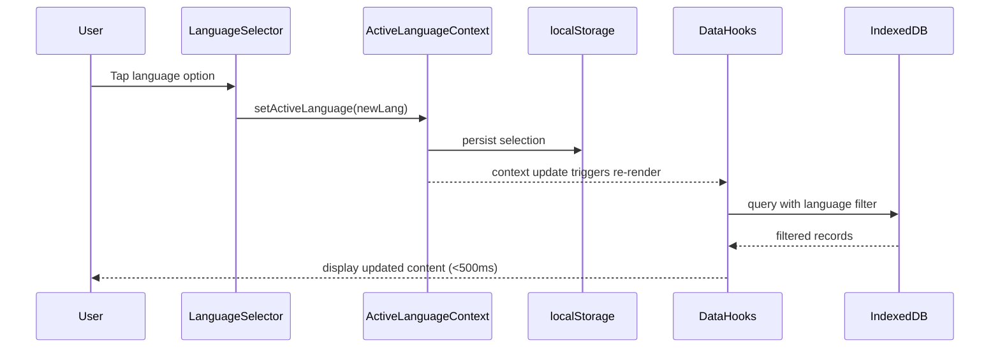
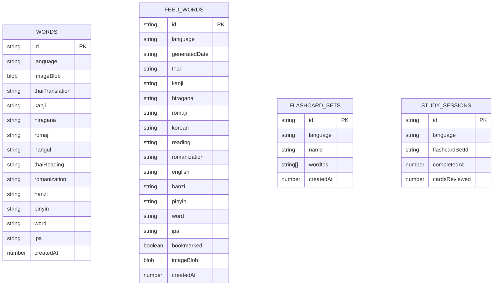

# Design Document: Multi-Language Game

## Overview

This design extends the Tarnly app from a Korean-only vocabulary learning tool to a multi-language system supporting English, Japanese, Korean, and Chinese. The core architectural change is introducing a **language dimension** to all data storage and retrieval operations, while maintaining backward compatibility with existing Korean data.

The current app uses a single IndexedDB database (`tarnly-images`, version 7) with shared object stores (`words`, `feed-words`, `flashcard-sets`). The multi-language design adds a `language` field to every record and uses IndexedDB indexes to efficiently filter by language. A global `ActiveLanguage` context provides the current language selection to all components, enabling instant content switching without page reloads.

**Key Design Decisions:**
1. **Single database with language-indexed stores** (vs. separate databases per language) — simpler migration, atomic cross-language operations if needed, single connection management.
2. **React Context for active language** — enables all components to reactively update when language changes, replacing the current `useLanguagePreference` hook which only handles translation language (Thai/English).
3. **Schema version bump** — IndexedDB upgrade adds `language` index to existing stores and migrates existing records to `korean`.

## Architecture

```mermaid
graph TB
    subgraph UI Layer
        LS[Language Selector - Global]
        WF[Word Feed]
        FC[Flashcard Sets]
        SC[Scan Preview]
        PR[Profile / Stats]
    end

    subgraph Context Layer
        ALC[ActiveLanguageContext]
    end

    subgraph Data Layer
        DB[IndexedDB - tarnly-images v8]
        LS_STORE[localStorage - active language]
    end

    subgraph API Layer
        FEED_API[/api/feed]
        ID_API[/api/identify]
    end

    LS --> ALC
    ALC --> WF
    ALC --> FC
    ALC --> SC
    ALC --> PR

    WF --> DB
    FC --> DB
    SC --> DB
    PR --> DB

    WF --> FEED_API
    SC --> ID_API

    ALC --> LS_STORE
```

### Language Switch Flow



## Components and Interfaces

### ActiveLanguageContext

A React Context that replaces the current `useLanguagePreference` hook for target language management.

```typescript
// app/_lib/ActiveLanguageContext.tsx

export type TargetLanguage = 'english' | 'japanese' | 'korean' | 'chinese';

export interface ActiveLanguageContextValue {
  activeLanguage: TargetLanguage;
  setActiveLanguage: (lang: TargetLanguage) => void;
}

export const STORAGE_KEY = 'tarnly:active-language';
export const DEFAULT_LANGUAGE: TargetLanguage = 'korean';
```

### Language-Aware Database Module

Extends the existing `db.ts` with language-filtered query helpers.

```typescript
// app/_lib/db.ts (extended)

export const DB_VERSION = 8; // bumped from 7

// New index added to existing stores during upgrade
// words: index 'language' on keyPath 'language'
// feed-words: index 'language' on keyPath 'language'
// flashcard-sets: index 'language' on keyPath 'language'

// Study sessions store (new)
export const STUDY_SESSIONS_STORE = 'study-sessions';

export function queryByLanguage<T>(
  db: IDBDatabase,
  storeName: string,
  language: TargetLanguage
): Promise<T[]>;
```

### Global Language Selector Component

A persistent UI element accessible from every screen.

```typescript
// app/_components/GlobalLanguageSelector.tsx

interface LanguageOption {
  value: TargetLanguage;
  label: string;        // e.g., "한국어", "日本語", "中文", "English"
  icon: string;         // flag emoji or icon
  nativeName: string;   // native script name
}
```

### Word Record Interfaces (Language-Specific)

```typescript
// app/_lib/wordTypes.ts

interface BaseWordRecord {
  id: string;
  language: TargetLanguage;
  imageBlob: Blob | null;
  thaiTranslation: string;
  createdAt: number;
}

interface JapaneseWordRecord extends BaseWordRecord {
  language: 'japanese';
  kanji: string;
  hiragana: string;
  romaji: string;
}

interface KoreanWordRecord extends BaseWordRecord {
  language: 'korean';
  hangul: string;
  thaiReading: string;
  romanization: string;
}

interface ChineseWordRecord extends BaseWordRecord {
  language: 'chinese';
  hanzi: string;
  pinyin: string;
}

interface EnglishWordRecord extends BaseWordRecord {
  language: 'english';
  word: string;
  ipa: string;
}

export type WordRecord = JapaneseWordRecord | KoreanWordRecord | ChineseWordRecord | EnglishWordRecord;
```

### Feed Word Interfaces (Language-Specific)

```typescript
// app/home/_lib/types.ts (extended)

interface BaseFeedWord {
  language: TargetLanguage;
  thai: string;
}

interface JapaneseFeedWord extends BaseFeedWord {
  language: 'japanese';
  kanji: string;
  hiragana: string;
  romaji: string;
}

interface KoreanFeedWord extends BaseFeedWord {
  language: 'korean';
  korean: string;
  reading: string;
  romanization: string;
  english: string;
}

interface ChineseFeedWord extends BaseFeedWord {
  language: 'chinese';
  hanzi: string;
  pinyin: string;
}

interface EnglishFeedWord extends BaseFeedWord {
  language: 'english';
  word: string;
  ipa: string;
}

export type FeedWord = JapaneseFeedWord | KoreanFeedWord | ChineseFeedWord | EnglishFeedWord;
```

### Flashcard Set Interface

```typescript
// app/learn/_lib/useFlashcardSets.ts (extended)

export interface FlashcardSet {
  id: string;
  language: TargetLanguage;
  name: string;
  wordIds: string[];
  createdAt: number;
}
```

### Study Session Interface

```typescript
// app/_lib/studySessionTypes.ts

export interface StudySession {
  id: string;
  language: TargetLanguage;
  flashcardSetId: string;
  completedAt: number;
  cardsReviewed: number;
}
```

### Text Scanner - Language Character Detection

```typescript
// app/scan/_lib/languageDetection.ts

export interface CharacterRange {
  language: TargetLanguage;
  regex: RegExp;
}

export const CHARACTER_RANGES: CharacterRange[] = [
  { language: 'japanese', regex: /[\u3040-\u309F\u30A0-\u30FF\u4E00-\u9FFF]/ },
  { language: 'korean', regex: /[\uAC00-\uD7AF\u1100-\u11FF\u3130-\u318F]/ },
  { language: 'chinese', regex: /[\u4E00-\u9FFF\u3400-\u4DBF]/ },
  { language: 'english', regex: /[A-Za-z]/ },
];

export function extractWordsForLanguage(
  text: string,
  language: TargetLanguage
): string[];

export function detectTextLanguage(text: string): TargetLanguage | null;
```

### Learning Statistics Interface

```typescript
// app/profile/_lib/useLearningStats.ts (extended)

export interface LanguageLearningStats {
  language: TargetLanguage;
  totalWords: number;
  totalFlashcardSets: number;
  totalStudySessions: number;
}
```

## Data Models

### IndexedDB Schema (Version 8)



### Migration Strategy

When upgrading from DB version 7 to 8:

1. **Add `language` index** to `words`, `feed-words`, and `flashcard-sets` stores
2. **Migrate existing records**: iterate all records in each store and add `language: 'korean'` field (since the app was Korean-only)
3. **Create `study-sessions` store** with indexes on `language` and `completedAt`
4. **Add compound index** `language_date` on `feed-words` for efficient daily feed queries per language

### localStorage Schema

| Key | Value | Purpose |
|-----|-------|---------|
| `tarnly:active-language` | `'english' \| 'japanese' \| 'korean' \| 'chinese'` | Persisted active language selection |
| `tarnly:translation-language` | `'thai' \| 'english'` | Existing translation preference (unchanged) |

### API Request/Response Changes

The feed and identify API routes will accept a `language` parameter to generate vocabulary in the correct language:

```typescript
// Feed API - POST /api/feed
interface FeedRequest {
  language: TargetLanguage;
  excludeWords: string[];
  count: number;
}

// Identify API - POST /api/identify
interface IdentifyRequest {
  image: string; // base64
  language: TargetLanguage;
}
```

## Correctness Properties

*A property is a characteristic or behavior that should hold true across all valid executions of a system—essentially, a formal statement about what the system should do. Properties serve as the bridge between human-readable specifications and machine-verifiable correctness guarantees.*

### Property 1: Language selection round-trip

*For any* valid TargetLanguage value, persisting it to localStorage via `setActiveLanguage` and then reading it back on initialization should produce the same TargetLanguage value.

**Validates: Requirements 1.2, 1.3**

### Property 2: Language-filtered query isolation

*For any* collection of records (WordRecords, FeedWordRecords, or FlashcardSets) stored across multiple languages, querying by a specific TargetLanguage should return exactly those records whose `language` field matches the queried language, and no others.

**Validates: Requirements 2.3, 3.2, 3.3, 4.2, 6.2**

### Property 3: Save associates active language

*For any* valid record input (word, feed word, or flashcard set) saved while a TargetLanguage is active, the resulting stored record's `language` field must equal the active language at the time of save.

**Validates: Requirements 2.2, 4.1, 7.2**

### Property 4: Inactive language data preservation

*For any* set of records belonging to language A, performing save, delete, or update operations on records of language B should leave all language A records byte-for-byte identical.

**Validates: Requirements 2.4, 4.4**

### Property 5: Feed generation idempotence

*For any* TargetLanguage and calendar date where FeedWord entries already exist, the `shouldFetchToday` function should return `false`, preventing duplicate generation.

**Validates: Requirements 3.5**

### Property 6: Word record schema completeness

*For any* valid WordRecord, all required fields defined for its language type must be present and non-undefined: Japanese requires (kanji, hiragana, romaji, thaiTranslation), Korean requires (hangul, thaiReading, romanization, thaiTranslation), Chinese requires (hanzi, pinyin, thaiTranslation), English requires (word, ipa, thaiTranslation).

**Validates: Requirements 5.1, 5.2, 5.3, 5.4**

### Property 7: Word card field ordering

*For any* TargetLanguage, the function that returns display fields for a word card must return them in the order: [native script field, pronunciation guide field, translation field].

**Validates: Requirements 5.5**

### Property 8: Incomplete record graceful rendering

*For any* WordRecord where at least one required field is an empty string, the render output should contain a placeholder indicator for each empty field and still display the values of non-empty fields.

**Validates: Requirements 5.6**

### Property 9: Language-aware text extraction

*For any* text string and *for any* TargetLanguage, the `extractWordsForLanguage` function should return only words composed entirely of characters belonging to that language's character set. If no characters match, it should return an empty array.

**Validates: Requirements 7.1, 7.3, 7.4**

### Property 10: Per-language statistics accuracy

*For any* collection of WordRecords, FlashcardSets, and StudySessions across multiple languages, computing statistics for a specific TargetLanguage should count only records whose `language` field matches that language.

**Validates: Requirements 8.1, 8.2**

## Error Handling

### Storage Errors (Requirement 2.5)

| Scenario | Behavior |
|----------|----------|
| IndexedDB unavailable | Display error toast: "ไม่สามารถบันทึกคำศัพท์ได้" / "Could not save word" |
| Write operation fails | Display error, preserve user input in form state |
| Read operation fails | Display error, show empty state with retry button |
| DB version upgrade fails | Fall back to read-only mode, prompt user to clear data |

### Feed Generation Errors (Requirement 3.6)

| Scenario | Behavior |
|----------|----------|
| API timeout (30s) | Show error message, retain existing feed entries |
| API rate limit (429) | Show "Too many requests" message, retain existing entries |
| Network error | Show "Cannot connect" message, retain existing entries |
| Invalid API response | Show generic error, retain existing entries |

### Language Switch Errors (Requirement 6.5)

| Scenario | Behavior |
|----------|----------|
| Data load exceeds 500ms | Revert to previous language, show error toast |
| IndexedDB query fails | Revert to previous language, show error toast |

### Scan Errors (Requirement 7.3)

| Scenario | Behavior |
|----------|----------|
| No matching characters | Show message: "ข้อความที่สแกนไม่ตรงกับภาษาที่เลือก" with suggestion to switch language |
| Scan timeout (5s) | Show timeout error, allow retry |
| More than 50 words detected | Truncate to first 50, show indicator that results were limited |

## Testing Strategy

### Unit Tests (Example-Based)

- Language selector renders 4 options (Req 1.1)
- Default language is Korean when localStorage is empty (Req 1.4)
- Visual distinction for active language (Req 1.5)
- IndexedDB error handling displays message and preserves input (Req 2.5)
- Feed generation failure retains existing entries (Req 3.6)
- 30-day feed retention policy (Req 3.4)
- Empty flashcard set state display (Req 4.3)
- Global language selector accessible from layout (Req 6.1)
- Language switch confirmation toast (Req 6.4)
- Language switch failure rollback (Req 6.5)
- Study session creation on flashcard review (Req 8.3)
- Zero statistics for empty language (Req 8.4)

### Property-Based Tests (fast-check)

The project already has `fast-check` v4.8.0 installed. Each property test will run a minimum of 100 iterations.

| Property | Test File | Generator Strategy |
|----------|-----------|-------------------|
| Property 1: Language selection round-trip | `app/_lib/__tests__/activeLanguage.property.test.ts` | Generate random TargetLanguage values |
| Property 2: Language-filtered query isolation | `app/_lib/__tests__/languageFilter.property.test.ts` | Generate arrays of records with random language assignments |
| Property 3: Save associates active language | `app/_lib/__tests__/languageSave.property.test.ts` | Generate random word inputs + random active language |
| Property 4: Inactive language data preservation | `app/_lib/__tests__/dataPreservation.property.test.ts` | Generate multi-language record sets, perform operations on one language |
| Property 5: Feed generation idempotence | `app/home/_lib/__tests__/feedIdempotence.property.test.ts` | Generate random dates and languages with pre-existing feed data |
| Property 6: Word record schema completeness | `app/_lib/__tests__/wordSchema.property.test.ts` | Generate valid WordRecords for each language type |
| Property 7: Word card field ordering | `app/_lib/__tests__/fieldOrdering.property.test.ts` | Generate all TargetLanguage values, verify ordering |
| Property 8: Incomplete record graceful rendering | `app/_lib/__tests__/incompleteRecord.property.test.ts` | Generate WordRecords with random empty fields |
| Property 9: Language-aware text extraction | `app/scan/_lib/__tests__/languageExtraction.property.test.ts` | Generate mixed-language text strings |
| Property 10: Per-language statistics accuracy | `app/profile/_lib/__tests__/languageStats.property.test.ts` | Generate multi-language record collections |

### Integration Tests

- Language switch completes within 500ms (Req 6.3)
- Profile stats update within 500ms on language switch (Req 8.5)
- Scan extracts words within 5 seconds (Req 7.1)
- DB migration from v7 to v8 preserves existing Korean data
- Feed API generates correct language-specific vocabulary

### Test Configuration

```typescript
// Property test tag format
// Feature: multi-language-game, Property {N}: {property_text}

// Minimum iterations
fc.assert(fc.property(...), { numRuns: 100 });
```

### Test Dependencies

- `vitest` — test runner (already installed)
- `fast-check` — property-based testing (already installed)
- `fake-indexeddb` — IndexedDB mock for Node.js (already installed)
- `@testing-library/react` — component testing (already installed)

