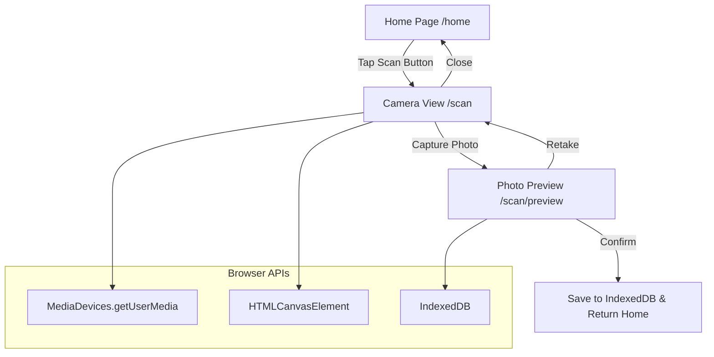
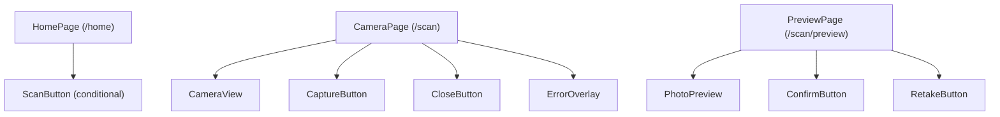

# Design Document: Scan Button

## Overview

The Scan Button feature adds camera-based photo capture to the Tarnly Korean PWA. Users tap a floating "Scan" button on the Home screen to open a full-screen camera view, capture a photo of Korean text, preview it, and confirm or retake. The feature leverages the browser's `MediaDevices.getUserMedia` API to work entirely within the PWA without native app installation.

### Key Design Decisions

1. **Client-side only** — All camera logic runs in the browser via Web APIs. No server-side processing is needed for capture/preview.
2. **Route-based navigation** — Camera View and Photo Preview are implemented as Next.js app router pages (`/scan` and `/scan/preview`) enabling native-like back navigation and clean resource cleanup on unmount.
3. **Canvas-based capture** — A hidden `<canvas>` element captures the current video frame, producing a Blob/Object URL for preview and local storage persistence.
4. **IndexedDB for image storage** — Captured images are stored as Blobs in IndexedDB (not localStorage) to handle large binary data efficiently.
5. **Feature detection gating** — The Scan button is conditionally rendered based on `navigator.mediaDevices?.getUserMedia` availability.

## Architecture



### Component Hierarchy



## Components and Interfaces

### ScanButton

A floating action button rendered on the Home page. Conditionally hidden when `getUserMedia` is not supported.

```typescript
interface ScanButtonProps {
  // No props — self-contained; uses router for navigation
}
```

**Behavior:**
- Checks `navigator.mediaDevices?.getUserMedia` on mount
- If unsupported, renders nothing
- On tap, navigates to `/scan`

### CameraView

Full-screen camera feed component using a `<video>` element connected to a MediaStream.

```typescript
interface CameraViewProps {
  onCapture: (imageBlob: Blob) => void;
  onClose: () => void;
  onError: (error: CameraError) => void;
}

type CameraError = {
  type: 'permission_denied' | 'not_found' | 'capture_failed' | 'stream_interrupted';
  message: string;
};
```

**Behavior:**
- Requests `getUserMedia({ video: { facingMode: 'environment', width: { ideal: 1280 }, height: { ideal: 720 } } })`
- Falls back to `facingMode: 'user'` if rear camera unavailable
- Renders live feed in a `<video autoPlay playsInline>` element
- On capture: draws current frame to hidden canvas, exports as Blob
- On close/unmount: stops all MediaStream tracks

### CaptureButton

Circular button at bottom-center of Camera View.

```typescript
interface CaptureButtonProps {
  onPress: () => void;
  disabled: boolean;
}
```

**Behavior:**
- Scale-down animation on press (150ms minimum)
- Disabled state during capture processing
- Re-enabled on capture failure

### PhotoPreview

Displays the captured image with confirm/retake actions.

```typescript
interface PhotoPreviewProps {
  imageBlob: Blob;
  onConfirm: () => void;
  onRetake: () => void;
}
```

**Behavior:**
- Displays image via `URL.createObjectURL(blob)` scaled to fit viewport (object-fit: contain)
- Revokes object URL on unmount to prevent memory leaks

### ErrorOverlay

Displays contextual error messages with optional retry action.

```typescript
interface ErrorOverlayProps {
  error: CameraError;
  onRetry?: () => void;
  onDismiss: () => void;
}
```

### useCameraStream (Custom Hook)

Encapsulates camera stream lifecycle management.

```typescript
interface UseCameraStreamReturn {
  videoRef: React.RefObject<HTMLVideoElement>;
  stream: MediaStream | null;
  isLoading: boolean;
  error: CameraError | null;
  capture: () => Promise<Blob>;
  retry: () => void;
  stop: () => void;
}
```

### useImageStorage (Custom Hook)

Handles IndexedDB operations for captured images.

```typescript
interface UseImageStorageReturn {
  save: (blob: Blob) => Promise<string>; // returns stored image ID
  isLoading: boolean;
  error: string | null;
}
```

## Data Models

### CapturedImage (IndexedDB Schema)

```typescript
interface CapturedImage {
  id: string;          // UUID v4
  blob: Blob;          // Original resolution image
  createdAt: number;   // Unix timestamp (ms)
  width: number;       // Original pixel width
  height: number;      // Original pixel height
  mimeType: string;    // e.g. 'image/jpeg'
}
```

**IndexedDB Configuration:**
- Database name: `tarnly-images`
- Object store: `captures`
- Key path: `id`
- Index: `createdAt` (for chronological retrieval)

### Camera Constraints

```typescript
const DEFAULT_CONSTRAINTS: MediaStreamConstraints = {
  video: {
    facingMode: { ideal: 'environment' },
    width: { ideal: 1280 },
    height: { ideal: 720 },
  },
  audio: false,
};

const FALLBACK_CONSTRAINTS: MediaStreamConstraints = {
  video: {
    width: { ideal: 1280 },
    height: { ideal: 720 },
  },
  audio: false,
};
```

### Application State (per-page)

```typescript
// /scan page state
interface CameraPageState {
  stream: MediaStream | null;
  isCapturing: boolean;
  error: CameraError | null;
}

// /scan/preview page state  
interface PreviewPageState {
  imageBlob: Blob | null;
  isSaving: boolean;
  error: string | null;
}
```


## Correctness Properties

*A property is a characteristic or behavior that should hold true across all valid executions of a system — essentially, a formal statement about what the system should do. Properties serve as the bridge between human-readable specifications and machine-verifiable correctness guarantees.*

### Property 1: Aspect-ratio-preserving fit

*For any* source dimensions (width > 0, height > 0) and any container dimensions (containerWidth > 0, containerHeight > 0), the `computeFitDimensions` function SHALL return display dimensions that:
1. Maintain the original aspect ratio (displayWidth / displayHeight ≈ sourceWidth / sourceHeight within floating-point tolerance)
2. Do not exceed the container bounds (displayWidth ≤ containerWidth AND displayHeight ≤ containerHeight)
3. Maximize one axis (displayWidth = containerWidth OR displayHeight = containerHeight)

**Validates: Requirements 3.1, 5.3**

### Property 2: Image storage round-trip

*For any* valid image Blob (size > 0, valid mimeType), saving it to IndexedDB via `useImageStorage.save()` and then reading it back by ID SHALL produce a Blob with identical size and mimeType as the original.

**Validates: Requirements 3.4**

## Error Handling

| Scenario | Error Type | User-Facing Message | Recovery Action |
|----------|-----------|---------------------|-----------------|
| Camera permission denied | `permission_denied` | "กรุณาอนุญาตการเข้าถึงกล้องในการตั้งค่าอุปกรณ์" | Link to device settings instructions |
| No camera found | `not_found` | "ไม่พบกล้องบนอุปกรณ์นี้" | Dismiss and return to Home |
| Rear camera unavailable | N/A (silent fallback) | None — falls back to available camera | Automatic |
| Photo capture failed | `capture_failed` | "ถ่ายภาพไม่สำเร็จ กรุณาลองอีกครั้ง" | Re-enable Capture button |
| Camera stream interrupted | `stream_interrupted` | "การเชื่อมต่อกล้องขาดหาย" | Retry button to re-init stream |
| IndexedDB save failed | Storage error | "บันทึกภาพไม่สำเร็จ กรุณาลองอีกครั้ง" | Retry button on preview screen |
| getUserMedia not supported | N/A (feature gating) | None — Scan button hidden | No action needed |

### Error Handling Strategy

1. **Graceful degradation** — If camera APIs are unavailable, the Scan button is hidden entirely. No broken UI states.
2. **User-actionable messages** — All error messages are in Thai and include clear next steps.
3. **Resource cleanup on error** — Any partial stream or object URL is cleaned up when errors occur.
4. **No silent failures** — Every error path shows feedback to the user (except silent fallback for rear camera).

## Testing Strategy

### Unit Tests (Example-based)

| Test | Validates |
|------|-----------|
| ScanButton hidden when getUserMedia unavailable | Req 5.2 |
| ScanButton navigates to /scan on tap | Req 1.1 |
| CameraView requests getUserMedia with correct constraints | Req 1.4, 5.1, 5.6 |
| CameraView falls back when rear camera unavailable | Req 1.5 |
| CameraView displays error on permission denied | Req 1.3 |
| CaptureButton disabled during capture | Req 2.2 |
| CaptureButton shows press animation ≥ 150ms | Req 2.4 |
| Successful capture navigates to /scan/preview | Req 2.3 |
| Capture failure re-enables button and shows error | Req 2.5 |
| PhotoPreview displays confirm and retake buttons | Req 3.2 |
| Retake discards image and navigates to /scan | Req 3.3 |
| Confirm saves image and navigates to /home | Req 3.4 |
| Save failure shows error and retains image | Req 3.5 |
| Close button stops stream and navigates home | Req 4.2 |
| Close during capture cancels and navigates home | Req 4.3 |
| Stream tracks stopped on close | Req 4.4 |
| Stream interruption shows error with retry | Req 5.4 |

### Property-Based Tests

**Library:** [fast-check](https://github.com/dubzzz/fast-check) (TypeScript PBT library)

**Configuration:** Minimum 100 iterations per property test.

| Property Test | Tag | Validates |
|---------------|-----|-----------|
| Aspect-ratio-preserving fit | Feature: scan-button, Property 1: Aspect-ratio-preserving fit | Req 3.1, 5.3 |
| Image storage round-trip | Feature: scan-button, Property 2: Image storage round-trip | Req 3.4 |

**Property 1 implementation approach:**
- Generate arbitrary positive integers for sourceWidth, sourceHeight, containerWidth, containerHeight
- Call `computeFitDimensions(sourceWidth, sourceHeight, containerWidth, containerHeight)`
- Assert: result maintains aspect ratio within ε tolerance, fits within container, and maximizes one axis

**Property 2 implementation approach:**
- Generate arbitrary Blobs with random sizes (1 byte to 10MB) and valid mimeTypes
- Save via `useImageStorage.save(blob)`, read back by returned ID
- Assert: retrieved blob has same `size` and `type` as original

### Integration Tests

| Test | Validates |
|------|-----------|
| Full flow: tap Scan → grant permission → see camera feed | Req 1.1, 1.2, 1.6 |
| Full flow: capture → preview → confirm → saved in IndexedDB | Req 2.2, 2.3, 3.4 |
| Full flow: capture → preview → retake → back to camera | Req 3.3 |
| PWA standalone mode camera access | Req 5.5 |

### Test Environment

- **Unit/Property tests:** Vitest + React Testing Library + fast-check
- **Mocking:** `navigator.mediaDevices.getUserMedia` mocked via vi.fn()
- **IndexedDB mock:** fake-indexeddb for property tests
- **Integration tests:** Playwright with device emulation for camera permission flows
