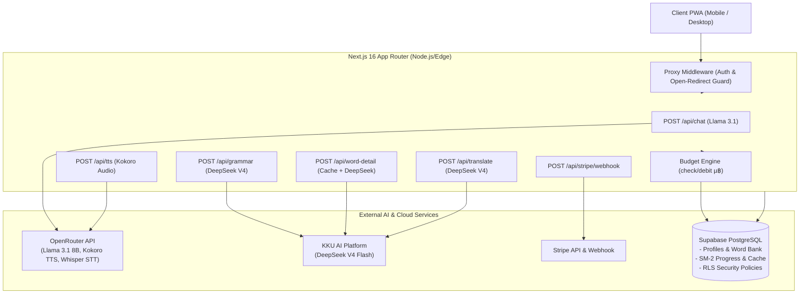

# GeeGeeJobLa (จีจีจบล่ะ) 🐘✨

> **Mobile-First AI English Learning Partner with SM-2 Spaced Repetition & Micro-Budgeting Engine**  
> เว็บแอปพลิเคชัน Progressive Web App (PWA) ผู้ช่วยฝึกสนทนาภาษาอังกฤษสำหรับคนไทย ขับเคลื่อนด้วยสถาปัตยกรรม Dual-LLM, ระบบคลังคำศัพท์ Spaced Repetition (SM-2), และระบบควบคุมต้นทุนแบบ Micro-Baht (µ฿)

[](https://nextjs.org/)
[](https://react.dev/)
[](https://tailwindcss.com/)
[](https://www.typescriptlang.org/)
[](https://supabase.com/)
[](https://vitest.dev/)
[](https://stripe.com/)

---

## 🎓 ข้อมูลโครงงาน (Project Metadata)

- **ชื่อโครงงาน:** GeeGeeJobLa (จีจีจบล่ะ) — แพลตฟอร์มการเรียนรู้ภาษาอังกฤษอัจฉริยะสำหรับคนไทย
- **ประเภท:** ปริญญานิพนธ์ / Senior Project & Capstone Coursework
- **สถาบัน:** มหาวิทยาลัยขอนแก่น (Khon Kaen University)
- **คณะ / ภาควิชา:** วิทยาลัยการคอมพิวเตอร์ / ภาควิชาวิทยาการคอมพิวเตอร์และเทคโนโลยีสารสนเทศ
- **สนับสนุนเทคโนโลยี AI:** KKU AI Platform (`gen.ai.kku.ac.th`)

---

## 🌟 นวัตกรรมและจุดเด่นของระบบ (Key Innovations)

1. **Dual-LLM Intelligent Routing:**
   - **OpenRouter (Llama 3.1 8B):** สวมบทบาทคู่สนทนาภาษาอังกฤษที่เป็นธรรมชาติ คอยตั้งคำถามปลายเปิดเพื่อกระตุ้นให้ผู้เรียนฝึกตอบอย่างต่อเนื่อง
   - **KKU AI Platform (DeepSeek V4 Flash):** รับผิดชอบงานที่มีความแม่นยำสูง ได้แก่ การแปลบริบทภาษาอังกฤษเป็นไทย, การสร้างการ์ดคำศัพท์อย่างละเอียด (Word Detail), และการตรวจแก้ไวยากรณ์ (Grammar Correction) พร้อมคำอธิบายภาษาไทย
2. **One-Tap Word Capture & Permanent Shared Cache:**
   - แตะคำศัพท์ภาษาอังกฤษคำใดก็ได้ในบทสนทนาเพื่อเปิดการ์ดความหมาย (คำแปล, นิยาม, ชนิดคำ, Tense, ตัวอย่างการใช้)
   - มีระบบ **SHA-256 Prompt Versioned Cache** เก็บผลลัพธ์คำศัพท์ลงตาราง `ai_word_detail_cache` ถาวร ช่วยให้คำศัพท์ซ้ำแสดงผลได้ทันที (Zero Latency) และลดค่าใช้จ่าย Token ได้กว่า 80%
3. **SM-2 Spaced Repetition & Mini-Games:**
   - คำศัพท์ที่บันทึกจะถูกคำนวณรอบการทบทวนอัตโนมัติด้วยอัลกอริทึม SuperMemo 2 (SM-2)
   - ทบทวนผ่าน **3 มินิเกม** บนหน้า `/refresh`:
     - 🧩 **Matching Game:** จับคู่คำศัพท์ภาษาอังกฤษกับคำแปลภาษาไทย
     - ⌨️ **Typing Game:** สะกดคำศัพท์ภาษาอังกฤษจากคำใบ้ภาษาไทย
     - 🎙️ **Speak Game:** ฝึกออกเสียงคำศัพท์ผ่านระบบตรวจจับเสียงพูด (Speech-to-Text)
4. **Server-Side Micro-Baht (µ฿) Budget Engine:**
   - ควบคุมงบประมาณค่าใช้จ่าย AI รายวันต่อผู้ใช้ผ่าน Supabase RPC (`check_budget`, `debit_budget`) โดยหักตาม Token จริงที่ใช้ (เช่น Free: 20,000 µ฿/วัน, Premium: 50,000 µ฿/วัน)
5. **Data Privacy & PDPA Compliance:**
   - ข้อความในบทสนทนาจะถูกล้างทิ้งอัตโนมัติทุก 3 วันผ่าน `pg_cron`
   - รองรับการรีเซ็ตข้อมูลการเรียนรู้ และการลบบัญชีถาวรแบบ Cascade ทั้งระบบ

---

## 🏗️ สถาปัตยกรรมระบบ (System Architecture)



---

## 🛠️ เทคโนโลยีที่ใช้งาน (Tech Stack)

| ส่วนประกอบ | เทคโนโลยี |
|---|---|
| **Frontend Framework** | [Next.js 16.2.6](https://nextjs.org/) (App Router, Turbopack) + [React 19.2.4](https://react.dev/) |
| **Styling & Theme** | [Tailwind CSS v4](https://tailwindcss.com/) (Neobrutalist Theme, Light/Dark mode) |
| **State & Data Fetching** | Custom Hooks, Context API, Web Speech API |
| **Icons & Animation** | [Lucide React](https://lucide.dev/), [Motion](https://motion.dev/) |
| **Database & Auth** | [Supabase](https://supabase.com/) (PostgreSQL 15+, Row Level Security, RPC Functions) |
| **Payment Gateway** | [Stripe](https://stripe.com/) (Subscription Checkout, Customer Portal, Idempotent Webhook) |
| **AI LLM Routing** | OpenRouter (Meta Llama 3.1 8B), KKU AI Platform (DeepSeek V4 Flash) |
| **Speech Processing** | Kokoro-82M (TTS) via OpenRouter, Whisper Large v3 (STT) |
| **Testing Suite** | [Vitest 4.1.7](https://vitest.dev/) (Unit, Component, and Logic Testing - 181+ tests) |

---

## 🚀 การติดตั้งและเริ่มต้นใช้งาน (Step-by-Step Setup)

### 1. ความต้องการขั้นต่ำ (Prerequisites)
- [Node.js](https://nodejs.org/) เวอร์ชัน 20.x หรือใหม่กว่า
- บัญชี [Supabase](https://supabase.com/) (หรือ Local Supabase CLI)
- บัญชี [OpenRouter](https://openrouter.ai/) และ [KKU AI Platform](https://gen.ai.kku.ac.th/)

### 2. การติดตั้ง Dependencies
```bash
# โคลนโปรเจกต์
git clone https://github.com/your-username/geegeejobla.git
cd geegeejobla

# ติดตั้งแพ็กเกจ
npm install
```

### 3. ตั้งค่า Environment Variables
คัดลอกไฟล์ `.env.example` ไปเป็น `.env`:
```bash
cp .env.example .env
```
กรอกค่า API Keys ต่างๆ ตามคำอธิบายในไฟล์ `.env.example` *(สำหรับการทดสอบแบบออฟไลน์ สามารถใช้ `STRIPE_SECRET_KEY=sk_test_mock` ได้)*

### 4. การตั้งค่าฐานข้อมูล (Database Migrations & Seed Data)
1. เปิด **Supabase Dashboard** -> ไปที่ **SQL Editor**
2. รันสคริปต์ [supabase/migrations/0000_initial_schema.sql](supabase/migrations/0000_initial_schema.sql) เพื่อสร้างตาราง, RLS Policies, Triggers และ RPC Functions
3. รันสคริปต์ [supabase/seed.sql](supabase/seed.sql) เพื่อนำเข้าบัญชีและข้อมูลตัวอย่างสำหรับทดสอบ

### 5. เริ่มรันโปรแกรมในโหมด Development
```bash
npm run dev
```
เปิดเบราว์เซอร์แล้วเข้าไปที่ `http://localhost:3000`

---

## 🧪 การทดสอบและตรวจสอบคุณภาพโค้ด (Testing & Quality)

```bash
# รัน Unit Tests ทั้งหมด (Vitest 181+ tests)
npm test

# ตรวจสอบ Lint และความสะอาดของโค้ด (ESLint 9)
npm run lint

# ตรวจสอบ TypeScript Types
npx tsc --noEmit

# สร้าง Production Build
npm run build
```

---

## 📱 การติดตั้งใช้งานแบบ PWA (Progressive Web App)

- **iOS (Safari):** เข้าเว็บไซต์ `http://localhost:3000` หรือ Production URL -> แตะปุ่ม **Share (แชร์)** -> เลือก **"Add to Home Screen (เพิ่มไปยังหน้าจอโฮม)"**
- **Android (Chrome):** เข้าเว็บไซต์ -> แตะเมนู 3 จุด -> เลือก **"Install App (ติดตั้งแอป)"**

---

## 👥 บัญชีทดสอบสำเร็จรูป (Demo Accounts)

หลังรัน `supabase/seed.sql` ท่านสามารถใช้บัญชีด้านล่างเข้าสู่ระบบเพื่อทดสอบได้ทันที:

| บัญชี | อีเมล | รหัสผ่าน | สถานะ & จุดประสงค์การทดสอบ |
|---|---|---|---|
| 🟢 **Free User** | `free-demo@geegeejobla.local` | `demo1234` | มี 16 คำศัพท์ในระบบ (6 คำครบกำหนดทบทวนใน `/refresh`) |
| 💎 **Premium User** | `premium-demo@geegeejobla.local` | `demo1234` | ปลดล็อก AI Suggestions และ Grammar Correction |
| ⚠️ **Budget Max** | `budget-max@geegeejobla.local` | `demo1234` | ทดสอบการแสดงผล Banner เตือนงบประมาณรายวันเต็ม (429) |

---

## 📚 เอกสารประกอบอื่นๆ
- 📖 [คู่มือการใช้งานและ 5-Minute Evaluator Tour](docs/user-manual.md)
- 📐 [รายละเอียดการออกแบบระบบและ Requirements](design-docs/requirements.md)
- 🗄️ [รายละเอียดโครงสร้างฐานข้อมูล Database Design](design-docs/database-design.md)
