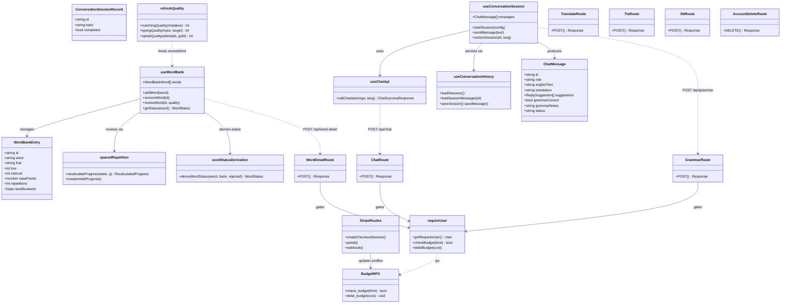

# Class Diagram — Tarnly

The codebase is a Next.js app, not OO. Below, core domain types, React hooks, pure utilities, and API route handlers are modelled as classes; exported functions/handlers as methods. Grouped by domain; only the primary members are shown.

Guidance: `-->` association/usage, `..>` HTTP/RPC dependency. Hooks live under `app/**/_lib/hooks`; pure utilities under `app/**/_lib/utils`; route handlers under `app/api/**/route.ts`; `BudgetRPC` is the Supabase `SECURITY DEFINER` pair in `supabase/migrations/budget_rpcs.sql`. Chat/TTS/STT call OpenRouter; grammar/word-detail/translate call KKU DeepSeek.
