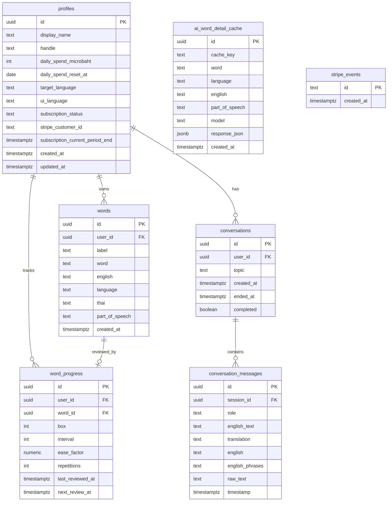

# Database Design — Tarnly

Supabase (PostgreSQL). `profiles` is the hub of all user data, linking to the word bank, spaced-repetition progress, and conversation history. Row Level Security is enabled on every user table. Schema is applied manually; `supabase/migrations/*.sql` documents the budget RPCs and the pg_cron cleanup.

## Tables

### profiles
One row per `auth.users` account: identity, daily AI budget, Stripe subscription state. Auto-created with defaults on first profile load (`PGRST116` → insert).

| Column | Type | Constraints | Notes |
|--------|------|-------------|-------|
| id | uuid | PK, FK → auth.users.id | |
| display_name | text | not null, default `'Learner'` | |
| handle | text | unique | `^[a-z0-9_]{3,20}$` |
| daily_spend_microbaht | integer | not null, default 0, CHECK ≥ 0 | µ฿ spent today; reset by `check_budget` |
| daily_spend_reset_at | date | not null, default `CURRENT_DATE` | last reset date (Asia/Bangkok) |
| target_language | text | not null, default `'english'` | learning target |
| ui_language | text | not null, default `'th'` | UI language |
| subscription_status | text | not null, default `'free'` | `'free'` / `'active'` |
| stripe_customer_id | text | nullable | |
| subscription_current_period_end | timestamptz | nullable | premium expiry |
| created_at / updated_at | timestamptz | not null, default `now()` | |

### words
Personal vocabulary bank captured from chat. `thai`/`part_of_speech` are filled in the background after insert via `/api/word-detail` + translation.

| Column | Type | Constraints | Notes |
|--------|------|-------------|-------|
| id | uuid | PK, default `gen_random_uuid()` | |
| user_id | uuid | FK → profiles.id, not null | owner |
| label | text | not null | raw clicked form (later overwritten with Thai gloss) |
| word | text | nullable | normalized lowercase (dedup key per user) |
| english | text | nullable | original English form |
| language | text | not null, default `'english'`, CHECK = `'english'` | |
| thai | text | nullable | short Thai gloss |
| part_of_speech | text | nullable | |
| created_at | timestamptz | not null, default utc `now()` | |

### word_progress
SM-2 / Leitner spaced-repetition state per saved word (one row per word).

| Column | Type | Constraints | Notes |
|--------|------|-------------|-------|
| id | uuid | PK | |
| user_id | uuid | FK → profiles.id | |
| word_id | uuid | FK → words.id | deleted before its word (FK order) |
| box | integer | not null, default 1, CHECK ≥ 1 | Leitner box |
| interval | integer | not null, default 1, CHECK ≥ 0 | days to next review |
| ease_factor | numeric | not null, default 2.5, CHECK ≥ 1.3 | |
| repetitions | integer | not null, default 0, CHECK ≥ 0 | |
| last_reviewed_at | timestamptz | not null, default `now()` | |
| next_review_at | timestamptz | not null, default `now()` | due time → drives `needs_review` status |

### conversations
Chat session summaries (topics persist; messages are purged — see below). Created lazily on the first message.

| Column | Type | Constraints | Notes |
|--------|------|-------------|-------|
| id | uuid | PK | |
| user_id | uuid | FK → profiles.id | |
| topic | text | not null | first message, sliced to 60 chars |
| created_at | timestamptz | not null, default utc `now()` | |
| ended_at | timestamptz | nullable | |
| completed | boolean | not null, default false | |

### conversation_messages
Individual chat lines. **Retention: purged 3 days after creation via `pg_cron`.**

| Column | Type | Constraints | Notes |
|--------|------|-------------|-------|
| id | uuid | PK | |
| session_id | uuid | FK → conversations.id, ON DELETE CASCADE | |
| role | text | not null, CHECK in (`'user'`,`'assistant'`) | |
| english_text | text | nullable | assistant sentences joined with `\|\|\|` |
| translation | text | nullable | Thai, `\|\|\|`-joined for assistant |
| english | text | nullable | normalized English, `\|\|\|`-joined |
| english_phrases | text | nullable | JSON grammar data (`grammarCorrect`/`grammarNotes`) — user rows only |
| raw_text | text | nullable | original/spoken input |
| timestamp | timestamptz | not null, default utc `now()` | |

### ai_word_detail_cache
Permanent shared cache of LLM-generated word details, keyed by SHA-256 of `word:language:english:partOfSpeech:model:v9` (prompt version bumps invalidate).

| Column | Type | Constraints | Notes |
|--------|------|-------------|-------|
| id | uuid | PK | |
| cache_key | text | unique, not null | SHA-256 of lookup params |
| word | text | not null | lowercase index (fallback lookup) |
| language | text | not null, CHECK = `'english'` | |
| english | text | nullable | |
| part_of_speech | text | nullable | |
| model | text | not null | e.g. `deepseek-v4-flash` |
| response_json | jsonb | not null | `{thai, definition, partOfSpeech, tense, usage}` |
| created_at | timestamptz | not null, default `now()` | permanent — no expiry |

### stripe_events
Idempotency ledger for Stripe webhooks (insert `evt_...` id; PK clash `23505` = already processed).

| Column | Type | Constraints | Notes |
|--------|------|-------------|-------|
| id | text | PK | Stripe `evt_...` id |
| created_at | timestamptz | not null, default `now()` | |

> TTS audio is cached **in-memory** (module-scope FIFO Map, 500 entries) in the `/api/tts` route — not in the database.

## Row Level Security
- **User-owned (`profiles`, `words`, `word_progress`, `conversations`):** `auth.uid() = user_id` (or `= id` for `profiles`).
- **`conversation_messages`:** access via parent — `EXISTS (SELECT 1 FROM conversations WHERE id = session_id AND user_id = auth.uid())`.
- **`ai_word_detail_cache`:** shared read; server writes via `supabaseServer` client.
- **`stripe_events`:** RLS on, no policy → only the service-role webhook handler reaches it.

## Database Logic
- **`check_budget(p_limit_microbaht)`** — `SECURITY DEFINER`. Resets `daily_spend_microbaht` to 0 if `daily_spend_reset_at` is before today (Bangkok); returns `spent < limit`. Callers fail-closed (block on DB error).
- **`debit_budget(p_cost_microbaht)`** — adds token cost (`tokens × TOKEN_COST_MICROBAHT`) to today's spend after each LLM response, in `after()`.
- **`pg_cron` cleanup** (`phase_e_pgcron.sql`) — nightly `DELETE FROM conversation_messages WHERE created_at < now() - INTERVAL '3 days'`.
- **Account delete** (`DELETE /api/account/delete`, service-role) — cascade: `words` → `conversations` → `word_progress` → `profiles` → `auth.users`.
- **Data reset** (in-app) — deletes `words` + `conversations`, zeroes `daily_spend_microbaht`, clears localStorage.
