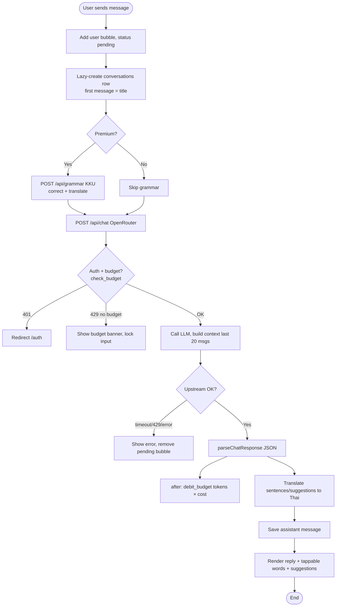

# Flowchart — Send a Chat Message

A learner sends a message; premium messages are grammar-checked first, then the budget-gated chat call produces the AI reply, and the actual token cost is debited afterward.

> Other primary flows — word capture → SM-2 review, word-detail cache lookup, refresh mini-games, and Stripe upgrade — are covered in `sequence-diagram.md`.
