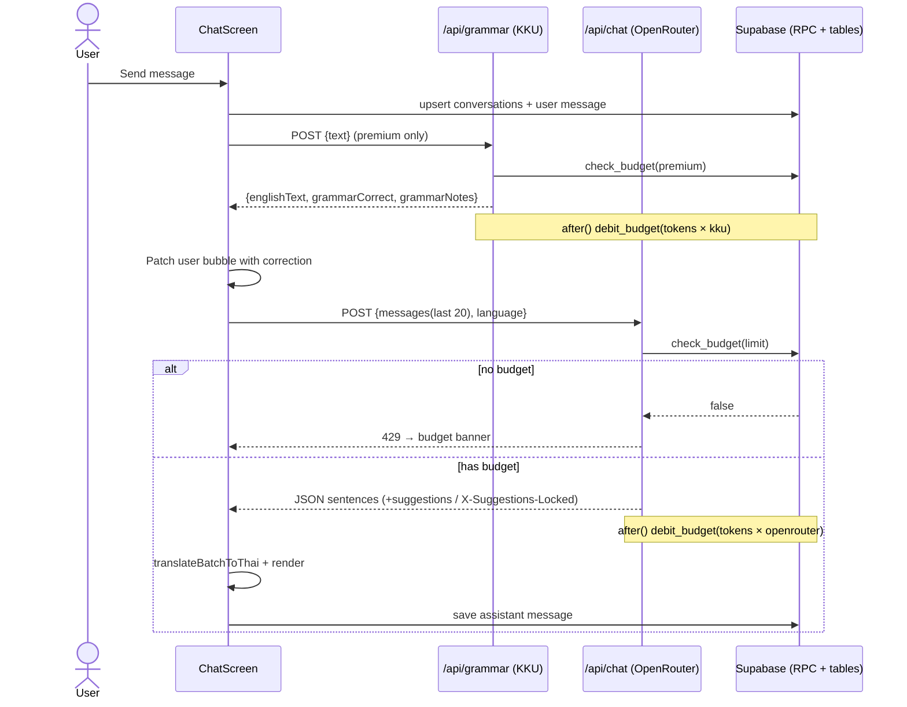
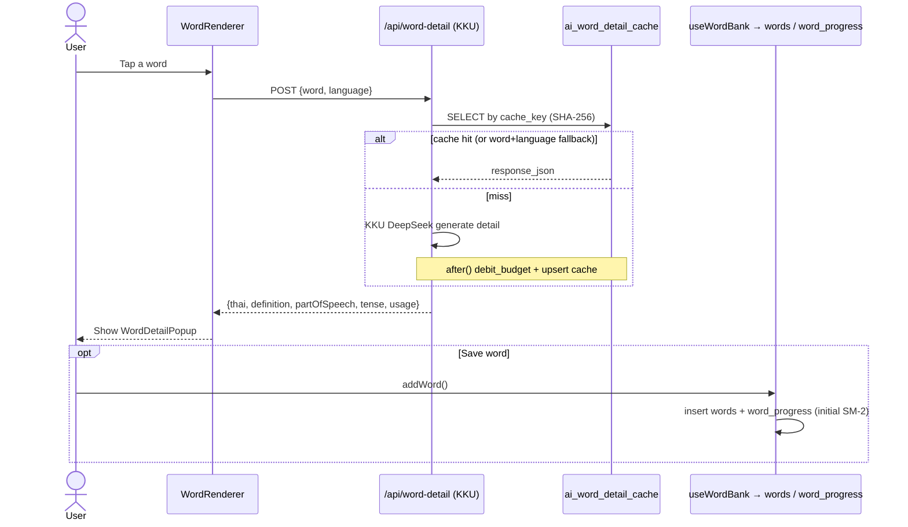
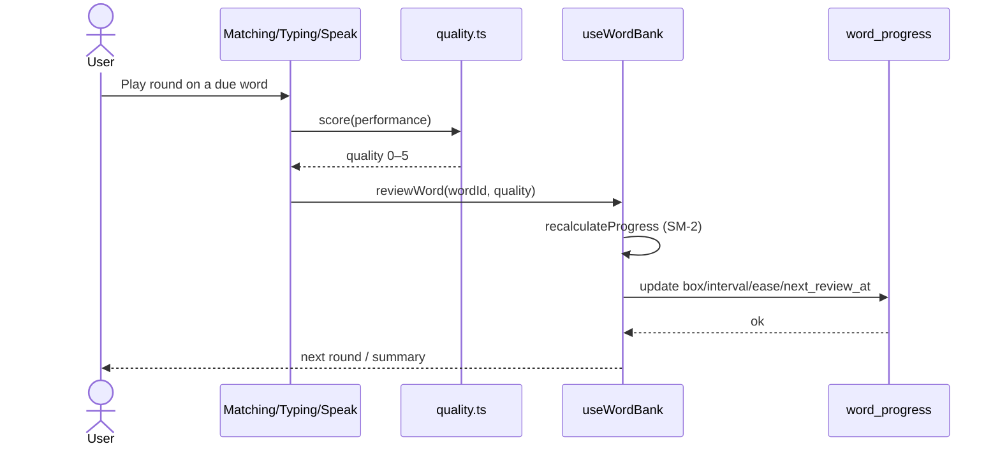

# Sequence Diagram — Core Flows

Covers the three core interactions: sending a chat turn (grammar + budget-gated LLM), tapping a word for its cached detail, and a refresh mini-game updating SM-2 progress.

## Chat turn (premium path)

## Word detail lookup + save

## Refresh mini-game → SM-2 review

